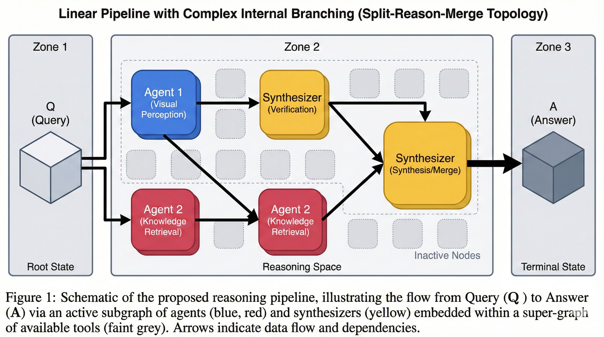
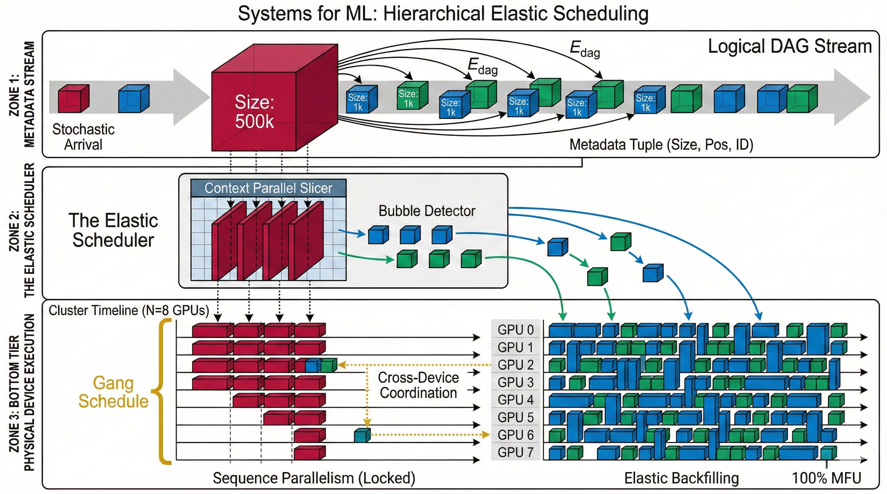
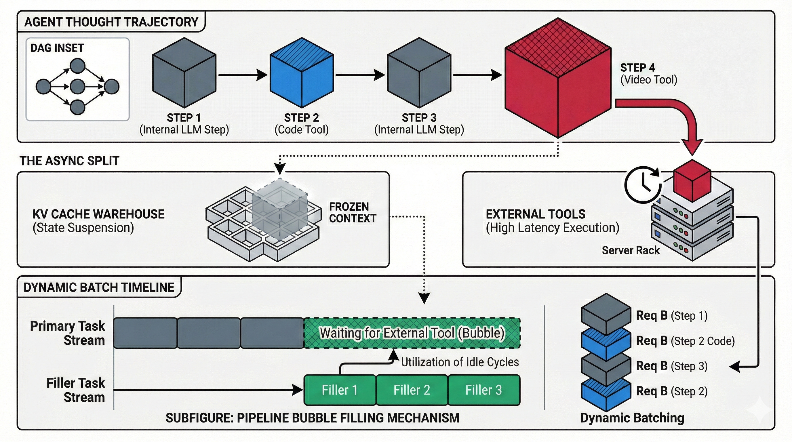
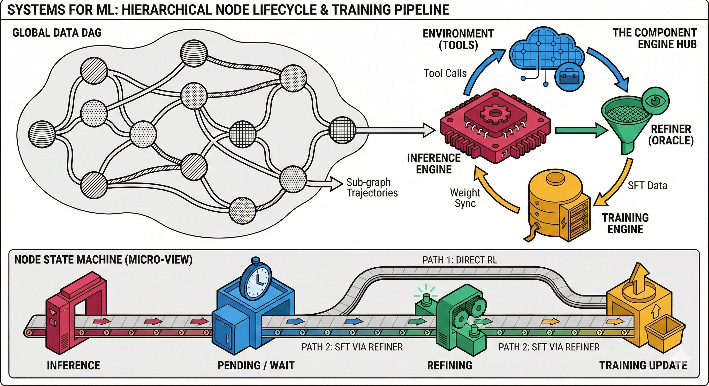

# 4 levels of DAG

## Level one: data/dataset

### 1. Visual Overview: The "Agentic DAG"

The figure depicts a **Directed Acyclic Graph (DAG)** that models a non-linear reasoning workflow. It visualizes the transformation of an initial input into a final output through a network of intermediate agents.

- **Left-Side Annotation ("plans / agents / data"):** This legend defines the components of the graph. The nodes represent **Agents** (or specific tool executions), the structure represents the **Plan**, and the edges represent the flow of **Data**.
    
- **The Input Node (Box "Q"):** Located on the far left, this represents the **Query**, **Question**, or **Initial State** (e.g., the raw dashcam video and the user prompt). It acts as the root of the DAG.
    
- **The Output Node (Box "A"):** Located on the far right, this represents the **Answer**, **Action**, or **Terminal State** (e.g., the final liability report). It is the sink of the DAG where all reasoning branches converge.

### 2. Node-by-Node Logic Flow

The graph illustrates a **"Split-Reason-Merge"** topology, characteristic of complex chain-of-thought systems:

- Parallel Branching (The Split):
    
    From the "Q" node, the graph splits into two distinct paths.
    
    - **Upper Path (Blue Agent):** Represents a specialized sub-task (e.g., _Visual Perception_ to extract speed). It processes data from Q and passes it forward.
        
    - **Lower Path (Red Agent):** Represents a different sub-task (e.g., _Knowledge Retrieval_ for traffic laws). Interestingly, the Red agent receives inputs from **both** the initial Q and the Blue agent, suggesting a dependency (e.g., "I need to know the car is speeding [Blue] before I look up speeding laws [Red]").
        
- **Intermediate Processing (Yellow Agents):**
    
    - **Top Yellow Agent:** Takes input from the Blue agent, likely refining or verifying the data (e.g., _Verification Step_).
        
    - **Bottom Yellow Agent (The Synthesizer):** This is a critical **Merge Node**. It receives arrows from multiple upstream sources (The Red agent and the Top Yellow agent). This represents the **Data Synthesis** step where the system combines "verified speed" (Yellow) and "legal limits" (Red) to form a logical conclusion.
        
- Convergence (The Answer):
    
    The final synthesized state (from the Bottom Yellow agent) flows into the "A" box, producing the final response.
    

### 3. Mapping to "Subgraph" and "Data Collection" Concepts

You mentioned expanding this DAG as a "whole collection" where a task is a "subgraph." This figure perfectly illustrates that concept:

- **The "Super-Graph" (The Whole Collection):** Imagine a massive graph containing _every possible tool_ your system has (OCR, Weather API, Law DB, Object Detection, Tire Analysis, etc.). This is the universe of all capabilities.
    
- **The "Task Subgraph" (This Figure):** The sketch shows **one specific instantiation** (a subgraph) activated for a specific query.
    
    - _Example:_ For _this_ specific accident, the system decided it needed the **Blue Agent** (Speed Tool) and **Red Agent** (Law Tool). It _did not_ activate a "Tire Analysis" agent, effectively pruning that part of the Super-Graph.
        
    - Therefore, this drawing represents the **active inference path**—a verifiable, traceable slice of the larger model's capability.
        

### Summary

In the context of your previous documents, this figure visualizes the **Teacher Model's generated trajectory**. It is the "Ground Truth" structure that the Student Model tries to predict: not just the final Answer (A), but the specific sequence of optimal tool calls (Blue $\rightarrow$ Red $\rightarrow$ Yellow) required to get there.

---

## Level two: Training Chunks/Node-Chunks

### Figure Title: Elastic ChunkFlow Scheduling with Context Parallelism

The figure is divided into three vertical tiers, representing the flow from logical generation to physical execution.

### Tier 1: The Logical Metadata Stream (Producer)

- **Visual:** A continuous stream of "Abstract Blocks" flowing in from the left, generated by the Teacher/Policy Models.
    
- **Content Abstraction:** Instead of video frames or text, each block is labeled only with its **Metadata Tuple**: $(Size, Position, Dependency\_ID)$.
    
    - **Variable Sizes:** Some blocks are massive (e.g., `Size: 500k` for video context), while others are tiny (e.g., `Size: 1k` for a tool call).
        
    - **DAG Dependencies:** Arrows connect these blocks, indicating that Block B cannot enter the scheduler until Block A is marked "Complete."
        
- **Asynchrony:** The blocks arrive irregularly, representing the stochastic nature of agentic reasoning (some branches finish faster than others).
    
### Tier 2: The Elastic Scheduler (The "Brain")

- **Visual:** A central "Dispatcher" unit receiving the Metadata Stream. It applies two critical operations:
    
- **Operation A: Context Parallel Splitting (The Slicer)**
    
    - For the massive blocks (e.g., the 500k video node), the figure shows the scheduler slicing them vertically into **Sequence Chunks**.
        
    - _Constraint:_ These slices are linked by a bracket labeled **"Gang Schedule Constraint."** This indicates that these specific slices _must_ run simultaneously on a group of GPUs (to support Ring Attention/All-Gather operations).
        
- **Operation B: Bubble Detection & filling**
    
    - The scheduler identifies the inevitable "Bubble" (idle time) caused by waiting for the massive Gang Schedule to synchronize.
        
    - _Action:_ It actively pulls **small, independent chunks** (from unrelated parallel branches or different sequences) to fill these gaps.
        
### Tier 3: Physical Device Execution (Consumer)

- **Visual:** A timeline view of $N$ GPU devices (e.g., GPU 0 to GPU 7), potentially distributed across different physical racks (Elastic Location).
    
- **The "Tetris" Packing (The Core Solution):**
    
    - **Context Parallel Rows:** You see a solid block spanning **GPU 0–3** representing the massive video node. They are processing in lock-step (Sequence Parallelism).
        
    - **Elastic Backfilling:** On **GPU 4–7** (or interleaved on the same GPUs during I/O waits), the timeline is packed with the smaller, independent chunks identified in Tier 2.
        
    - **No "Bubbles":** Unlike a standard timeline where GPU 4–7 might sit idle waiting for the sequence on GPU 0–3 to finish, here they are fully occupied processing "Node C" from a completely different DAG branch.
        
- **Elasticity Indicator:** A dotted line connects a chunk on **GPU 2** to a chunk on **GPU 6**, indicating that despite being physically distant, they are logically part of the same training batch, coordinated by the scheduler to maximize global throughput.
    

### Summary of the Flow

1. **Raw Data** arrives as a DAG.
    
2. **Metadata Extraction** strips content, leaving only compute requirements ($Size$) and topology ($Dependency$).
    
3. **The Scheduler** detects a massive node requiring **Context Parallelism** and locks 4 GPUs to run it.
    
4. **Simultaneously**, it schedules small, independent nodes onto the remaining **Elastic GPUs** (or fills the pipeline bubbles of the main GPUs) to ensure 100% Cluster Utilization.

--- 

## Level three: Rollout Phases

This figure visualizes the **Asynchronous Partial Rollout** mechanism designed to solve the "Bubble" problem caused by high-latency multi-modal tool executions (like video processing) during inference.

### 1. The Logical View: Agentic Reasoning Stream (Top & Middle Left)

The top section depicts the logical flow of a single agent's reasoning process.

- **Sequential Steps (① - ④):** The row of blocks represents the agent's "Thought Chain."
    
    - **Internal Reasoning (①, ③):** Plain blocks represent fast, internal LLM reasoning steps.
        
    - **External Tool Calls (②, ④):** The blocks with hatched boxes above them represent **Tool Executions**.
        
        - **Block ② (Blue Hatched):** Represents a lightweight tool call (labeled **"code"**).
            
        - **Block ④ (Red Hatched):** Represents a heavy multi-modal tool call (labeled **"video"**).
            
- **The Underlying DAG (Middle Left):** The small directed graph confirms that these steps are not just a linear list but a **Directed Acyclic Graph**. Node ① branches into ② and ③, which must converge (sync) before reaching the final video processing step ④.
    

### 2. The Bottleneck: External Environment Execution (Middle Right)

The middle-right section illustrates the "External Environment" that handles the tool calls.

- **Hatched Blocks:** The Blue (Code) and Red (Video) blocks are sent here.
    
- **Latency Disparity:** The drawing emphasizes size differences—the **Red Video Block** is much larger than the Blue Code Block, indicating significantly higher latency and compute cost.
    
- **Environment Batching:** The label **"batch Cache execution"** implies that this external system doesn't run tools one-by-one. It collects requests from multiple agents (e.g., 128 agents all needing video analysis) and executes them in a **high-throughput batch**.
    

### 3. The Solution: Partial Rollouts & Dynamic Batching (Bottom Section)

The bottom half of the diagram visualizes the **Inference Engine's State** during these external calls. It is divided into vertical columns, representing parallel execution slots (slots in the batch).

- **Asynchronous Phases (The "Split"):**
    
    - The engine does not block the entire GPU while waiting for the Red Video Tool. Instead, it performs a **Partial Rollout**.
        
    - **Suspended State ("req"):** Underneath the Red/Blue tool blocks, there are large empty boxes labeled **"req"** (request) with dashed outlines. These represent the **Suspended Contexts**. The agent's state is "frozen" or cached while the external call is pending.
        
- **Bubble Filling ("other req"):**
    
    - **Left Column ("other req"):** This is the critical optimization. While the Middle and Right columns are suspended (waiting for Code/Video results), the scheduler inserts **"other req"**—chunks from completely different agents or tasks—into the pipeline.
        
    - **Dynamic Batching:** This results in a highly dynamic batch where **active reasoning steps** (from Agent A) and **returning tool results** (from Agent B) are processed side-by-side.
        
- **Placeholder/Speculation:** The `?` marks in the top section and the "Cache" label suggest that for very slow tools, the system might proceed with a **Speculative Result** (a placeholder) to keep generating the graph, verifying it only when the actual tool result returns later.
    

### Summary of System Flow

1. **Inference:** The agent reaches Node ④ (Video).
    
2. **Partial Rollout:** The engine recognizes an external dependency. It freezes the current state (saving it to Cache) and sends the request to the External Environment.
    
3. **Async Execution:** The External Environment batches this video request with others.
    
4. **Bubble Filling:** The Inference Engine immediately swaps in a new task ("other req") to keep the GPU busy.
    
5. **Resume:** Once the external result returns, the frozen state is re-activated and placed back into the dynamic batch for the next reasoning step.

---

## Level 4: Scheduling by DAG-Node states

This figure represents the **Macro-Architecture** of your training system, visualizing how the static data structure (DAG) interacts with the dynamic compute engines (Inference, Training, Refiner).

### 1. The Global Data View (Top Half)

The top section illustrates the relationship between your dataset and the system components.

- **The Data DAG (`data-dag`):**
    
    - On the left, a complex graph of interconnected nodes (hatched in yellow, red, blue, green) represents the entire training dataset.
        
    - **Subgraphs as Samples:** The arrows connecting these nodes illustrate that a single training sample is not just one node, but a **subgraph** (a specific trajectory of reasoning) within this larger structure.
        
    - **Dynamic Assignment:** Arrows lead from these nodes to different components on the right, indicating that depending on its state, a node might be dispatched to the **Refiner**, **Inference Engine**, or **Training Engine**.
        
- **The Component Interaction Loop:**
    
    - **Inference Engine (Red):** The central hub that generates the initial reasoning or tool calls. It has a bidirectional link (`weight sync`) with the **Training Engine**, ensuring it always uses the latest policy.
        
    - **Environment (Blue):** Located above the Inference Engine. It receives `tool calls` and returns observations.
        
    - **Refiner (Green):** A special component that acts as a bridge. It takes raw, potentially flawed outputs from the Inference Engine/RL process and "refines" them (likely using the **Oracle Injection** mentioned in your text) into clean **SFT Data**.
        
    - **Training Engine (Yellow):** The consumer. It receives the `Trn'g Batch` (Training Batch) from both the Refiner (SFT data) and the direct RL pipeline to update the model weights.
        

### 2. The Node Lifecycle DAG (Bottom Half)

The bottom half zooms in to visualize the "Stages" of a _single node_ as a state machine (also visualized as a DAG).

- **The Four Stages:**
    
    1. **Inference (Red):** The node enters the system here to generate a thought or action.
        
    2. **Pending (Blue):** The node enters a "Wait State" (`pending for tools / rewards`). This corresponds to the **Partial Rollout/Asynchrony** discussed earlier—the GPU is freed while this node waits for external signals.
        
    3. **Refining (Green):** If the node requires correction (or is selected for SFT data generation), it moves here. The **Refiner** modifies the content (e.g., injecting ground truth).
        
    4. **Training (Yellow):** The final destination where the node (now containing a reward or a corrected target) is used for a gradient update.
        
- **The Dual Pathways (RL vs. SFT):**
    
    - The diagram explicitly differentiates the workflow for two data types using red curved arrows:
        
    - **Path ① (RL):** `Pending` → `Training`. The node is used directly for Reinforcement Learning (likely using the reward calculated in the Pending stage).
        
    - **Path ② (SFT):** `Refining` → `Training`. The node passes through the Refiner first to become supervised data.
        

### Summary

The figure depicts a system where **Data is Logic**. The dataset is not a static file but a living DAG where nodes flow through a pipeline of **Inference → Tool Wait → Refiner/Reward → Training**, orchestrated asynchronously to maximize resource efficiency.