# DistFlow: A Fully Distributed RL Framework for Scalable and Efficient LLM Post-Training

[ST][DAG][Async][Batch][Runtime][Network] | [TP][RL][Rollout][Train][Sync] | [APP][Reasoning][MultiModal]

## Summary

DistFlow is a fully distributed reinforcement learning framework for large language model post-training that addresses the single-controller bottleneck in existing RL systems. By adopting a multi-controller paradigm with decentralized data management, it achieves near-linear scalability up to 1024 GPUs and up to 7x throughput improvement over state-of-the-art frameworks. The system uses a DAG-defined execution pipeline that decouples algorithmic logic from physical resource management, enabling rapid experimentation with different RL workflows.

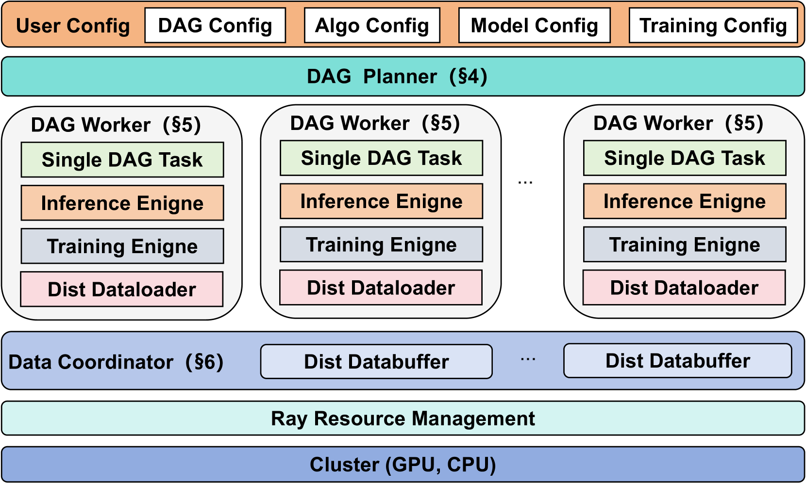

**Figure 1**: DistFlow architecture overview showing the multi-controller paradigm with DAG Planner, DAG Workers, and Data Coordinator working together to eliminate centralized bottlenecks.

## Key Technical Innovations [DAG][Async][Network]

### 1. Multi-Controller Architecture [DAG][Async][Network]

Traditional RL frameworks employ a **single-controller** architecture where a centralized node manages:
- Initial dataset loading
- Collection and dispatch of intermediate data between stages
- Overall execution coordination

This creates severe bottlenecks as all data flows through one node via "one-to-all" and "all-to-one" communication operations.

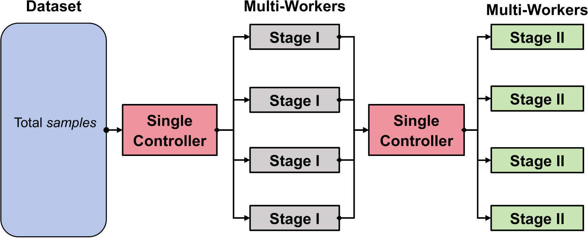

**Figure 2**: The single-controller bottleneck showing how all data operations flow through a centralized node, causing communication overhead and scalability limitations.

DistFlow's **multi-controller** paradigm:
- Distributes data loading, computation, and collection across all workers
- Eliminates the central node entirely
- Enables each worker to operate independently
- Achieves near-linear scalability through fully distributed execution

**Core breakthrough**: Decentralized dataflow eliminates both communication bottlenecks and single-point-of-failure risks

**Technical detail**: Each worker has its own controller and manages its portion of the dataflow, with coordination handled through distributed buffers rather than a central orchestrator

**Performance impact**: Up to 7x throughput improvement at scale, with the gap widening as GPU count increases

### 2. DAG-Defined Execution Pipeline [DAG][Runtime]

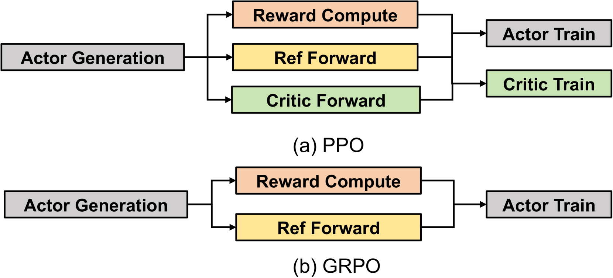

**Figure 3**: Popular RL algorithms modeled as DAGs - (a) Proximal Policy Optimization (PPO) and (b) Group Relative Policy Optimization (GRPO). Each node represents a computational operation, edges represent data dependencies.

DistFlow uses a **DAG Planner** that:
- Accepts user-defined DAG configuration files
- Decomposes parallel nodes into sequential execution chains
- Automatically serializes workflows to avoid resource contention
- Maps logical graphs to physical hardware resources

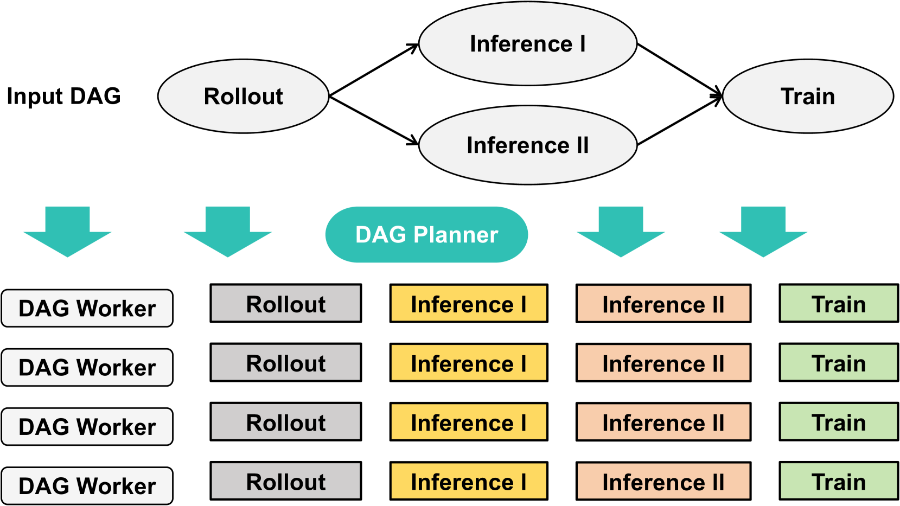

**Figure 4**: DAG Planner transforming parallel nodes (Inference I, Inference II) into a sequential execution chain to prevent resource conflicts in colocated architectures.

**Core breakthrough**: Complete separation of algorithmic logic from resource management

**Technical detail**: Users define workflows through high-level node abstractions (Role: ACTOR/CRITIC/REWARD/REFERENCE, Type: MODEL_INFERENCE/MODEL_TRAIN/COMPUTE), and the framework handles distributed scheduling automatically

### 3. Distributed Data Coordinator [Network][Batch]

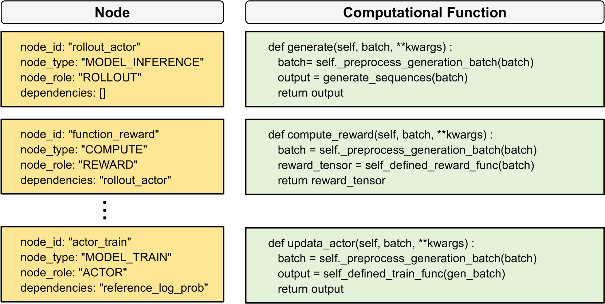

**Figure 5**: Dynamic function dispatch in DAG Worker - node definitions (Role + Type) are mapped to specific computational functions at runtime.

The Data Coordinator consists of two components:

#### Distributed Dataloader [Batch][Network]

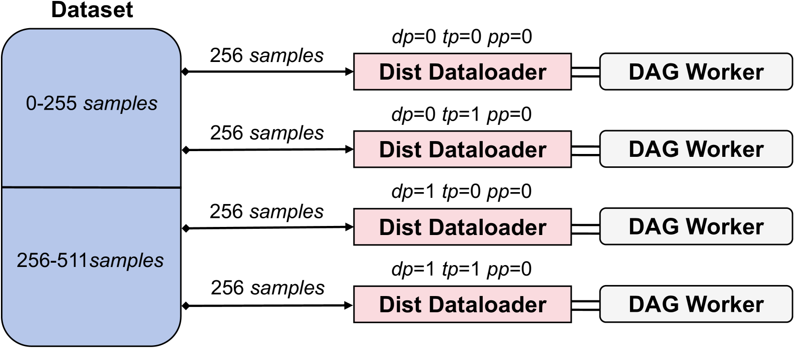

**Figure 6**: Distributed Dataloader workflow - each data-parallel worker group loads only its partition of the dataset, eliminating single-node loading bottlenecks.

- Each GPU has its own dataloader
- Dataset partitioned by DP rank
- Parallel loading eliminates initial bottleneck
- No redundant data across workers

#### Distributed Databuffer [Network][Sync]

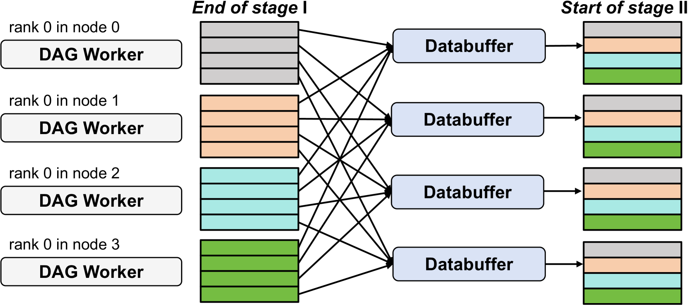

**Figure 7**: Data redistribution mechanism when DP size changes - all-to-all communication pattern re-partitions data across stages with different parallelism strategies.

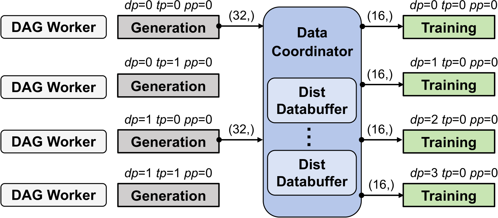

**Figure 8**: Complete Distributed Databuffer workflow showing data flow from Generation stage (DP=2, TP=2) to Training stage (DP=4).

**Core breakthrough**: Automatic parallelism-aware data redistribution between stages

**Technical detail**:
- One databuffer per node, shared by local workers
- Handles fast-path (DP unchanged) and redistribution (DP changed) scenarios
- All-to-all communication for re-partitioning
- Concatenates received partitions for correct batch sizes

### 4. DAG Worker Execution Model [Runtime][DAG]

Each DAG Worker follows a structured lifecycle:
1. **Initialization**: Load models, initialize engines (vLLM/SGLang/FSDP), bind functions to nodes
2. **Execution Loop**: For each iteration - request data batch → execute node chain → aggregate metrics

The **dynamic function dispatch** mechanism:
- Decouples node logical definition from implementation
- Enables modular, pluggable architecture
- Researchers can add new functions without modifying core framework
- Supports rapid algorithmic experimentation

## Performance Results [DAG][Async][Network]

### End-to-End Throughput

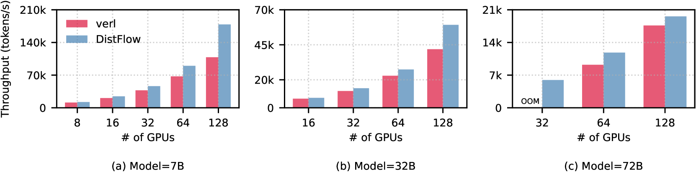

**Figure 9**: PPO throughput comparison - DistFlow achieves 1.09x to 1.64x speedup over baseline (verl), with advantage increasing at larger scales. Baseline fails with OOM on 72B model at 32 GPUs.

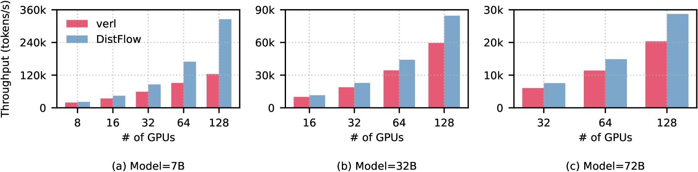

**Figure 10**: GRPO throughput comparison - DistFlow achieves up to 2.62x speedup, demonstrating superior performance on data-intensive workloads.

**Key results**:
- **PPO**: 1.09x - 1.64x speedup across all model sizes (7B, 32B, 72B)
- **GRPO**: Up to 2.62x speedup (data-intensive scenario)
- **OOM resilience**: DistFlow handles 72B model where baseline fails
- **Scaling advantage**: Speedup increases with GPU count

### Linear Scalability

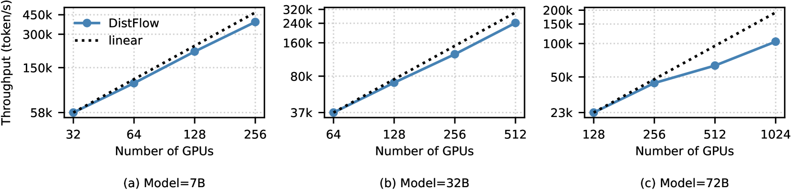

**Figure 11**: Near-linear scalability evaluation up to 1024 GPUs with VLM models using GRPO algorithm. For 32B model, performance at 512 GPUs retains 80.5% of throughput at 64 GPUs.

**Key results**:
- **Near-linear scaling** from 32 to 1024 GPUs
- **80.5% efficiency retention** when scaling 64→512 GPUs (32B model)
- Baseline cannot complete same tests due to OOM errors

### Maximum Batch Size Performance

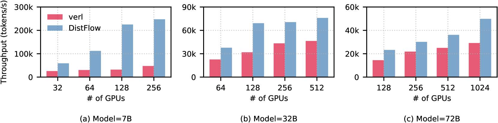

**Figure 12**: Performance comparison using baseline's maximum supported batch sizes - DistFlow achieves up to 7x speedup in multi-modal settings where baseline is severely constrained.

**Key result**: **Up to 7x speedup** when comparing at baseline's maximum feasible batch size

### Long-Context Performance

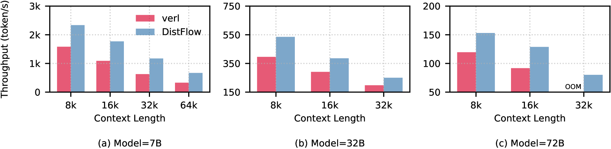

**Figure 13**: Long-context performance (8K-64K tokens) - DistFlow's advantage grows with context length. For 7B model, speedup increases from 1.48x at 8K to 2.03x at 64K. Baseline fails with OOM at 32K for 72B model.

**Key results**:
- Speedup grows from **1.48x (8K) → 2.03x (64K)** for 7B model
- Baseline OOM at 32K context for 72B model
- Distributed architecture excels at data-intensive long-context workloads

### Training Convergence

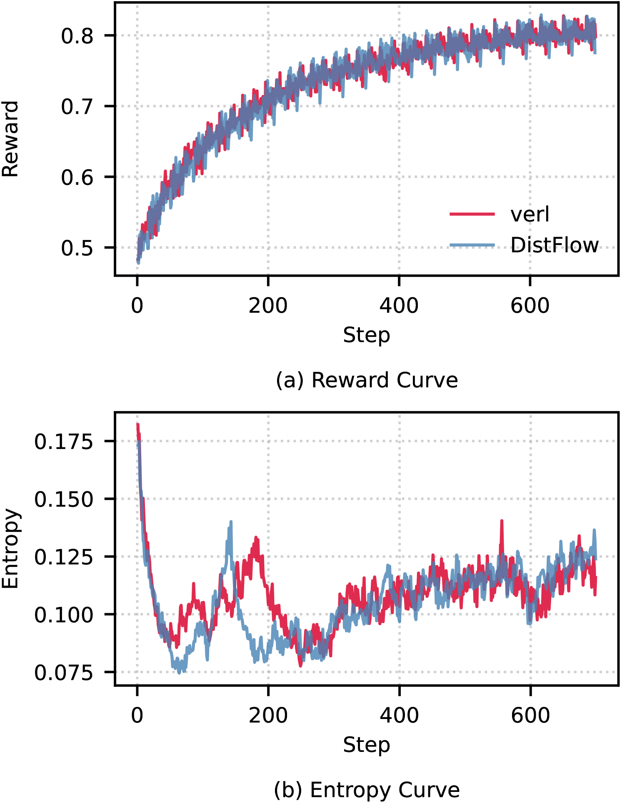

**Figure 14**: Reward and entropy curves comparison - DistFlow achieves identical convergence to baseline with 21% reduced total execution time (32B model, GRPO, 20 epochs).

**Validation**: Identical training curves confirm efficiency gains don't compromise model accuracy

## System Components [DAG][Runtime]

### 1. DAG Planner
- Receives user-defined DAG configuration
- Decomposes DAG into executable tasks
- Serializes parallel nodes to prevent resource conflicts
- Dispatches tasks to DAG Workers

### 2. DAG Worker
- Fundamental execution unit (one per GPU)
- Manages complete lifecycle: initialization → execution loop
- Dynamic function binding based on node Role/Type
- Integrates multiple engines: vLLM, SGLang, PyTorch FSDP, Megatron

### 3. Data Coordinator
- **Distributed Dataloader**: Parallel dataset loading by DP rank
- **Distributed Databuffer**: Automatic data redistribution between stages
- One instance per node, shared by local workers

## Technical Stack [Runtime][Network]

- **Framework**: PyTorch 2.6.0, CUDA 12.6, NCCL 2.21.5
- **Resource Management**: Ray for distributed execution
- **Training Engine**: PyTorch FSDP (future: Megatron)
- **Inference Engines**: vLLM 0.8.5, SGLang
- **Cluster**: 128 nodes × 8 NVIDIA Hopper GPUs with NVLink, RoCE v2 RDMA

## Evaluation Methodology [RL][Reasoning][MultiModal]

- **Models**: Qwen-2.5-Instruct (7B, 32B, 72B), Qwen-2.5-VL-Instruct (VLM)
- **Algorithms**: PPO, GRPO
- **Datasets**: DeepScaleR-Preview-Dataset (40K math problems), MM-Eureka-Dataset (multi-modal)
- **Baseline**: verl v0.4.0 (state-of-the-art RL training system)
- **Metrics**: Throughput (tokens/second), scalability, convergence accuracy

## Key Insights [DAG][Async][Network]

1. **Single-controller is the fundamental bottleneck** in existing RL frameworks - centralized dataflow doesn't scale beyond ~128 GPUs

2. **DAG-based modeling is natural for RL workflows** - PPO and GRPO map cleanly to DAG structure with clear data dependencies

3. **Data redistribution is critical** when parallelism strategies change between stages (e.g., Generation with TP to Training with different DP)

4. **Multi-modal and long-context workloads benefit most** from distributed dataflow - these data-intensive scenarios expose centralization bottlenecks

5. **Algorithmic flexibility matters** - DAG-defined pipelines enable rapid experimentation without framework modifications

## External Resources

- [Paper on arXiv](https://arxiv.org/abs/2507.13833)
- [HTML Version with Figures](https://arxiv.org/html/2507.13833v1)
- Related frameworks: [verl](https://github.com/volcengine/verl) (baseline comparison), [OpenRLHF](https://github.com/OpenRLHF/OpenRLHF), [DeepSpeed-Chat](https://github.com/microsoft/DeepSpeedExamples/tree/master/applications/DeepSpeed-Chat)

## Tags Breakdown

**System Topics [ST]**:
- `[DAG]` - Core execution model uses directed acyclic graphs
- `[Async]` - Multi-controller enables asynchronous, independent worker execution
- `[Batch]` - Distributed batching and data partitioning strategies
- `[Runtime]` - DAG Worker runtime with dynamic function dispatch
- `[Network]` - All-to-all communication patterns for data redistribution

**Training Phases [TP]**:
- `[RL]` - PPO and GRPO reinforcement learning algorithms
- `[Rollout]` - Actor generation phase with vLLM/SGLang inference engines
- `[Train]` - Policy update phase with FSDP training backend
- `[Sync]` - Data synchronization between stages with different parallelism

**Application [APP]**:
- `[Reasoning]` - Evaluated on math problems (DeepScaleR dataset)
- `[MultiModal]` - VLM experiments with Qwen-2.5-VL on MM-Eureka dataset
