# AsyncFlow: An Asynchronous Streaming RL Framework for Efficient LLM Post-Training

[ST][Async][Runtime][Network][Batch] | [TP][RL][Rollout][Train][Sync] | [APP][Reasoning][MultiModal]

## Summary

AsyncFlow is an asynchronous streaming reinforcement learning framework built on a task-separated architecture that addresses scalability bottlenecks in LLM post-training. The framework introduces **TransferQueue**, a distributed data storage and transfer module that enables fully streamed dataflow with centralized management, combined with a **producer-consumer-based asynchronous workflow** that minimizes computational idleness through delayed parameter updates. AsyncFlow achieves up to 2.03× throughput improvement over state-of-the-art baselines while maintaining algorithmic convergence, with superior linear scaling efficiency (0.65-0.88) across large-scale clusters.

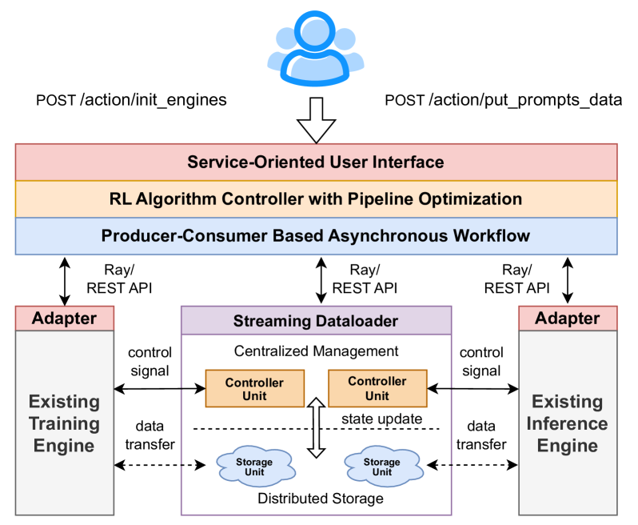

**Figure 1**: AsyncFlow framework overview showing the task-separated architecture with streaming dataflow management across training and inference clusters.

## Key Technical Innovations [Async][Runtime][Network]

### 1. Hierarchical Architecture Design [ST][Runtime][Network]

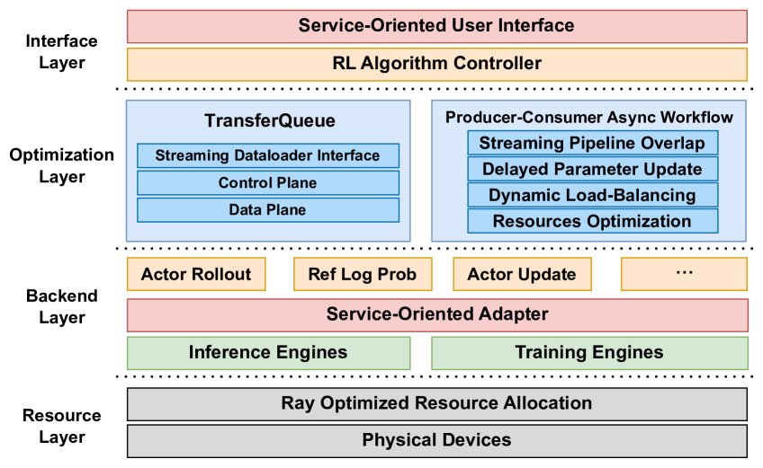

**Figure 2**: Four-layer hierarchical architecture of AsyncFlow - Resource Layer (Ray), Backend Layer (heterogeneous adapters), Optimization Layer (TransferQueue + async workflow), and Interface Layer (service-oriented APIs).

**Core breakthrough**: Complete architectural separation of concerns enabling flexibility and scalability

**Technical details**:
- **Resource Layer**: Ray-based distributed resource management with execution-time simulator pre-optimization
- **Backend Layer**: Modular adapters for heterogeneous training/inference engines (FSDP, DeepSpeed, vLLM, custom backends)
- **Optimization Layer**: TransferQueue for dataflow + async workflow for resource utilization
- **Interface Layer**: Service-oriented APIs bridging academic research and industrial deployment

**Performance impact**: Enables seamless integration with existing infrastructure while maintaining algorithmic flexibility

### 2. TransferQueue: Distributed Asynchronous Streaming Dataloader [Async][Network][Batch]

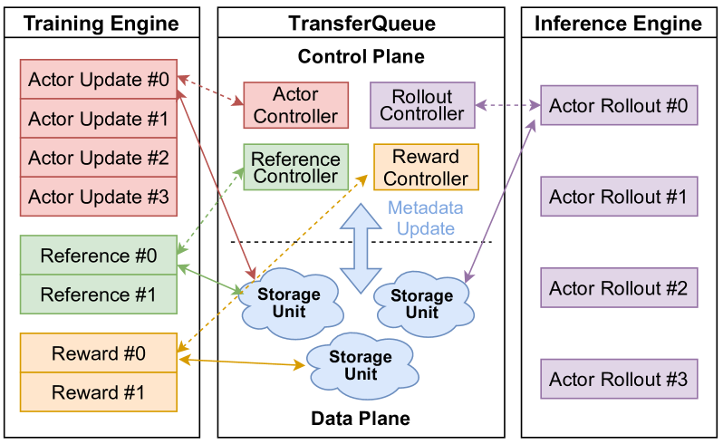

**Figure 3**: TransferQueue architecture showing control plane (controllers) and data plane (storage units) separation. Each DP group interacts with controllers for metadata coordination, then executes read/write with storage units.

#### 2.1 Control Plane: Centralized Data Management [Network][Runtime]

**Core breakthrough**: Unified data management eliminates complex cross-instance dependency chains

**Technical details**:
- Each RL task has dedicated **TransferQueue controller** maintaining metadata for all training samples
- Metadata includes: storage location, data status (0=unavailable, 1=ready), consumption records
- Controllers operate independently across RL tasks to avoid algorithmic interference
- Dynamic batch assembly from available data based on load-balancing policies
- Consumption tracking prevents duplicate access across DP groups within same task

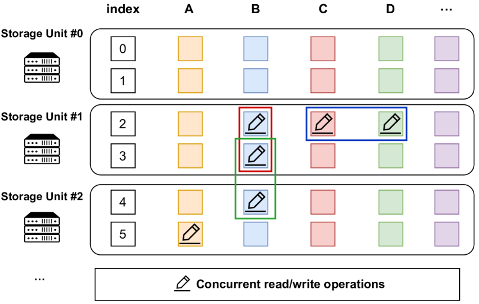

**Figure 4**: TransferQueue data structure - 2D columnar design with rows as complete samples (addressable by global index) and columns as task-specific components (prompts, responses, log probs, etc.).

**Key advantages**:
- **Automated pipeline overlapping**: Downstream tasks access partial data without waiting for complete dataset
- **Dynamic load-balancing**: Faster instances request more data based on availability
- **Simplified programming model**: No manual dataflow definition across DP groups needed
- **Proactive balancing**: Equitable token distribution across DP groups minimizes actor update idling

#### 2.2 Data Plane: Distributed Storage and Transfer [Network][Batch]

**Core breakthrough**: Software-defined networking approach decouples control from data plane

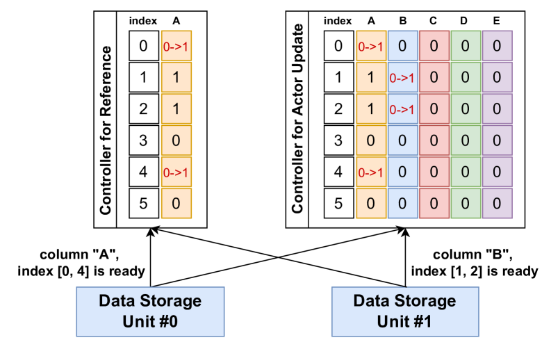

**Figure 5**: Metadata notification process - when data is written to storage units, they broadcast global indices and column identifiers to all registered controllers.

**Technical details**:
- **Distributed storage**: Each storage unit maintains subset of rows to amortize overhead
- **2D columnar structure**: Columns for task-specific data, rows for complete samples with global indices
- **Concurrent operations**: Support concurrent read/write at distinct positions
- **Atomic writes**: Data consistency guaranteed through metadata-based atomic operations
- **Variable-length support**: Eliminates unnecessary padding, minimizes communication overhead

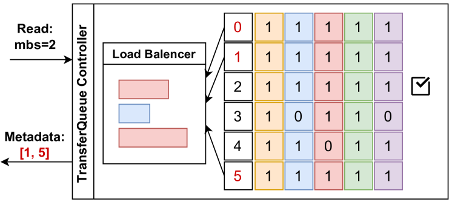

**Figure 6**: TransferQueue controller scheduling - red indexes indicate samples satisfying RL task requirements (all columns=1), checkmarks indicate consumed samples.

#### 2.3 High-Concurrency Design [Async][Network]

**Scalability optimizations**:

1. **Separation of concerns**: Control plane scheduling and data plane I/O execute concurrently (pipelined workflow)

2. **Single-rank communication**: Only one rank per DP group interfaces with TransferQueue, then broadcasts to other ranks using HCCL

3. **Variable-length optimization**: Tensors concatenated along sequence dimension with length metadata restoration, avoiding padding overhead

```python
# TransferQueue usage example (Code 1 from paper)
def generate_sequences(self):
    # Define data columns and initialize TransferQueue
    experience_consumer_stage = 'actor_rollout'
    experience_columns = ['prompts', 'prompt_length']
    experience_count = self.rl_config.rollout_dispatch_size

    data_loader = self.create_stream_data_loader(
        experience_consumer_stage=experience_consumer_stage,
        experience_columns=experience_columns,
        experience_count=experience_count,
        use_vllm=True,
        pad_to_multiple_of=self.generate_config.infer_tensor_parallel_size,
    )
    data_iter = iter(data_loader)

    for batch_data, index in data_iter:
        # Do inference
        prompts_data = batch_data['prompts']
        responses = self.rollout.generate_sequences(prompts_data)
        # Write generated responses to TransferQueue
        self.collect_transfer_queue_data(responses, index)
```

### 3. Producer-Consumer Asynchronous Workflow Optimization [Async][TP][Sync]

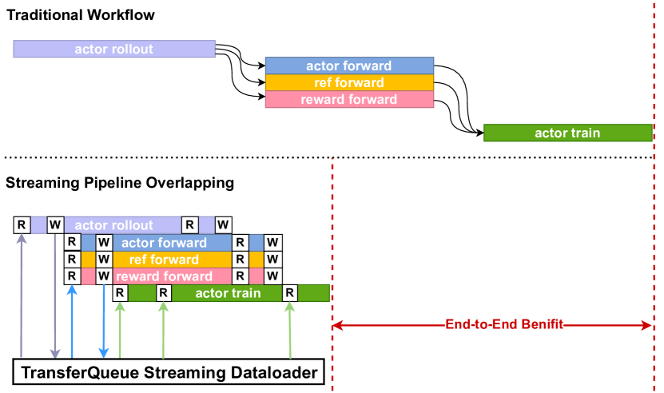

**Figure 7**: Streaming pipeline overlapping enabled by TransferQueue - RL tasks can access partial data as soon as available rather than waiting for complete dataset.

#### 3.1 Asynchronous Off-Policy Bubble Reduction [Async][RL][Sync]

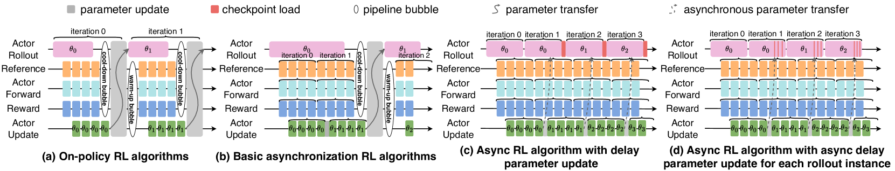

**Figure 8**: Evolution of RL workflow efficiency - (a) on-policy with warm-up/cool-down bubbles, (b) asynchronous off-policy extending stable phase, (c) delayed parameter update mechanism enabling nearly infinite stable phase, (d) sub-step asynchrony with sequential parameter updates.

**Core breakthrough**: Delayed parameter update eliminates pipeline bubbles while maintaining convergence

**Technical evolution**:

**Traditional On-Policy (Fig 8a)**:
- Strict synchronization between actor rollout and actor update
- Warm-up and cool-down bubbles create significant idle time
- Identical parameter states ensure convergence

**Asynchronous Off-Policy (Fig 8b)**:
- Enlarged global batch size allows stale parameter usage
- Extends stable phase, reduces bubble proportion
- Version differences constrained by convergence requirements

**Delayed Parameter Update (Fig 8c)** - **AsyncFlow's key innovation**:
- Defers parameter update by one step
- Rollout continues with old weights during update transition
- New parameters asynchronously written to host memory
- Loading to NPUs only after current generation completes
- **Nearly infinite stable phase** by eliminating warm-up/cool-down
- Exposed synchronization reduced to fast H2D transmission

**Sub-Step Asynchrony (Fig 8d)** - **Future work**:
- Sequential parameter updates across abundant rollout instances
- Remaining instances continue fulfilling downstream data requirements
- Most recently updated parameters generate part of data
- Minimizes checkpoint loading overhead

#### 3.2 Parameter Update Overlapping [Network][Async]

**WeightSender/WeightReceiver architecture**:

- **Synchronous mode**: Actor rollout blocked by parameter update, uses high-bandwidth HCCL links
- **Asynchronous mode**: Model weights offloaded to host, transmitted over network, decoupled from computation
- **Key benefit**: Parameter update neither stalls nor interferes with ongoing computational tasks

#### 3.3 Task Resource Planning [Runtime][Batch]

**Graph-based optimization module**:

- **Hybrid cost model**: Combines analytical (fast, theoretical) and profiling (accurate, expensive) methods
- **Search optimization**: Finds optimal resource allocation under constraints
- **Block-level profiling**: Actual execution on training/inference tasks for precision
- **Analytical estimation**: Hardware specifications + theoretical computation/communication volumes for speed

### 4. Service-Oriented User Interface [ST][Runtime]


**Figure 9**: Service-oriented user interface architecture - User-Level (algorithm controller) and Backend-Level (engine adapters) providing clear separation of concerns.

#### 4.1 User-Level Interface [Runtime][TP]

**Trainer class - Unified algorithm controller**:

```python
# Key APIs for industrial automation
- init_engines(): Initialize training and inference engines
- put_prompts_data(): Load prompt dataset to system
- put_experience_data() / get_experience_data(): Coordinate experience data between engines
- weight_sync_notify(): Notify weight updates across engines
```

**Research-focused design**:
- Centralized entry point for algorithm development
- Organizes critical RL tasks: `generate_sequences`, `update`
- Easy modification of core algorithms through Trainer class
- Rapid experimentation through standardized APIs

#### 4.2 Backend-Level Interface [ST][Runtime]

```python
# Backend adapter abstraction (Code 2 from paper)
class RLAdapter:
    pass

class MindSpeedAdapter(RLAdapter):
    def __init__(self, forward_backward_func, model, batches, forward_step):
        self.forward_backward_func = forward_backward_func
        self.forward_step = forward_step
        self.model = model
        self.batches = batches
        ...

    # Abstraction for RL task: compute_log_prob
    def compute_log_prob(self):
        ...
        losses_reduced = self.forward_backward_func(
            forward_step_func=self.forward_step,
            data_iterator=iter(self.batches),
            model=self.model,
            micro_batch_size=self.micro_batch_size,
            forward_only=True,
            collect_non_loss_data=True,
        )
        ...

class VLLMAdapter(RLAdapter):
    pass
```

**Key benefits**:
- **Modular abstraction**: Decouples algorithm logic from execution engines
- **Backend flexibility**: Supports FSDP, DeepSpeed, vLLM, custom frameworks
- **Industrial deployment**: Seamless integration with existing clusters
- **Clear separation**: Researchers use high-level APIs, engineers optimize low-level implementation

## Performance Results [Async][Network]

### End-to-End Throughput Analysis

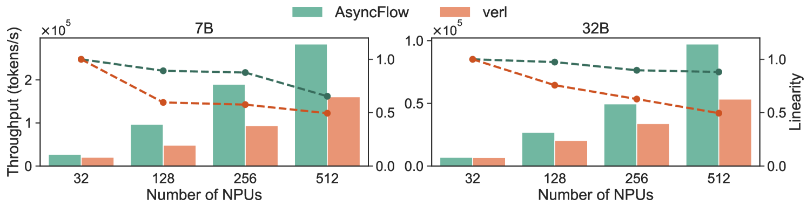

**Figure 10**: End-to-end throughput comparison across varying cluster sizes (32-1024 NPUs) and model sizes (7B, 32B). AsyncFlow achieves 1.59× average speedup, with peak 2.03× on 256 NPUs for 7B model.

**Key results**:
- **Average improvement**: 1.59× throughput gain across all configurations
- **Peak performance**: 2.03× speedup for 7B model on 256 NPUs
- **512 NPU scaling**: 1.76× (7B) and 1.82× (32B) speedup
- **Small-scale efficiency**: 33.4% improvement even at 32 NPUs
- **Linear scaling efficiency**: 0.65 (7B) and 0.88 (32B) when cluster expands 16×

**Comparison to task-collocated baseline (verl)**:
- AsyncFlow consistently outperforms across all configurations
- Performance gap widens at larger scales
- Superior adaptability to resource-constrained environments

### Ablation Studies

| No. | Setting | Normalized Throughput |
|-----|---------|----------------------:|
| ➀ | Baseline (conventional task-separated) | 1.00× |
| ➁ | + TransferQueue | 2.01× |
| ➂ | + Async workflow optimization | 2.74× |

**Breakdown analysis** (7B model, 512 NPUs):

1. **Baseline**: Sequential execution, one task at a time, significant idling
2. **TransferQueue alone**: 2.01× throughput through fine-grained overlapping
3. **Full AsyncFlow**: Additional 36.3% improvement from async workflow + delayed parameter update

### Optimized Workflow Analysis

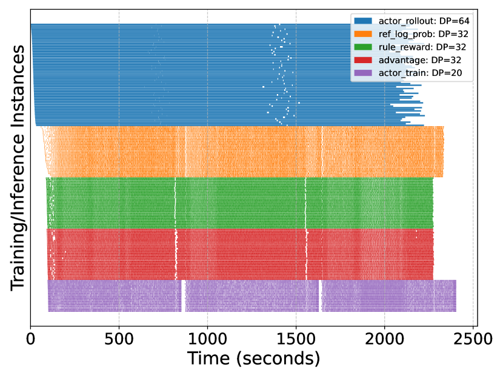

**Figure 11**: Gantt chart of AsyncFlow execution timeline (32B model, 512 NPUs, iterations 0-3). RL tasks achieve substantial parallelism with minimal inter-task idle times, validating task-separated framework efficiency.

**Key observations**:
- Substantial parallelism across training and inference instances
- Minimal inter-task idle time through optimized dataflow scheduling
- Validates task-separated frameworks balance resource utilization and scalability

### Algorithmic Stability

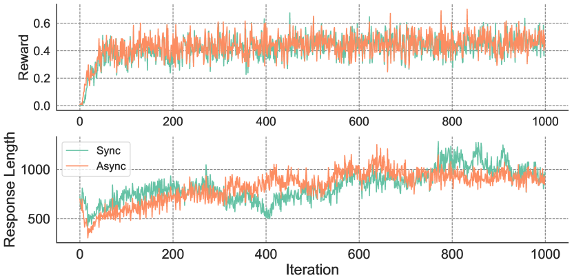

**Figure 12**: Reward and average response length comparison between asynchronous and synchronous RL workflows (7B model, 16 NPUs). Negligible difference in reward scores with converging variance.

**Validation**: Asynchronous workflow maintains model performance while achieving significant throughput gains

## System Architecture Summary [ST][Runtime]

### Hardware Configuration
- **Platform**: Ascend NPU clusters (16 NPUs per node, 2880 GB system memory)
- **Software**: Ascend Extension for PyTorch 7.0.0 (PyTorch 2.5.1), CANN 8.1.RC1
- **Backends**: vLLM-Ascend 0.7.3 (inference), MindSpeed (training)

### Evaluation Methodology [TP][APP]

**Models**: Qwen2.5 series (7B, 32B parameters)

**Algorithm**: Group Relative Policy Optimization (GRPO)
- Eliminates separate critic model
- Estimates advantages through group-relative comparisons
- Validated by DeepSeek-R1 success

**Dataset**: DeepScaleR (40K+ mathematics problems from AIME, AMC)
- Same dataset used by state-of-the-art frameworks

**Baseline**: verl (Hybridflow)
- State-of-the-art task-collocated framework
- 3D-HybridEngine for resharding reduction
- Adapted for Ascend NPU platform

## Key Insights [Async][Network]

1. **Task-separated architectures excel at scale**: Superior linearity (0.65-0.88) compared to task-collocated frameworks as cluster size increases

2. **Centralized data management enables automation**: TransferQueue's unified view eliminates complex cross-instance dependency chains, enabling automated load-balancing and pipeline overlapping

3. **One-step asynchrony is the sweet spot**: Delayed parameter update with single-step staleness eliminates bubbles while maintaining convergence, with performance dropping logarithmically beyond this threshold

4. **Control/data plane separation enables scalability**: Inspired by SDN, this decoupling allows independent scaling of scheduling logic and I/O operations

5. **Service-oriented APIs bridge research and production**: Two-level abstraction (algorithm controller + backend adapters) enables rapid academic iteration while supporting industrial deployment requirements

## DAG-Specific Considerations [DAG][Async]

While AsyncFlow doesn't explicitly model RL workflows as DAGs, its architecture inherently supports DAG-based execution patterns:

1. **TransferQueue as DAG executor**: Dynamic dataflow routing across tasks enables implicit DAG execution without explicit graph definition

2. **Producer-consumer pattern**: Natural fit for DAG execution where producer nodes (actor rollout) feed consumer nodes (actor update, reward inference)

3. **Pipeline overlapping**: Enables parallel execution of independent DAG branches while respecting data dependencies

4. **Fine-grained scheduling**: Sample-level granularity allows more sophisticated DAG-aware scheduling than traditional iteration-level parallelism

## External Resources

- [Paper on arXiv](https://arxiv.org/abs/2507.01663)
- [HTML Version with Figures](https://arxiv.org/html/2507.01663v1)
- [MindSpeed-RL Framework](https://gitee.com/ascend/MindSpeed-RL) - Huawei's Ascend-powered RL post-training framework
- Related frameworks: [verl/Hybridflow](https://github.com/volcengine/verl), [OpenRLHF](https://github.com/OpenRLHF/OpenRLHF), [StreamRL](https://arxiv.org/abs/2504.15930)

## Tags Breakdown

**System Topics [ST]**:
- `[Async]` - Core innovation: asynchronous streaming dataflow and delayed parameter updates
- `[Runtime]` - Four-layer hierarchical architecture with service-oriented interfaces
- `[Network]` - Distributed data management, control/data plane separation
- `[Batch]` - Dynamic batching with load-balancing and variable-length support

**Training Phases [TP]**:
- `[RL]` - GRPO (Group Relative Policy Optimization) algorithm implementation
- `[Rollout]` - Actor rollout with asynchronous parameter updates
- `[Train]` - Actor update with pipelined weight synchronization
- `[Sync]` - One-step asynchrony balancing efficiency and convergence

**Application [APP]**:
- `[Reasoning]` - Evaluated on DeepScaleR mathematics dataset (AIME, AMC)
- `[MultiModal]` - Architecture supports multi-modal post-training (extension point)

## Comparison to Related Work

| Framework | Architecture | Key Innovation | AsyncFlow Advantage |
|-----------|--------------|----------------|---------------------|
| **DeepSpeed-Chat** | Task-collocated | Time-sharing scheduling | Eliminates resharding overhead |
| **OpenRLHF** | Task-separated | Ray orchestration | Automated pipeline overlapping via TransferQueue |
| **verl** | Task-collocated | 3D-HybridEngine | Superior scalability at large clusters (2.03× vs 1.76×) |
| **StreamRL** | Task-separated | Streaming rollout + length predictor | Centralized data management + sub-step asynchrony |
| **AsyncFlow** | Task-separated | TransferQueue + delayed update | Best of both: streaming efficiency + async workflow |

**Unique AsyncFlow capabilities**:
1. TransferQueue's centralized data management with distributed storage
2. Delayed parameter update enabling nearly infinite stable phase
3. Service-oriented two-level interface (user + backend)
4. Ascend NPU optimization with HCCL-based communication
