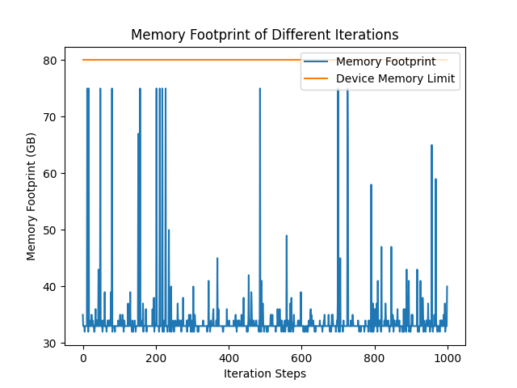
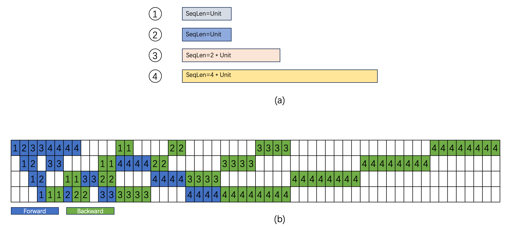
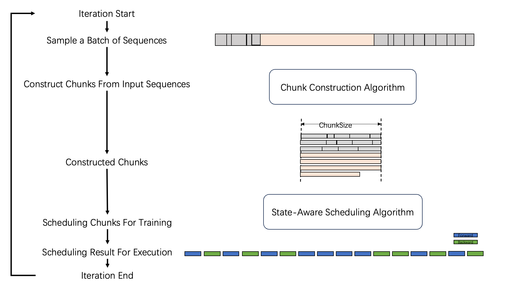
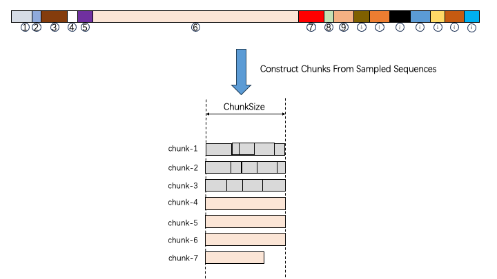
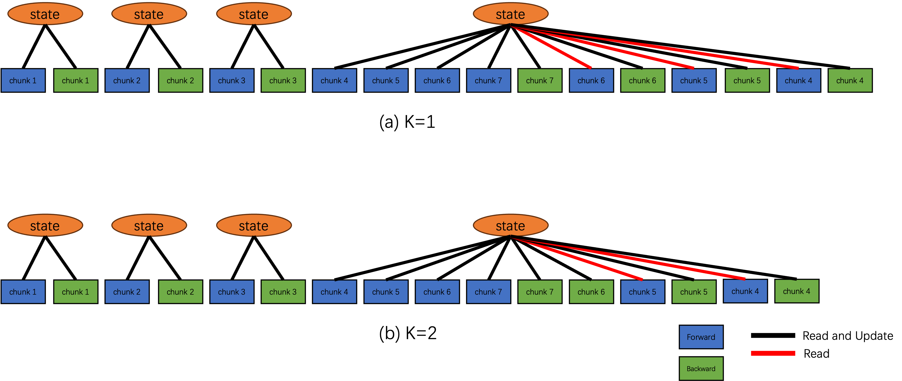
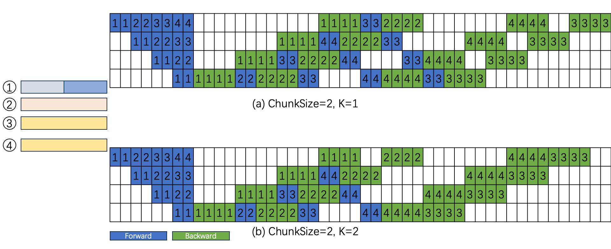
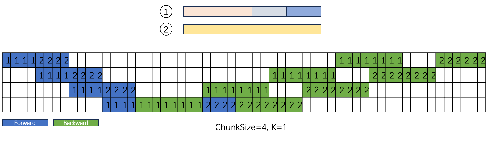
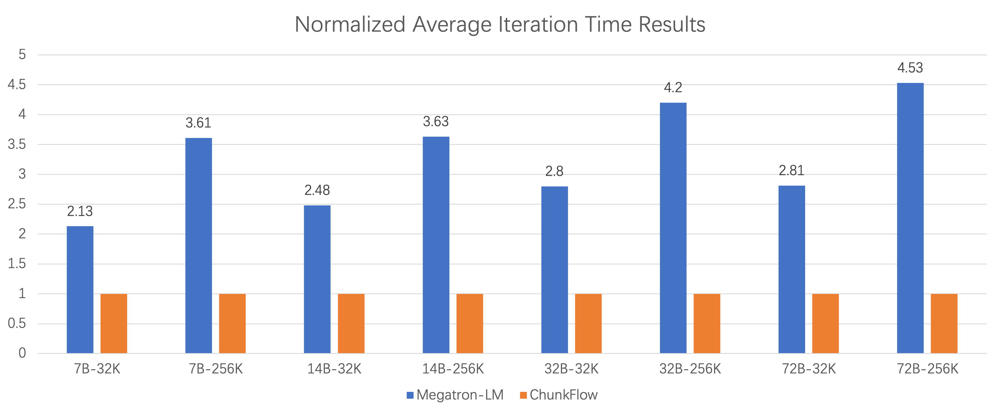

# ChunkFlow: Efficient Long Context Fine-tuning via Uniform Chunking

[ST][Chunk][Runtime][GPU][Batch] | [TP][SFT][Train] | [APP][Reasoning][MultiModal]

## Summary

ChunkFlow is a chunk-centric training method for long context fine-tuning of large language models that addresses the unique challenges posed by long-tailed sequence length distributions in fine-tuning datasets. By reorganizing variable-length input sequences into uniformly sized chunks through consolidation of short sequences and splitting of long ones, ChunkFlow achieves optimal computational efficiency and balanced memory usage. The framework introduces a state-aware chunk scheduling mechanism that ensures peak memory consumption is determined by chunk size rather than maximum sequence length, and integrates with pipeline parallelism through state-aware 1F1B scheduling. Experimental results demonstrate up to **4.53× speedup** compared to Megatron-LM baseline.

## Key Technical Innovations [Chunk][Runtime][GPU]

### 1. Problem: Long-Tailed Distribution in Long Context Fine-Tuning [Chunk][GPU]

**Observation 1: Extremely Long-Tailed Sequence Length Distribution**

| Dataset | Sequences < 4K | Longest Sequence |
|---------|---------------|------------------|
| LMSysChat1M | >99% | ~300K tokens |
| Llama3 Training | 99.89% (<1K avg) | 0.11% (~37K avg) |

**Key insight**: Existing approaches designed for long sequences severely underutilize GPU resources when processing predominantly short sequences.



**Figure 1**: Memory footprints across 1000 consecutive training micro-steps for Qwen2.5-7B on LMSysChat1M with 32K context length. Peak memory reaches 75GB, but 97.7% of micro-steps consume <45GB - demonstrating severe underutilization.

**Observation 2: GPU Resource Underutilization**

When fine-tuning with 256K context length:
- Must allocate 16 GPUs to handle sequences >32K (only 0.013% of dataset)
- 65% performance drop for sequences <32K due to computation partitioning across 16 GPUs vs 4 GPUs

**Observation 3: Variable Lengths Cause Pipeline Bubbles**



**Figure 2**: (a) Four sequences with different lengths (Unit, 2×Unit, 4×Unit). (b) Standard 1F1B scheduling yields 57.14% bubble ratio vs 42.8% theoretical for equal-length sequences - variable lengths significantly exacerbate pipeline bubbles.

### 2. ChunkFlow: Chunk-Centric Training Method [Chunk][Runtime][Batch]



**Figure 3**: Overall ChunkFlow workflow - (1) Chunk Construction reorganizes sequences into uniform chunks, (2) State-Aware Scheduling manages chunks through forward/backward passes, (3) Integration with pipeline parallelism (1F1B) for distributed training.

**Core breakthrough**: Uniform chunk sizing eliminates memory bottlenecks and pipeline inefficiencies caused by variable sequence lengths

**Technical approach**:
1. **Chunk Construction**: Bin-packing algorithm consolidates short sequences and splits long ones
2. **State-Aware Scheduling**: Ensures memory scales with K×ChunkSize, not max sequence length
3. **Pipeline Integration**: State-aware 1F1B reduces bubble ratio for variable-length sequences

#### 2.1 Chunk Construction Algorithm [Chunk][Batch]

**Algorithm 1: ChunkConstructionAlgorithm**

```
Input: ChunkSize, List[sequence]
Output: ResultChunks: List[Chunk]

1. LongSequences ← Select sequences longer than ChunkSize
2. ShortSequences ← Select sequences shorter than ChunkSize

3. For each Sequence in LongSequences:
    Divide Sequence by ChunkSize into multiple chunks
    Append chunks to ResultChunks

4. For BinCnt = 1, ..., size_of(ShortSequences):
    Try binpacking ShortSequences into BinCnt bins
    with ChunkSize as max weight limit
    If successful, take result and break

5. For each Bin in ResultBins:
    Pack sequences in Bin into single chunk
    Add to ResultChunks
```

**Key design principles**:
- Treat chunk construction as bin-packing with two constraints: number of bins and max weight
- Prioritize minimizing bins to maximize GPU computation efficiency
- Split sequences exceeding ChunkSize into uniform-sized chunks



**Figure 4**: Chunk construction result from batch of 16 input sequences. Sequence 6 is split into 4 chunks (Chunk 4-7), while shorter sequences are packed into 3 chunks (Chunk 1-3).

#### 2.2 State-Aware Chunk Scheduling [Chunk][Runtime][GPU]

**Algorithm 2: ChunkSchedulingAlgorithm**

```
Input: DependentChunks = List[Chunk], K
State: StateStore for sharing states across chunks
Output: LossList for gradient accumulation

IF size_of(DependentChunks) <= K THEN
    // Simple case: fewer chunks than K
    For each Chunk in DependentChunks:
        Loss = model(Chunk, StateStore)
        Append Loss to LossList

    For each Loss in reversed(LossList):
        backward_with_gradient_accumulation(Loss)

ELSE
    // Complex case: more chunks than K
    // First pass: forward with selective activation storage
    For each Chunk in DependentChunks:
        Loss = model(Chunk, StateStore)
        IF Chunk.Idx >= K THEN
            Append Loss to LossList
        ELSE
            Discard activations for Chunk

    // Second pass: backward for stored losses
    For each Loss in reversed(LossList):
        backward_with_gradient_accumulation(Loss)

    // Third pass: recompute and backward for discarded chunks
    For each Chunk in DependentChunks:
        IF Chunk.Idx < K THEN
            Loss = model(Chunk, StateStore)
            backward_with_gradient_accumulation(Loss)
```

**Core breakthrough**: Memory consumption scales with K×ChunkSize, not original sequence length

**Technical details**:
- **Standalone chunks**: Complete sequences, processed independently
- **Dependent chunks**: Segments from split long sequences, require state sharing
- **Causal attention property**: Forward passes in ascending order (need previous KV), backward in descending (need subsequent gradients)
- **Selective recomputation**: First N-K chunks execute twice, activations discarded on first pass
- **StateStore**: Shares key/value tensors across chunks from same sequence



**Figure 5**: Chunk scheduling results with (a) K=1 and (b) K=2. When K=1, Chunk 3 executes twice, at most one chunk's activation stored at any time. K=2 retains two activations for higher memory but better performance.

#### 2.3 State-Aware 1F1B Pipeline Scheduling [Chunk][Runtime]



**Figure 6**: State-aware 1F1B scheduling with ChunkSize=2×Unit for (a) K=1 and (b) K=2. Compared to baseline (57.14% bubble ratio), achieves 54.1% (K=1) and 47.8% (K=2) - 8% and 12% efficiency improvements respectively.

**Integration with pipeline parallelism**:

Standard 1F1B on variable sequences: 57.14% bubble ratio
- State-aware 1F1B (K=1): 54.1% bubble ratio (**8% improvement**)
- State-aware 1F1B (K=2): 47.8% bubble ratio (**12% improvement**)

**Key insight**: Uniform chunk sizes enable predictable pipeline scheduling, reducing bubbles

### 3. Parameter Tuning: ChunkSize and K [Chunk][GPU]



**Figure 7**: Unsuitable ChunkSize and K leads to performance degradation. ChunkSize=4×Unit, K=1 produces only 2 chunks, increasing bubble ratio to 60% and causing 15% performance degradation vs standard 1F1B.

**Parameter selection guidelines**:

| Scenario | ChunkSize | K | Rationale |
|----------|-----------|---|-----------|
| No pipeline parallelism | Maximize within memory | 1 | Maximize GPU utilization |
| With pipeline parallelism | Grid search | Grid search | Balance bubbles vs efficiency |

**Trade-offs**:
- **Too large ChunkSize**: Fewer chunks → more pipeline bubbles → degraded performance
- **Too small ChunkSize**: Reduced bubbles but poor GPU computational efficiency
- **Too large K**: Higher memory consumption
- **Too small K**: More recomputation overhead

**Optimization approach**: Grid search for (ChunkSize, K) combination that minimizes iteration time

### 4. Memory Consumption Characteristics [Chunk][GPU]

**Table 5: Memory Consumption by Context Length and ChunkSize**

| Context Length | ChunkSize | Peak Memory |
|----------------|-----------|-------------|
| 32K | 8K | ~57GB |
| 32K | 16K | ~68GB |
| 256K | 8K | ~60GB |
| 256K | 16K | ~73GB |

**Key observation**: Memory primarily determined by ChunkSize, not max sequence length in dataset

**Note**: Slightly higher memory for 256K vs 32K with same ChunkSize due to storing all key/value tensors without offloading optimization (future work)

## Performance Results [Chunk][Runtime][GPU]

### End-to-End Training Performance



**Figure 8**: Normalized end-to-end training performance for Qwen2.5 models (7B-72B) with 32K and 256K context lengths. ChunkFlow achieves up to 4.53× speedup over Megatron-LM baseline.

**Table 3: Baseline Parallel Strategies (Megatron-LM)**

| Model | Context | TP | SP | PP | Recomputation |
|-------|---------|----|----|----|---------------|
| 7B | 32K | 4 | 4 | 1 | Selective |
| 7B | 256K | 4 | 4 | 4 | Full |
| 14B | 256K | 4 | 4 | 4 | Full |
| 32B | 256K | 4 | 8 | 4 | Full |
| 72B | 256K | 8 | 8 | 4 | Selective |

**Table 4: ChunkFlow Optimal Parameters**

| Model | Context | ChunkSize | K | Strategy |
|-------|---------|-----------|---|----------|
| 7B | 32K | 8K | 1 | <4,4,1,selective> |
| 7B | 256K | 2K | 16 | <4,4,4,selective> |
| 14B | 256K | 4K | 8 | <4,4,4,selective> |
| 32B | 256K | 4K | 8 | <4,4,4,selective> |
| 72B | 256K | 8K | 4 | <8,8,4,selective> |

**Key results**:

| Model | Context | Speedup | Notes |
|-------|---------|---------|-------|
| 7B | 32K | 2.38× | Selective recompute vs baseline |
| 7B | 256K | 4.53× | No full recompute needed |
| 14B | 256K | 3.76× | No full recompute needed |
| 32B | 256K | 3.21× | No full recompute needed |
| 72B | 256K | 1.67× | Same selective recompute as baseline |

**Performance gains attributed to**:
1. **Short sequence consolidation**: Dramatically improves computational efficiency
2. **State-aware 1F1B**: Reduces pipeline bubbles
3. **Memory predictability**: Eliminates full recomputation for 256K context (7B-32B)
4. **Uniform chunk sizing**: Optimal GPU utilization regardless of input distribution

### Parameter Sensitivity Analysis

**Table 6: Impact of ChunkSize and K (7B, 256K context, <4,4,4,selective>)**

| ChunkSize | K | Performance | Analysis |
|-----------|---|-------------|----------|
| 2K | 16 | Suboptimal | Chunks too small, poor GPU efficiency |
| 4K | 8 | Good | Balanced |
| 8K | 4 | **Optimal** | Best trade-off |
| 16K | 2 | Good | Fewer chunks but efficient |
| 32K | 1 | Degraded | Too few chunks, more bubbles |

Maintains ChunkSize×K constant (32K) to ensure same total activation storage

**Configuration**: 7B model, 256K context, <4,4,4,selective> strategy

## Evaluation Methodology [TP][APP]

### Dataset Characteristics

**Table 2: Sequence Length Distribution in Evaluation Dataset**

| Range | Percentage |
|-------|------------|
| < 1K tokens | ~90% |
| 1K - 4K tokens | ~8% |
| 4K - 32K tokens | ~2% |
| > 32K tokens | <0.1% |

Similar distribution to LMSysChat1M with slightly higher proportion of >32K and <1K sequences

### Hardware Configuration

- **Platform**: Alibaba Cloud ml.gu7ef.8xlarge-gu100 instances
- **Global batch size**: 256
- **Micro-batch size**: 1

### Models and Baselines

- **Models**: Qwen2.5 series (7B, 14B, 32B, 72B)
- **Baseline**: Megatron-LM (state-of-the-art LLM training system)
- **ChunkFlow**: Built on Megatron-LM with chunk-centric modifications

## System Architecture [ST][Runtime][Chunk]

### Parallelism Strategies

**Tensor Parallelism (TP)**: Divides individual layers across devices
**Sequence Parallelism (SP)**: Distributes long sequences across devices
**Pipeline Parallelism (PP)**: Splits model into sequential stages

**Key innovation**: ChunkFlow integrates with all three through state-aware scheduling

### Memory Management

**Traditional approach**:
- Memory scales with max sequence length in dataset
- Requires full recomputation for long contexts
- Severe underutilization for short sequences

**ChunkFlow approach**:
- Memory scales with K×ChunkSize (configurable)
- Selective recomputation sufficient
- Predictable, consistent memory usage

## Key Insights [Chunk][Runtime]

1. **Long-tailed distribution is fundamental**: Long context fine-tuning datasets are overwhelmingly short sequences with rare very long ones - systems must be designed for this reality

2. **Uniform chunk sizing is transformative**: By consolidating short and splitting long sequences into uniform chunks, achieve both optimal memory usage and computational efficiency

3. **State-aware scheduling enables scalability**: Selective activation storage with recomputation ensures memory doesn't scale with sequence length

4. **Pipeline bubbles exacerbated by variable lengths**: Standard 1F1B designed for equal-length workloads performs poorly on variable sequences - state-aware variant essential

5. **Parameter tuning critical**: (ChunkSize, K) significantly impact performance - requires grid search balancing pipeline bubbles, GPU efficiency, and memory

## DAG-Specific Considerations [DAG][Chunk]

While ChunkFlow doesn't explicitly model workflows as DAGs, its design aligns with DAG-based execution principles:

1. **Chunk dependency graph**: Dependent chunks form a linear DAG (forward: 1→2→3→N, backward: N→N-1→...→1)

2. **Stateful node execution**: StateStore mechanism enables state sharing across DAG nodes (chunks)

3. **Selective materialization**: Only store activations for K most recent nodes, recompute earlier ones

4. **Pipeline optimization**: Uniform chunk sizes enable better DAG scheduling for pipeline parallelism

**Future DAG integration opportunities**:
- Extend chunk scheduling to general DAG topologies
- Support multiple long sequences with inter-dependencies
- Dynamic DAG construction based on sequence characteristics

## External Resources

- [Paper on arXiv](https://arxiv.org/abs/2503.02356)
- [HTML Version with Figures](https://arxiv.org/html/2503.02356v1)
- [Megatron-LM](https://github.com/NVIDIA/Megatron-LM) - Baseline training framework
- Related: [LongAlign](https://arxiv.org/abs/2401.18058), [TeraPipe](https://arxiv.org/abs/2104.04473)

## Tags Breakdown

**System Topics [ST]**:
- `[Chunk]` - Core innovation: uniform chunk-based training paradigm
- `[Runtime]` - State-aware scheduling algorithm for chunk execution
- `[GPU]` - Memory optimization through selective activation storage
- `[Batch]` - Bin-packing algorithm for chunk construction from variable sequences

**Training Phases [TP]**:
- `[SFT]` - Long context supervised fine-tuning application
- `[Train]` - Forward/backward pass optimization with selective recomputation

**Application [APP]**:
- `[Reasoning]` - Long context required for complex reasoning tasks
- `[MultiModal]` - Applicable to multi-modal long-context scenarios

## Comparison to Related Work

| Method | Approach | Memory Scaling | Pipeline Bubbles | Speedup |
|--------|----------|----------------|------------------|---------|
| **Megatron-LM** | Full sequence training | Max sequence length | 42.8% (equal), 57.14% (variable) | 1× (baseline) |
| **Sequence Packing** | Concatenate in batch | Max sequence length | Same as baseline | ~1.5× |
| **Smart Batching** | Sort by length | Max sequence length | Same as baseline | ~1.2× |
| **TeraPipe** | Token-level PP | Max sequence length | Reduced but high | ~2× |
| **ChunkFlow** | Uniform chunks | K×ChunkSize | 47.8-54.1% | **4.53×** |

**Unique ChunkFlow capabilities**:
1. Uniform chunk sizing for predictable memory and execution
2. State-aware scheduling with selective recomputation
3. Integration with pipeline parallelism (state-aware 1F1B)
4. Handles extreme long-tailed distributions efficiently
5. Grid-search optimized parameters for each configuration

## Broader Applicability

ChunkFlow's design principles apply beyond long context fine-tuning:

1. **Long context continual pre-training**: Same variable-length distribution challenges
2. **Multi-modal training**: Image/video sequences with variable durations
3. **Code generation**: Variable-length code snippets and documentation
4. **Document processing**: Mixed-length documents in corpus

**Key requirements**:
- Dataset with variable-length sequences
- Memory constraints preventing max-length optimization
- Need for efficient GPU utilization across length distribution
