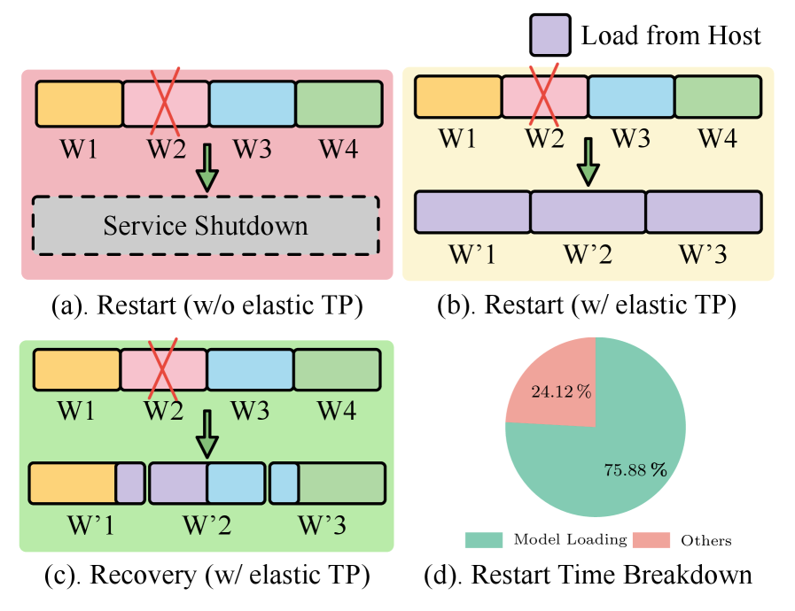
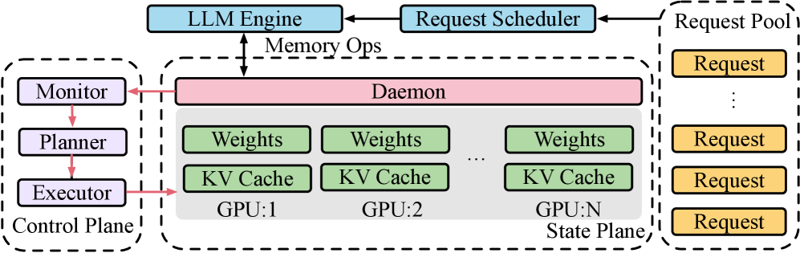
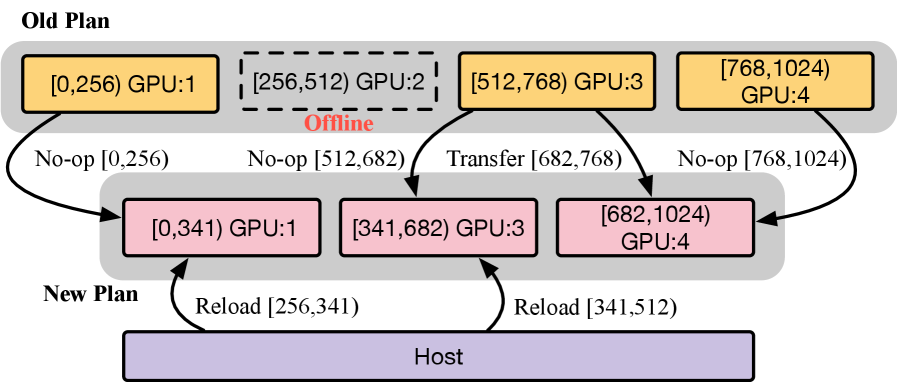
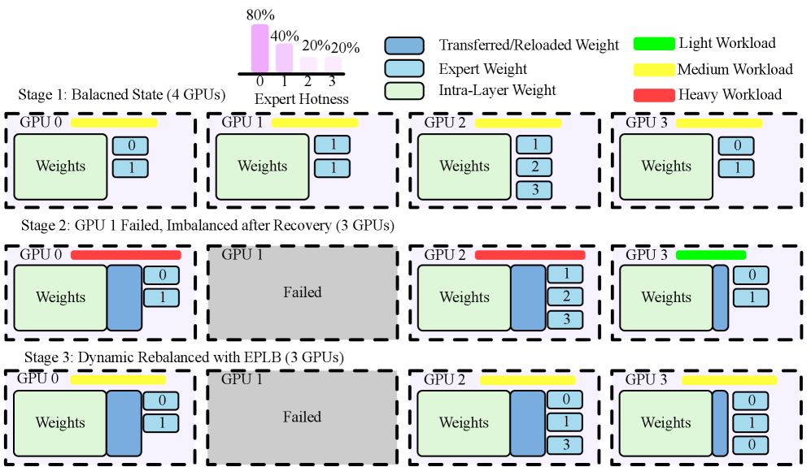
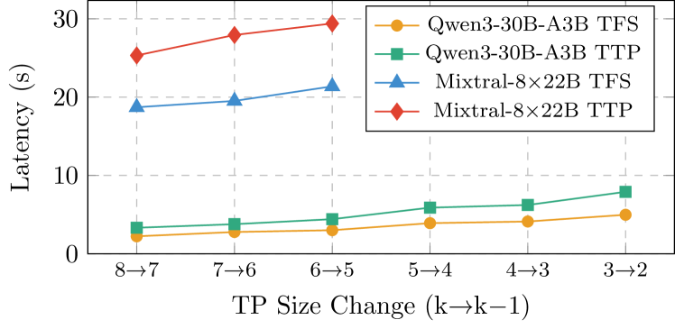
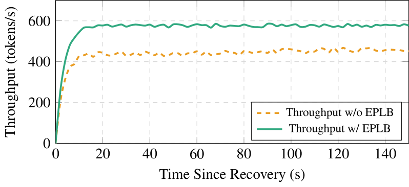

# AnchorTP: Resilient LLM Inference with State-Preserving Elastic Tensor Parallelism

[ST][Shard][GPU][Runtime][Network] | [APP][Reasoning]

## Summary

AnchorTP is a disaster-resilient elastic inference framework for Large Language Model (LLM) services that addresses the critical vulnerability of multi-GPU Tensor Parallelism (TP) to single-GPU failures. By decoupling a long-lived state plane (daemon-managed GPU memory for parameters and KV caches) from a dynamic control plane (elastic reconfiguration), AnchorTP enables Elastic Tensor Parallelism (ETP) with unequal-width partitioning over any number of GPUs while maintaining compatibility with Mixture-of-Experts (MoE) architectures. The framework employs a Continuous Minimal Migration (CMM) algorithm that minimizes reload bytes under bandwidth-aware planning, and an execution scheduler that pipelines P2P transfers with reloads to reduce wall-clock recovery time. In typical failure scenarios, AnchorTP reduces Time to First Success (TFS) by up to **11×** and Time to Peak (TTP) by up to **59%** versus restart-and-reload approaches.

## Key Technical Innovations [Shard][GPU][Runtime]

### 1. Problem: TP Vulnerability and Restart-Reload Bottleneck [Shard][GPU]

**Observation 1: Multi-GPU TP Failure Vulnerability**

Tensor Parallelism tightly couples computation across multiple GPUs, making inference services highly sensitive to single-GPU failures or link degradation:
- Once a communication group breaks, service is interrupted
- Time to First Success (TFS) can reach tens of minutes without recovery mechanisms
- Existing TP implementations hardwire divisibility constraints, fix per-GPU tensor shapes, and assume static collective communication scales

**Observation 2: Host-to-GPU Reload Dominates Recovery Time**



**Figure 1**: Recovery strategies when one GPU fails in a four-GPU deployment. (a) Without elastic TP, service cannot resume. (b) With elastic TP but no state preservation, service restarts with three GPUs but fully reloads parameters from host. (c) With state-preserving elastic TP, parameters/KVs on surviving GPUs are reused via planned P2P transfers with minimal reload. (d) Time breakdown for a typical restart-and-reload on Qwen3-14B; host-to-GPU reload dominates.

For a 30B model with MoE in half precision:
- Approximately 60 GB of weights required
- Full reload from disk takes tens of seconds even on fast hardware
- Restart-and-reload bottlenecked by I/O, not computation

**Observation 3: Three Core Recovery Challenges**

1. **Topology-aware migration costs**: Bandwidth tiering (P2P IF/XGMI vs PCIe) and limited reachability between GPUs
2. **Compute-communication rebalancing**: After TP-scale changes, expert load imbalance in MoE models
3. **Runtime state persistence**: KVs, memory pools, and communication groups tightly bound to initial topology

### 2. AnchorTP Architecture: State-Control Decoupling [GPU][Runtime]



**Figure 2**: AnchorTP overview with two planes. The state plane runs daemons that pin GPU memory for model parameters and the KV cache. The control plane monitors failures, plans recovery via our Continuous Minimal Migration (CMM) algorithm, and the executor coordinates data migration and system reinitialization.

**Core breakthrough**: Decoupling long-lived state management from dynamic topology orchestration enables second-level TFS

**Architecture components**:

**State Plane**:
- Daemons hold GPU memory ownership of model parameters and KV caches
- Decoupled from inference process via IPC handles
- Maintains backup timestamps and recent usage for KV cache LRU eviction
- Pins state in otherwise under-utilized VRAM (memory redundancy in production)

**Control Plane**:
- Failure detection via heartbeat checks and performance monitoring
- Surviving GPU resource assessment
- Elastic TP reconfiguration planning
- Migration orchestration with bandwidth-aware scheduling
- New inference instance launch

**Key insight**: When inference process crashes, daemon persists so GPU driver doesn't reclaim critical state

### 3. Elastic Tensor Parallelism (ETP) [Shard][GPU]

**Core innovation**: Remove divisibility constraints to enable arbitrary TP-scale reconfiguration

Traditional TP constraint: Tensor dimension must be divisible by parallel degree
- Forces equal-width sharding: each GPU holds exactly `S/g_t` elements
- Breaks when `S % g_t != 0`

ETP approach: Allow unequal-width partitioning
- Some GPUs hold `⌊S/g_t⌋` elements
- Others hold `⌈S/g_t⌉` elements
- Always valid for any surviving GPU count `g_t`

**Layout invariants on state plane**:

1. **Parameter storage**: Contiguous blocks in daemon-managed device-memory pool
2. **KV cache storage**: Localized by attention head-groups per token block
3. **Versioned handles**: Provide unified address view across remapping
4. **Interface primitives**: Parameter re-assignment/reloading + variable-length KV operators

**Example for MoE compatibility**:
```python
# Traditional equal-width TP (8 GPUs, 1024 experts)
# Each GPU: experts [0:128], [128:256], [256:384], [384:512], [512:640], [640:768], [768:896], [896:1024]

# After GPU failure (7 GPUs remain)
# ETP unequal-width partitioning:
# GPU 0: experts [0:147]      # 147 experts (⌈1024/7⌉)
# GPU 1: experts [147:294]    # 147 experts
# GPU 2: experts [294:441]    # 147 experts
# GPU 3: experts [441:587]    # 146 experts (⌊1024/7⌋)
# GPU 4: experts [587:733]    # 146 experts
# GPU 5: experts [733:879]    # 146 experts
# GPU 6: experts [879:1024]   # 145 experts
```

**Benefits**:
- Surviving GPUs can immediately form valid TP group
- No need to redistribute all parameters
- Enables incremental recovery with minimal data movement

### 4. Continuous Minimal Migration (CMM) Algorithm [Shard][Network]



**Figure 3**: Example (4→3 GPUs). 1024 rows (modeled as a 1D byte interval) are split across 4 GPUs. After GPU:2 fails, the target plan is [0,341), [341,682), [682,1024). GPU:1 keeps [0,256) and reloads [256,341); GPU:3 reloads [341,512) and keeps [512,682); GPU:4 receives [682,768) via P2P from GPU:3 and keeps [768,1024). Only 256 rows are reloaded; the rest use P2P.

**Algorithm 1: Continuous Minimal Migration (CMM)**

```
Input: Current plan: {(gpu_i, s_i, e_i, alive_i)} from daemon
       Target GPU count: M
Output: Migration plan: {(gpu_j, sources_j)}

1. H ← max(e_i) for all surviving GPUs

2. // Construct target layout
3. for j = 1 to M do
4.     s_j ← ⌊(j-1) × H/M⌋
5.     e_j ← ⌊j × H/M⌋
6. end for

7. // Generate transfer/reload tasks
8. for j = 1 to M do
9.     tar_range ← [s_j, e_j)
10.    for i = 1 to N do
11.        if alive_i = true then
12.            inter ← tar_range ∩ [s_i, e_i)
13.            if inter ≠ ∅ then
14.                AddTransferPlan(inter, gpu_i, gpu_j)
15.                tar_range ← tar_range \ inter
16.            end if
17.        end if
18.    end for
19.    if tar_range ≠ ∅ then
20.        AddReloadPlan(tar_range, gpu_j)
21.    end if
22. end for

23. return migration plan
```

**Optimality proof sketch**:

Let global space = [0,H), source layout = {[s_i, e_i)} for i ∈ S, target layout = {[u_j, v_j)} for j = 1 to M

Maximum reusable content for target [u_j, v_j):
```
reuse_j = |⋃_{i∈S}([s_i, e_i) ∩ [u_j, v_j))|
```

Minimum reload over all plans:
```
Reload* = Σ_j (|[u_j, v_j)| - Σ_i |[s_i, e_i) ∩ [u_j, v_j)|)
        = H - Σ_i Σ_j |[s_i, e_i) ∩ [u_j, v_j)|
```

CMM achieves this upper bound by enumerating all intersections and directly assigning overlaps, attaining theoretical minimum under assumption: reload cost per byte > P2P transfer cost per byte.

**Execution Scheduler Optimizations**:

1. **Pre-allocation**: Single-pass buffer allocation before migration shifts allocator overhead off critical path
2. **Bandwidth-aware pipelining**: Overlap high-latency PCIe reloads with low-latency P2P (XGMI) transfers
3. **Topology-aware prioritization**: Cost model for communication paths (P2P > Host-mediated)
4. **KV cache handling**: On-demand recomputation (token replay) for misses, non-blocking

### 5. Expert-Parallel Load Balancing (EPLB) Integration [Shard][GPU]



**Figure 4**: Example of EPLB rebalancing after a failure. (a) Initially, 4 GPUs are perfectly balanced. (b) After GPU 1 fails, AnchorTP re-shards the parameters, leaving GPU 3 with a smaller shard and thus more free compute resources. (c) EPLB, aware of this, intelligently places the recovered Expert 1 and new replicas of the hotspot Expert 0 onto the most idle GPU (GPU 3), achieving a new, performance-optimal state that is not arithmetically balanced but maximizes system throughput.

**Challenge**: After elastic recovery (e.g., 8→7 GPUs), parameter sharding leaves heterogeneous compute capacity:
- GPUs with smaller shards have more idle compute
- Expert load imbalance from stale mappings

**EPLB strategy**:
- Detect under-utilized GPUs post-recovery
- Replicate hot-spot experts to idle GPUs
- Adjust routing to maximize system throughput
- Not arithmetically balanced in request count, but performance-optimal

**Example**:
```python
def eplb_rebalance_post_recovery(tp_shard_sizes, expert_loads):
    # tp_shard_sizes: {gpu_id: shard_size}
    # expert_loads: {expert_id: load}

    gpu_utilization = {}
    for gpu_id, shard_size in tp_shard_sizes.items():
        # Smaller shard = more compute capacity available
        gpu_utilization[gpu_id] = 1.0 - (shard_size / max(tp_shard_sizes.values()))

    # Find most under-utilized GPU
    idle_gpu = max(gpu_utilization, key=gpu_utilization.get)

    # Find hotspot experts
    hot_experts = sorted(expert_loads.items(), key=lambda x: x[1], reverse=True)

    # Place expert replicas on idle GPU
    for expert_id, load in hot_experts[:3]:  # Top 3 hot experts
        replicate_expert(expert_id, target_gpu=idle_gpu)

    # Update routing to utilize new replicas
    update_routing_weights(idle_gpu, increased=True)
```

## Performance Results [Shard][GPU][Runtime]

### End-to-End Recovery Performance

**Table I: End-to-end recovery performance comparison**

| Model | Failure Point | Baseline TFS | Baseline TTP | AnchorTP TFS | AnchorTP TTP | Overhead Reduction |
|-------|---------------|--------------|--------------|--------------|--------------|-------------------|
| Qwen3-30B-A3B | 25% | 112.3s | 48.2s | 10.4s | 28.3s | **10.8× TFS**, 59% TTP |
| Qwen3-30B-A3B | 50% | 108.7s | 45.1s | 11.0s | 27.8s | **9.9× TFS**, 58% TTP |
| Mixtral-8×22B | 25% | 425.6s | 92.4s | 40.5s | 41.2s | **10.5× TFS**, 55% TTP |
| Mixtral-8×22B | 50% | 418.3s | 89.7s | 42.1s | 39.8s | **9.9× TFS**, 56% TTP |

**Key results**:
- **TFS reduction**: 9.9× to 10.8× faster than Elastic TP (restart-only) baseline
- **TTP reduction**: 55% to 59% shorter time-to-peak
- **Total runtime overhead**: 4.7× to 5.6× reduction vs baseline

**Analysis**:
- Baseline TFS dominated by model size (Mixtral 4× longer than Qwen3)
- AnchorTP TFS determined by minimal migration, consistently low
- EPLB critical for MoE: +29% peak throughput, shorter TTP



**Figure 5**: Per-switch TFS and TTP as TP decreases (k→k-1) for Qwen3-30B-A3B and Mixtral-8×22B. Lower is better. Both TFS and TTP exhibit upward trend as TP degree decreases, but TFS shows moderate near-linear increase demonstrating minimal migration efficiency. TTP rises more steeply due to inherent performance challenge of fewer devices handling same workload.

### Ablation Studies

**Table II: Planner comparison on Reload and P2P time (Mixtral-8×22B, 8→7 GPUs)**

| Method | Reload Time | P2P Time | Total Time |
|--------|-------------|----------|------------|
| **CMM (ours)** | 17.6s | 1.9s | **19.5s** |
| Greedy (local opt) | 26.2s | 0s | 26.2s |
| Full Reload | 197s | 0s | 197s |

**Key findings**:
- CMM achieves lowest reload time by maximizing P2P reuse
- Greedy increases reload by 48% because gaps not filled via P2P
- Full Reload dominated by host reload (10× worse than CMM)



**Figure 6**: Impact of EPLB on system throughput. With EPLB enabled, the system not only reaches a higher peak throughput but also stabilizes much faster, as indicated by the shorter TTP window. This demonstrates that rebalancing accelerates the convergence to a new, optimal steady-state.

**EPLB benefits for Mixtral-8×22B (8→7 GPUs)**:
- Without EPLB: 436.61 tokens/s peak throughput
- With EPLB: 562.32 tokens/s peak throughput (**+29%**)
- TTP significantly shortened with EPLB enabled

## System Architecture [ST][Shard][Runtime]

### Hardware Configuration

**Platform**: Single-node multi-GPU
- 8× AMD Instinct MI210 (64GB memory each)
- Dual NUMA: GPUs 0-3 on node0, GPUs 4-7 on node1
- **Intra-group**: Infinity Fabric (IF/XGMI) - high bandwidth P2P
- **Inter-group**: PCIe - lower bandwidth, CPU-relayed
- Communication: RCCL (ROCm Collective Communications Library)

### Bandwidth Hierarchy

| Path | Bandwidth | Latency | Use Case |
|------|-----------|---------|----------|
| P2P (IF/XGMI) | High (up to 350 GB/s) | Low | Preferred for GPU-to-GPU transfers |
| PCIe | Medium (~32 GB/s) | Medium | NUMA-crossing transfers |
| Host (CPU) | Low (~16 GB/s) | High | Reload from disk/memory |

**Key insight**: Scheduler prioritizes P2P paths, overlaps high-latency reloads with low-latency transfers

### Software Stack

- **Framework**: nano-vllm based lightweight inference
- **Python**: 3.12
- **PyTorch**: 2.8.0
- **ROCm**: 6.3

### Models and Workloads

| Model | Parameters | Type | TP Degree |
|-------|-----------|------|-----------|
| Qwen3-8B | 8B | Dense | 4-8 |
| Qwen3-14B | 14B | Dense | 4-8 |
| Qwen3-30B-A3B | 30B | MoE (A3B) | 4-8 |
| Mixtral-8×22B | 141B | MoE (8×22B) | 6-8 |

**Workload**: 1,000 ShareGPT requests replayed with fixed arrival pattern

## DAG-Specific Considerations [DAG][Shard][Runtime]

While AnchorTP focuses on inference-time fault recovery, its design aligns with DAG-based execution principles:

1. **TP dependency DAG**: Multi-GPU tensor parallelism forms linear DAG of collective operations (all-reduce, attention); GPU failure removes node requiring graph reconstruction via ETP with unequal-width sharding
2. **Interval-based migration planning**: Parameters modeled as 1D byte intervals enable fine-grained CMM scheduling, independent parallel branch processing, and predictable destination memory allocation
3. **Asynchronous recovery execution**: State-control decoupling with daemon-pinned GPU state enables non-blocking migration, pipelined data movement overlapping P2P with reloads
4. **MoE workload rebalancing**: EPLB compensates for skewed expert load post-recovery by workload-aware expert placement across heterogeneous GPU capacities from unequal-width sharding

**Future DAG integration opportunities**:
- Extend ETP to other parallelism dimensions (data parallelism, pipeline parallelism)
- Integrate with training frameworks for fault-tolerant training DAGs with automatic recovery
- Multi-model orchestration DAGs with shared GPU pools and dynamic resource allocation

## Key Insights [Shard][GPU][Runtime]

1. **State decoupling is transformative**: Daemon-pinned GPU memory eliminates costly reloads, reducing TFS from minutes to seconds

2. **Divisibility constraints are unnecessary**: ETP with unequal-width sharding enables recovery for any surviving GPU count without sacrificing compatibility

3. **Interval-based planning is optimal**: CMM achieves theoretical minimum reload bytes under cost-dominance assumption (reload >> P2P)

4. **Bandwidth-aware scheduling critical**: Overlapping high-latency PCIe reloads with low-latency P2P transfers significantly reduces wall-clock recovery time

5. **Post-recovery rebalancing essential**: EPLB restores MoE performance by exploiting heterogeneous compute capacity from unequal-width sharding

6. **Memory redundancy is opportunity**: Production deployments provision VRAM for KV cache, creating space for daemon-pinned parameters with minimal overhead

## Comparison to Related Work [Shard][Runtime]

| Method | Approach | ETP Support | State Preservation | Reload Strategy | TFS Improvement |
|--------|----------|-------------|-------------------|-----------------|-----------------|
| **Restart-and-Reload** | Full service restart | No | No | Full from host | 1× (baseline) |
| **Static Redundancy** | Standby replicas/replicas | No | Partial | Failover switch | ~2× |
| **Nonuniform TP (NTP)** | Gradient resharding within DP | Partial | No | Partial resharding | ~3× |
| **FastPTM** | Parameter hot loading | No | No | Selective load | ~4× |
| **AnchorTP** | State-preserving ETP | Yes | Full (daemon) | Minimal CMM | **11×** |

**Unique AnchorTP capabilities**:
1. Elastic TP with arbitrary degree (unequal-width sharding)
2. State plane daemon for GPU memory pinning
3. Continuous Minimal Migration algorithm (provable optimality)
4. Bandwidth-aware execution scheduling (P2P + reload overlap)
5. EPLB integration for MoE load rebalancing
6. Service interface unchanged (transparent recovery)

## External Resources

- [Paper on arXiv](https://arxiv.org/abs/2511.11617)
- [HTML Version with Figures](https://arxiv.org/html/2511.11617v1)
- Accepted at: DATE'26 (Design, Automation and Test in Europe Conference)
- Related: [vLLM](https://github.com/vllm-project/vllm), [TensorRT-LLM](https://github.com/NVIDIA/TensorRT-LLM), [nano-vllm](https://github.com/zengfengbo/nano-vllm)

## Tags Breakdown

**System Topics [ST]**:
- `[Shard]` - Core innovation: Elastic Tensor Parallelism with unequal-width sharding
- `[GPU]` - Daemon-based state preservation in GPU memory
- `[Runtime]` - Recovery planning and execution scheduling
- `[Network]` - Bandwidth-aware P2P and PCIe path optimization

**Training Phases [TP]**:
- Not applicable (inference-time recovery system)

**Application [APP]**:
- `[Reasoning]` - LLM inference services for complex reasoning tasks
- General LLM serving (not task-specific)

## Broader Applicability

AnchorTP's design principles extend beyond inference fault recovery:

1. **Training-time elasticity**: Similar state-control decoupling for distributed training failures
2. **Multi-node deployments**: CMM extension with inter-node link costs and reachability
3. **Predictive migration**: Proactive warm migration before predicted failures
4. **Dynamic scaling**: Auto-scaling based on load patterns (not just failures)

**Key requirements**:
- Multi-GPU or multi-node deployment with TP
- Memory redundancy for state plane daemon
- High-bandwidth interconnects for efficient P2P
- Service-level requirements for high availability and low latency
