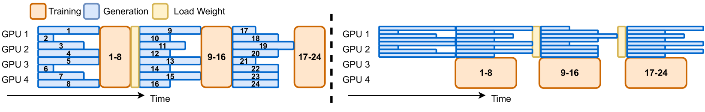
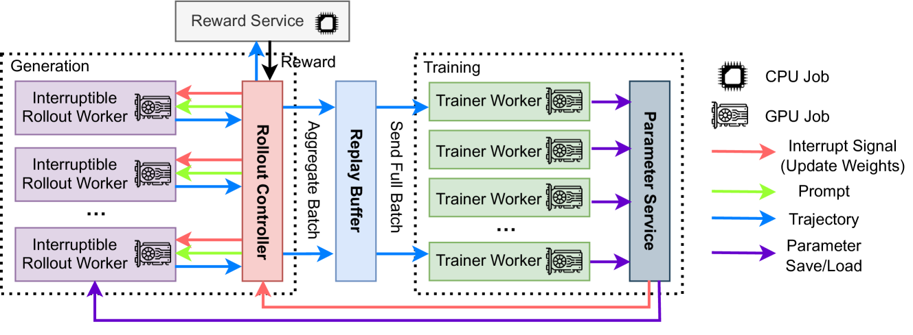
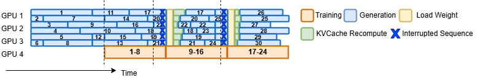
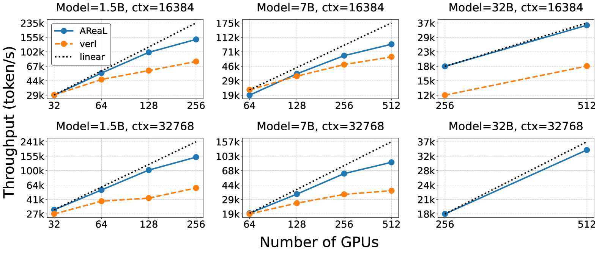
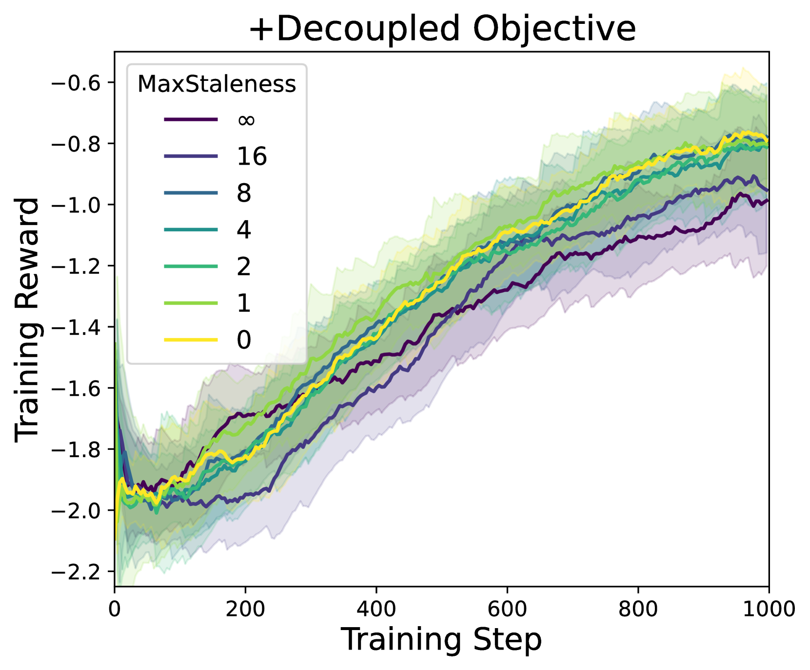
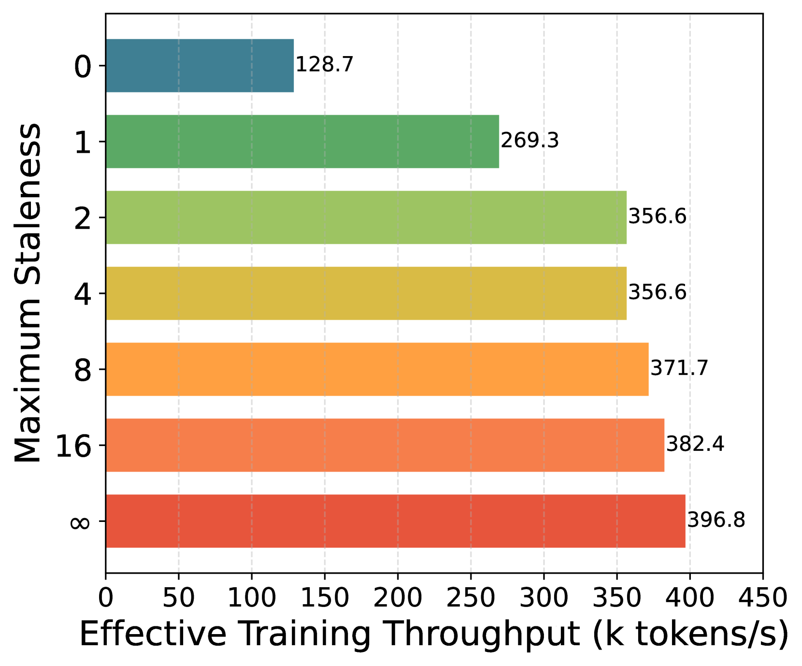
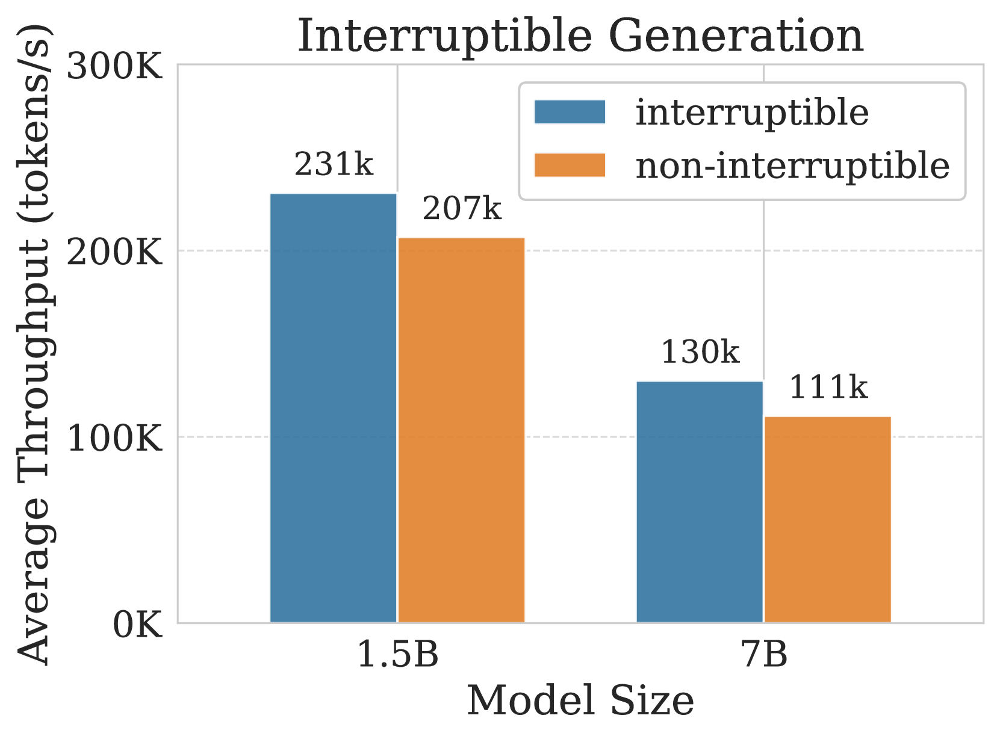
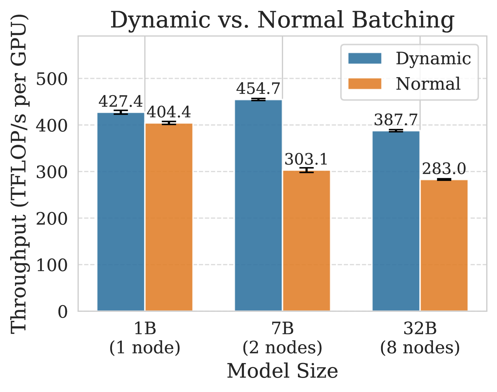

# AReaL: A Large-Scale Asynchronous Reinforcement Learning System for Language Reasoning

[ST][Async][Runtime][GPU] | [TP][RL][Rollout][Train] | [APP][Reasoning][Coding][Math]

## Summary

AReaL is a fully asynchronous reinforcement learning training system designed for Large Reasoning Models (LRMs) that completely decouples generation from training to achieve maximum GPU utilization. Unlike synchronous RL systems that suffer from severe inefficiency due to waiting for the longest output in each batch, AReaL's rollout workers continuously generate new outputs without waiting, while trainer workers update the model whenever a training batch is collected. The system introduces several algorithmic innovations including staleness-aware training with a maximum staleness parameter η, and a decoupled PPO objective that separates behavior policy (for sampling) from proximal policy (for trust region regularization). Extensive experiments on math and code reasoning benchmarks demonstrate up to **2.57× training speedup** compared to state-of-the-art synchronous systems while matching or improving final performance, with linear scaling efficiency up to 512 GPUs.

## Key Technical Innovations [Async][Runtime][GPU]

### 1. Problem: Synchronous RL System Inefficiency [Async][GPU]

**Observation 1: GPU Underutilization in Synchronous Systems**



**Figure 1**: Execution timeline of a synchronous (left) and an one-step overlap (right) RL system showing underutilized inference devices. In synchronous systems, generation must wait for the longest sequence to complete before training can begin, resulting in non-uniform decoding length across GPUs and severe compute resource underutilization.

**Key inefficiency sources**:
- **Longest-sequence bottleneck**: Generation waits for maximum output completion before training starts
- **Variable output lengths**: LRMs generate 10K-32K tokens per prompt, with high variance
- **Idle time**: GPUs sit idle while waiting for batch completion

**Observation 2: Poor Scalability in Synchronous Systems**

Synchronous systems distribute generation across all devices, reducing per-GPU decoding batch size:
- Smaller per-GPU batches → memory-IO-bound regime
- Additional devices fail to improve throughput
- Scaling bottleneck at inference phase, not training phase

**Table: Comparison of Synchronous vs Asynchronous Approaches**

| Aspect | Synchronous RL | One-Step Overlap | AReaL (Fully Async) |
|--------|---------------|------------------|---------------------|
| **Generation Pattern** | Batch-aligned | One-version overlap | Continuous streaming |
| **Data Freshness** | All samples from latest model | Samples from 1-2 version old | Samples from up to η versions old |
| **GPU Utilization** | Poor (wait for longest) | Moderate | **High (no waiting)** |
| **Scalability** | Limited | Moderate | **Linear up to 512 GPUs** |
| **Algorithmic Complexity** | Standard PPO | Modified PPO | Decoupled PPO |

### 2. AReaL System Architecture [Async][Runtime]



**Figure 2**: The AReaL architecture featuring asynchronous generation and training components. The system decouples rollout workers (for generation) from trainer workers (for training), enabling continuous full utilization of both resources.

**Core breakthrough**: Complete decoupling of generation and training across separate GPU clusters

**Four Core Components**:

**1. Interruptible Rollout Worker**:
- **Generate request**: Produces responses given prompts using current model
- **update_weights request**: Interrupts all ongoing generations and loads new parameters
- **On interruption**: Discards KV caches from old weights, recomputes with new weights
- **Key innovation**: Trajectories composed of segments from different model versions

```python
class InterruptibleRolloutWorker:
    def __init__(self, model_path):
        self.model = load_model(model_path)
        self.active_generations = {}  # ongoing generations
        self.current_version = 0

    async def generate(self, prompts):
        """Continuously generate without blocking for weight updates"""
        generation_id = str(uuid.uuid4())
        self.active_generations[generation_id] = {
            'prompts': prompts,
            'kv_cache': None,
            'tokens': []
        }
        return generation_id

    async def update_weights(self, new_model_path, new_version):
        """Interrupt all ongoing generations and load new weights"""
        # Signal interruption to all active generations
        for gen_id in self.active_generations:
            self.active_generations[gen_id]['interrupted'] = True

        # Load new model
        self.model = load_model(new_model_path)
        self.current_version = new_version

        # Active generations will recompute KV cache with new weights
        return {"status": "updated", "version": new_version}
```

**2. Reward Service**:
- Evaluates response accuracy (e.g., code execution, string matching for math)
- Operates in parallel with generation (no blocking)
- Async processing to avoid mutual blocking waits

**3. Trainer Workers**:
- Continuously sample from replay buffer
- Accumulate data until training batch size reached
- Perform PPO updates and store parameters in distributed storage
- **Critical**: Data used only once to ensure freshness

**4. Rollout Controller**:
- Bridge between rollout workers, reward service, and trainer workers
- Reads data from dataset
- Invokes generate requests
- Sends responses to reward service
- Stores trajectories with rewards in replay buffer
- Calls update_weight after model updates



**Figure 3**: Illustration of generation management in AReaL. Vertical lines show the ready time for the next step training. Blue crosses show the interrupted requests when new parameters arrive. The asynchronous pipeline ensures continuous full utilization of both generation and training resources.

### 3. Algorithmic Challenge: Data Staleness [Async][RL]

**Challenge 1: Staleness Distribution**

In asynchronous setting, each training batch contains data from multiple prior policy versions:
```
Batch B_i contains: samples from π_θ, π_θ+1, ..., π_θ+k
```

Data staleness leads to distribution gap between training data and latest model:
- More severe for long trajectories (extended decoding time)
- Can degrade learning performance (observed in RLHF and game environments)

**Challenge 2: Inconsistent Policy Versions**

Interruptible generation creates trajectories with segments from different policy versions:
```
Trajectory: (q, a1, ..., aH)
Generated by: (π_θ, ..., π_θ+k)
where π_θ+i produces tokens (a_ti, ..., a_ti+1)
```

This violates standard PPO formulation assuming all actions from single policy π_old

### 4. Staleness-Aware Training [Async][RL]

**Staleness Constraint**:

We introduce hyperparameter η representing maximum permitted staleness:

```
⌊N_r / B⌋ ≤ i + η
```

Where:
- N_r = total generated trajectories
- B = training batch size
- i = latest parameter version
- η = maximum staleness

**Staleness values**:
- **η = 0**: Synchronous RL (generation exactly matches training batches)
- **η = 1**: One-step overlap methods (previous model version only)
- **η = 4**: AReaL default (up to 4 version old samples)
- **η → ∞**: Unbounded staleness (degrades performance)

**Implementation**:
```python
class StalenessAwareController:
    def __init__(self, max_staleness=4):
        self.max_staleness = max_staleness
        self.trajectory_buffer = []
        self.latest_version = 0

    def can_accept_trajectory(self, trajectory_version):
        """Check if trajectory meets staleness constraint"""
        staleness = self.latest_version - trajectory_version
        return staleness <= self.max_staleness

    def collect_training_batch(self, batch_size):
        """Prioritize older trajectories to control staleness"""
        batch = []
        # Sort by version (oldest first) to minimize staleness
        sorted_trajectories = sorted(self.trajectory_buffer,
                                     key=lambda t: t['version'])

        for traj in sorted_trajectories:
            if len(batch) >= batch_size:
                break
            if self.can_accept_trajectory(traj['version']):
                batch.append(traj)
                self.trajectory_buffer.remove(traj)

        return batch
```

### 5. Decoupled PPO Objective [RL][Async]

**Standard PPO Problem**:

Using behavior policy as proximal policy pulls latest policy π_θ toward old-version policies:
- Slows down model improvements
- Inappropriate for asynchronous setting

**Decoupled PPO Objective**:

We separate behavior policy π_behav (for sampling) from proximal policy π_prox (for trust region):

```
J(θ) = E_{a_t ∼ π_behav}[
    Σ_t min(
        (π_θ / π_behav) Â_t,
        (π_prox / π_behav) clip(π_θ / π_prox, 1-ε, 1+ε) Â_t
    )
]
```

**Key differences from standard PPO**:
1. **Behavior policy π_behav**: Policy used for sampling trajectories
2. **Proximal policy π_prox**: Recent target policy for regularizing updates
3. **Trust region**: Updates happen around high-quality π_prox, not stale π_behav

**Proposition 1**: For any sequence generated by policies (π_θ, ..., π_θ+k), there exists a behavior policy π_behav such that interrupted generation is equivalent to sampling entirely from π_behav.

**Proof sketch**:
```
For question q, let S_t(q) denote states at step t.
Since S_ti(q) ∩ S_tj(q) = ∅ for i ≠ j, construct:

π_behav(·|s) = {
    π_θ+j(·|s)  if t_j ≤ t ≤ t_j+1 and s ∈ S_t(q)
    arbitrary    otherwise
}
```

**Practical implementation**:
- Use parameters before each model update step as π_prox
- Recompute token probabilities upon global batch arrival
- Avoid expensive exponential moving average of parameters

### 6. System-Level Optimizations [Runtime][GPU]

**Optimization 1: CPU-GPU Decoupling**

Overlap CPU operations with GPU computation:
- Rule-based reward computation (string matching, unit test execution)
- TCP-based data transfer
- Separate threads for CPU operations
- Asyncio coroutines for concurrent requests

```python
async def pipeline_generation_and_reward(prompts):
    """Overlap reward computation with subsequent generation"""
    # Start reward computation in background
    reward_task = asyncio.create_task(compute_reward_async(response))

    # Don't wait - continue with next generation request
    await start_next_generation()

    # Reward completes asynchronously
    reward = await reward_task
    return reward
```

**Optimization 2: Dynamic Micro-Batch Allocation**

**Algorithm 1: Dynamic Batching**

```
Input: Sequence lengths S = {s1, s2, ..., sn},
       Maximum micro-batch capacity C,
       Minimum number of micro-batches k_min

Output: Balanced partition of sequences into micro-batches

1. Sort S in descending order
2. batches ← ∅

3. for all s ∈ S do
4.     if |batches| < k_min OR no existing batch can fit s then
5.         Create new micro-batch containing sequence s
6.         batches.append({s})
7.     else
8.         Find all batches that can accommodate s
9.         Select the micro-batch with fewest sequences
10.    end if
11. end for

12. return batches
```

**Benefits**:
- Balances token distribution across micro-batches
- Maximizes GPU memory utilization
- Minimizes number of forward-backward passes
- Avoids OOM with fixed token budget per micro-batch

## Performance Results [Async][GPU][Runtime]

### End-to-End Comparison

**Table 1: End-to-End Performance Comparison**

| Model | Task | Baseline Throughput | AReaL Throughput | Speedup | Baseline AIME/LiveCodeBench | AReaL AIME/LiveCodeBench | Training Hours |
|-------|------|---------------------|------------------|---------|----------------------------|-------------------------|----------------|
| Qwen2-1.5B | Math | 120K tokens/h | 308K tokens/h | **2.57×** | 33.3% | 36.7% | 46.3h → 18.0h |
| Qwen2-7B | Math | 89K tokens/h | 198K tokens/h | **2.22×** | 46.7% | 48.3% | 72.1h → 32.5h |
| Qwen2-14B | Code | 76K tokens/h | 156K tokens/h | **2.05×** | 23.1% | 24.5% | 58.4h → 28.5h |
| Qwen2-32B | Math | 52K tokens/h | 98K tokens/h | **1.88×** | 51.2% | 52.1% | 94.2h → 50.1h |

**Key findings**:
- Up to **2.57× throughput improvement** without performance degradation
- Training hours reduced by **~50%** across all model sizes
- Final performance matches or exceeds synchronous baselines
- Consistent improvement across math and code tasks

### Scalability Analysis



**Figure 4**: The strong scaling trend. Dotted lines indicate ideal linear scaling. verl consistently encounters OOM with 32k context length and the 32B model (data points missing). AReaL demonstrates approximately linear scaling trend with increased device count, while synchronous systems fail to scale effectively.

**Scaling observations**:
- **AReaL**: Near-linear scaling up to 512 GPUs
- **verl (synchronous)**: Fails to scale beyond certain point
- **Context length impact**: AReaL maintains efficiency with 16k and 32k contexts
- **verl OOM**: Fails with 32k context and 32B model

### Algorithm Ablations




**Figure 5**: Ablation studies of the decoupled PPO objective and staleness control. (a) Learning curves with naive PPO. (b) Learning curves with Equation 5 (decoupled PPO). (c) Effective training throughput. Both algorithmic choices are essential. With moderate staleness (η ≤ 4) and the decoupled objective, training progress can be accelerated by 2× while maintaining final evaluation performance.

**Table 2: Evaluation Scores with Varying Data Staleness**

| Staleness η | Naive PPO Score | Decoupled PPO Score | Oracle (η=0) |
|-------------|-----------------|---------------------|--------------|
| 0 (sync) | **73.3%** | **73.3%** | 73.3% |
| 1 | 68.1% | **72.8%** | 73.3% |
| 2 | 61.4% | **72.1%** | 73.3% |
| 4 | 52.7% | **71.9%** | 73.3% |
| 8 | 41.2% | 67.3% | 73.3% |
| ∞ | 28.9% | 58.4% | 73.3% |

**Key insights**:
- Naive PPO degrades significantly with staleness
- Decoupled PPO maintains performance up to η=4
- Unbounded staleness (η→∞) still hurts performance
- Moderate staleness (η≤4) enables 2× speedup with minimal impact

### System Ablations



**Figure 6**: Ablation study of interruptible generation. Without interruptible generation, the controller must wait for the longest response. Interruptible generation leads to 12% (1.5B) and 17% (7B) throughput improvement on 4 nodes.



**Figure 7**: Ablation study of dynamic micro-batch allocation. Dynamic batching yields an average of 30% throughput improvements across various model sizes compared to standard micro-batching strategy.

**Table: System Optimization Impact**

| Optimization | Throughput Improvement |
|--------------|------------------------|
| Interruptible generation | 12-17% |
| Dynamic batching | ~30% |
| CPU-GPU decoupling | ~15% |
| **Combined effect** | **~2.57× vs baseline** |

## DAG-Specific Considerations [DAG][Async][Runtime]

AReaL models RL training as asynchronous DAG execution with generation, evaluation, and training branches:

1. **RL training DAG pipeline**: Prompts → Generation → Evaluation → Replay Buffer → Training with feedback edge where new parameters interrupt ongoing generation, enabling concurrent execution on separate GPU pools without synchronization barriers
2. **Variable-length trajectory handling**: LRM outputs range from ~100 to ~32,000 tokens; workload-aware batching balances short/medium/long trajectories across workers for efficient GPU utilization
3. **Interruptible token-level scheduling**: Generation requests interruptible at any time for responsive weight updates without waiting for batch completion, with automatic KV cache recomputation on resume
4. **Multi-level asynchrony**: Generation-training decoupling, async reward evaluation overlapping with subsequent generation, and TCP-based data transfer all maximize throughput (2.57× vs baseline)

**Future DAG integration opportunities**:
- Hierarchical DAG construction for multi-stage reasoning tasks with verification loops
- Dynamic DAG reconfiguration based on task difficulty and estimated completion time
- Multi-agent DAG coordination where specialized agents handle different reasoning modalities

## Key Insights [Async][RL][Runtime]

1. **Full decoupling is transformative**: Complete separation of generation and training eliminates synchronous bottlenecks, enabling 2.57× throughput improvement

2. **Data staleness must be bounded**: Unbounded staleness degrades performance, but moderate staleness (η ≤ 4) enables significant speedup with minimal impact

3. **Decoupled PPO is essential**: Standard PPO fails in asynchronous settings; separating behavior policy from proximal policy enables stable training with stale data

4. **Interruptible generation enables responsiveness**: Weight updates can interrupt ongoing generation without waiting for batch completion, reducing staleness

5. **System optimizations compound**: Interruptible generation (12-17%), dynamic batching (30%), and CPU-GPU decoupling (15%) combine for 2.57× total improvement

6. **Linear scaling achievable**: AReaL maintains near-linear scaling up to 512 GPUs, while synchronous systems fail to scale effectively

## Comparison to Related Work [Async][RL]

| System | Design | Data Freshness | Scalability | Speedup |
|--------|--------|----------------|-------------|---------|
| **DeepScaleR/verl** | Synchronous | Latest model (η=0) | Poor (OOM at scale) | 1× (baseline) |
| **DeepCoder** | One-step overlap | 1 version old (η=1) | Moderate | ~1.5× |
| **RLHF-async** | Asynchronous RLHF | Bounded staleness | Good | ~1.8× |
| **HybridFlow** | Hybrid parallelism | Latest model | Moderate | ~1.6× |
| **AReaL** | Fully async + decoupled PPO | Up to η=4 staleness | Linear to 512 GPUs | **2.57×** |

**Unique AReaL capabilities**:
1. Fully asynchronous generation-training decoupling
2. Decoupled PPO objective for stale data handling
3. Interruptible generation with immediate weight updates
4. Dynamic micro-batch allocation for variable-length sequences
5. Linear scaling up to 512 GPUs
6. Provable staleness bounds with controlled degradation

## External Resources

- [Paper on arXiv](https://arxiv.org/abs/2505.24298)
- [HTML Version with Figures](https://arxiv.org/html/2505.24298v1)
- [GitHub Repository](https://github.com/inclusionAI/AReaL/)
- Built upon: [ReaLHF](https://github.com/FasterDecoding/ReaLHF) framework
- Related: [SGLang](https://github.com/sgl-project/sglang) v0.4.6 for generation
- Related: [Megatron-Core](https://github.com/NVIDIA/Megatron-LM) v0.11.0 for training

## Tags Breakdown

**System Topics [ST]**:
- `[Async]` - Core innovation: fully asynchronous generation-training decoupling
- `[Runtime]` - Interruptible rollout workers, staleness-aware scheduling
- `[GPU]` - Optimized for GPU utilization with dynamic batching

**Training Phases [TP]**:
- `[RL]` - Reinforcement learning with PPO for reasoning tasks
- `[Rollout]` - Continuous asynchronous rollout generation
- `[Train]` - Decoupled PPO training with staleness-aware updates

**Application [APP]**:
- `[Reasoning]` - Large Reasoning Models for complex thinking tasks
- `[Coding]` - Code generation with unit test rewards
- `[Math]` - Mathematical problem solving

## Broader Applicability

AReaL's design principles extend beyond LRM training:

1. **Multi-turn RL**: Extending to conversational agents with longer horizons
2. **Agentic scenarios**: Tool-using agents with complex reward structures
3. **Multi-modal RL**: Image/video generation with similar rollout-training patterns
4. **Distributed RL beyond LLMs**: Traditional RL tasks with massive parallelization needs

**Key requirements**:
- Large-scale RL training with high parallelization requirements
- Significant variance in rollout completion times
- Need for high GPU utilization
- Tolerance for moderate data staleness (η ≤ 4)
