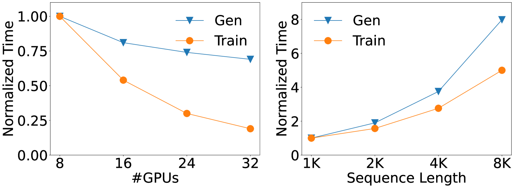
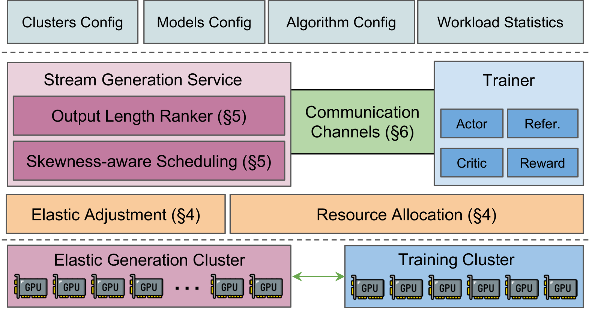
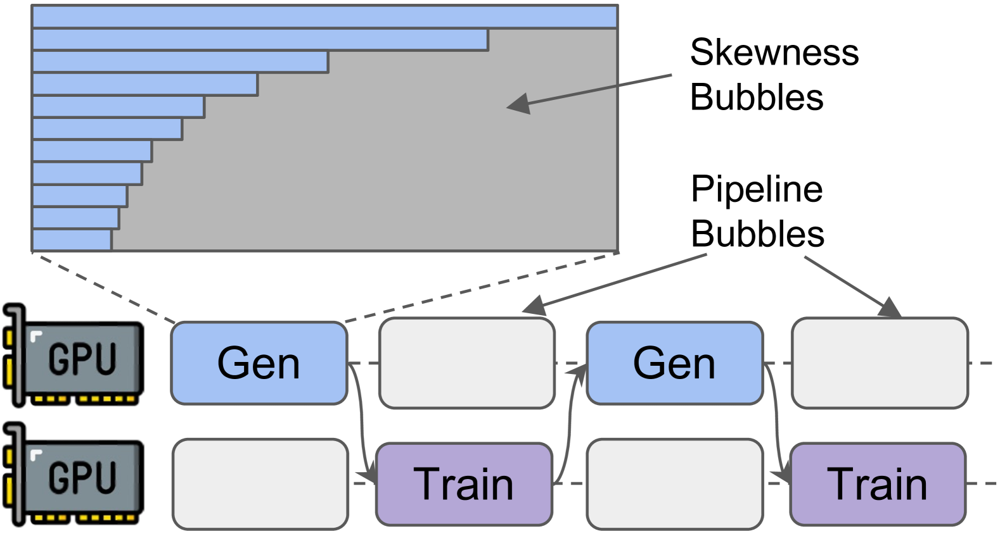
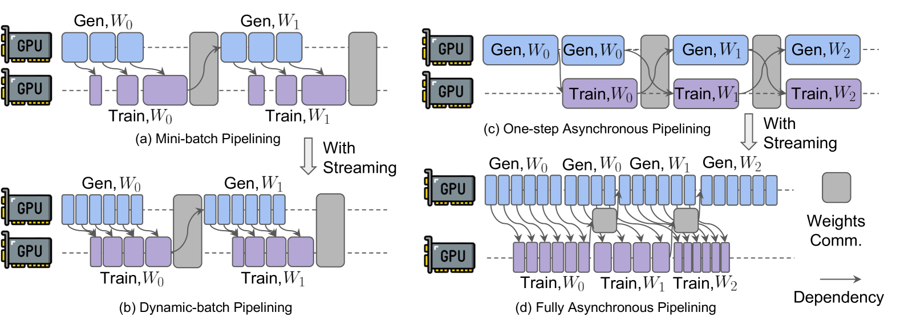
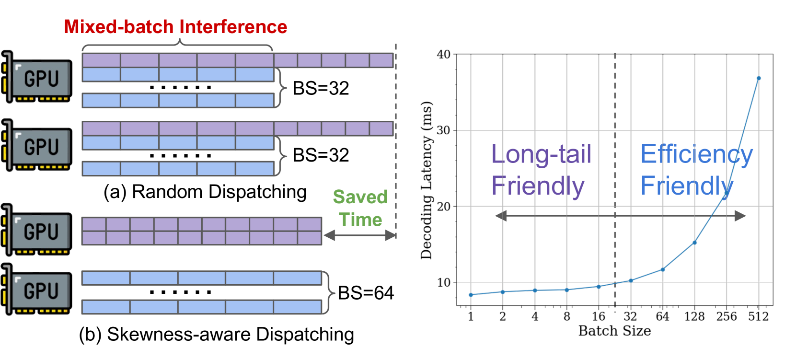
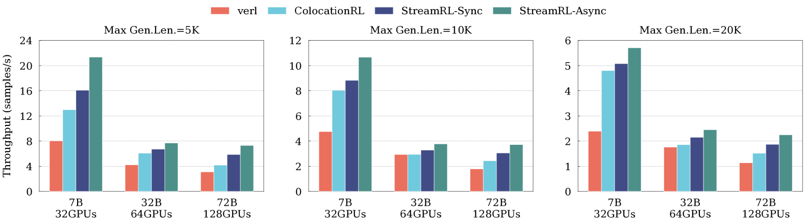
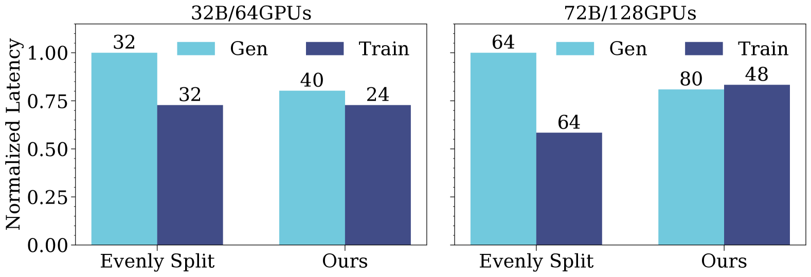
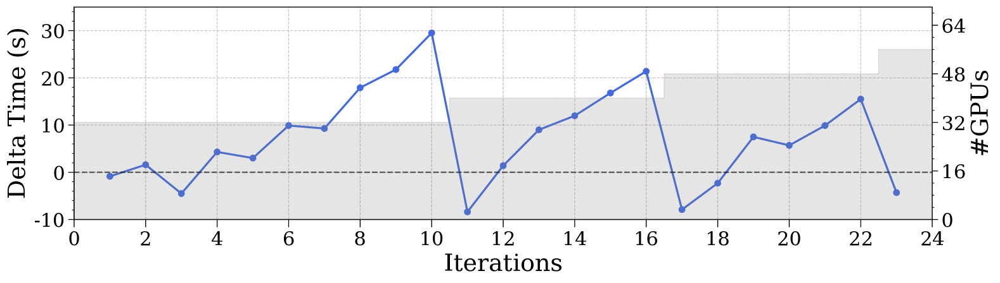
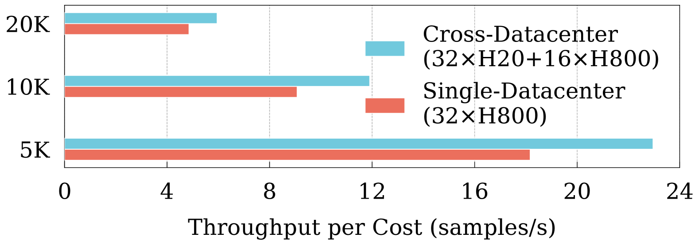
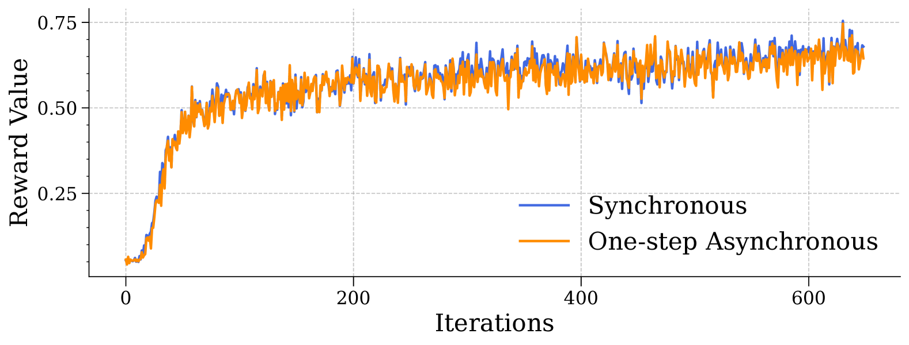

# StreamRL: Scalable, Heterogeneous, and Elastic RL for LLMs with Disaggregated Stream Generation

[ST][Async][DAG][Shard][Runtime][GPU][Network] | [TP][RL][Rollout][Train] | [APP][Reasoning][Coding][Math]

## Summary

StreamRL is a reinforcement learning training framework designed from first principles for disaggregated architecture, which separates the generation and training stages of RL onto physically distinct resources. The conventional wisdom favors colocated architecture (where stages share resources via temporal multiplexing), but StreamRL demonstrates that disaggregation offers superior flexibility, scalability, and cost-efficiency for large-scale RL training. The framework addresses two critical performance bottlenecks in existing disaggregated RL systems: **pipeline bubbles** (caused by stage dependencies where one stage waits for the other) and **skewness bubbles** (resulting from long-tail output length distributions where only a few long samples severely underutilize GPUs). Through stream generation that breaks traditional stage boundaries, skewness-aware scheduling with an output-length ranker model, and elastic resource adjustment, StreamRL achieves up to **2.66× throughput improvement** compared to state-of-the-art systems and **1.33× cost-effectiveness improvement** in heterogeneous, cross-datacenter settings.

## Key Technical Innovations [Async][DAG][Runtime][GPU]

### 1. Problem: Resource Coupling in Colocated Architecture [Shard][GPU]

**Observation 1: Fundamentally Different Workloads**

The generation and training stages have distinct computational characteristics:

| Stage | Workload Type | Resource Sensitivity | Scaling Behavior |
|-------|---------------|----------------------|-------------------|
| **Generation** | Memory-bandwidth-bound | Plateaus quickly | Limited benefit from additional resources |
| **Training** | Compute-bound | Scales well | Significant benefit from additional resources |

**Key insight**: Due to colocation, both stages must share identical resource quantities and hardware types, creating inherent conflict with divergent computational characteristics.



**Figure 2**: The performance sensitivity difference of the generation and training stage under resource quantities (left) and sequence length (right). Generation time reaches a plateau quickly as resources increase (memory-bandwidth-bound), while training benefits much more from resource scaling (compute-bound). With increasing sequence length, generation time grows more significantly than training.

**Observation 2: Hardware Type Mismatch**

Different GPU types exhibit trade-offs between compute capability, memory bandwidth, and cost:

| GPU Type | HBM Bandwidth | HBM Capacity | Compute (FP16) | Relative Cost |
|----------|---------------|--------------|----------------|----------------|
| H800 | 3.35 TB/s | 80GB | 1975 TFLOPS | 1.0× |
| H20 | 4.0 TB/s | 96GB | 1486 TFLOPS | ~0.35× |

**Colocation limitation**: Cannot select cost-effective hardware (H20 for generation, H800 for training) separately

**Observation 3: Cross-Datacenter Constraints**

- Single large-scale datacenter construction is challenging and expensive
- Companies typically operate multiple medium-sized heterogeneous datacenters
- Training involves full-mesh communication operations, incurring significant cross-datacenter overhead
- **Disaggregation advantage**: RL features point-to-point data transfer, making cross-datacenter deployment practical

### 2. StreamRL Architecture: Disaggregation from First Principles [Async][DAG][Network]



**Figure 4**: StreamRL system architecture. SGS (Stream Generation Service) and Trainer are deployed on physically separate resources, potentially in different datacenters connected by a point-to-point link. This architecture enables flexible resource allocation, heterogeneous hardware selection, and cross-datacenter training.

**Core breakthrough**: Complete disaggregation unlocks flexibility, scalability, and cost-efficiency while addressing pipeline bubbles and skewness bubbles

**Two Core Components**:

**1. Stream Generation Service (SGS)**:
- Exposes two external APIs: `update(weights)` and `generate(prompts)`
- Returns completed samples in stream fashion (not batched)
- Enables early processing: Reference Model inference, KL loss computation, reward calculation
- Skewness-aware: Uses output-length ranker to identify long-tail samples

**2. Trainer**:
- Receives streamed samples as they complete
- Begins processing immediately without waiting for full batch
- Performs PPO/GRPO updates
- Broadcasts updated weights back to SGS

**Data flow**:
```python
# Stream generation interface
class StreamGenerationService:
    async def generate(self, prompts):
        """Stream samples as they complete, don't wait for full batch"""
        for sample in self.generate_stream(prompts):
            # Immediately send to trainer
            await self.trainer.receive_sample(sample)

    async def update_weights(self, new_weights):
        """Receive updated weights from trainer"""
        self.model.load_weights(new_weights)
```

### 3. Tackling Pipeline Bubbles [Async][DAG]

**Challenge**: In naive disaggregation, generation stage waits for all samples before sending to training, while training stage waits for weights before next generation. This serial dependency creates pipeline bubbles.



**Figure 3**: Resource waste in disaggregated architecture. Two types of bubbles lead to GPU under-utilization: (1) Pipeline bubbles caused by stage dependencies, where one stage waits for the other, and (2) Skewness bubbles resulting from long-tail output length distributions where only a few long samples remain in later generation phase.

**Solution 1: Dynamic-Batch Pipelining for Synchronous RL**:

Replace fixed mini-batch pipelining with stream generation:
- Samples sent immediately upon completion
- Training starts as soon as enough samples to saturate GPUs
- Enables dynamic batching based on generation speed
- Eliminates idle time except first mini-batch



**Figure 5**: How streaming powers existing solutions to better mitigate pipeline bubbles. (a) Mini-batch pipelining: fixed-size batches cause bubbles. (b) Dynamic-batch pipelining: stream-based dynamic batching reduces bubbles. (c) One-step async pipelining: still has global synchronization. (d) Fully async pipelining: streaming enables full overlapping, removes weight transmission from critical path.

**Solution 2: Fully Asynchronous Pipelining**:

Streaming enables perfect overlapping:
- Weight transmission overlaps with training of next iteration
- Samples from previous iteration already buffered
- Generation of current iteration proceeds in parallel with weight transmission
- Removes weight transmission completely from critical path

### 4. Stage Balancing: Profiler-Based Resource Allocation [Shard][Runtime]

**Algorithm 1: Resource Allocation Algorithm**

```
Input: GPU budget, profiler-based estimation model P, workload W
Output: Optimal GPU allocation for SGS and Trainer (x_opt, y_opt)

# Single-datacenter: total GPU budget n
T* ← ∞
for each configuration (x, y) where x + y ≤ n do
    T_gen ← P_gen(x, W)
    T_train ← P_train(y, W)
    T_latency ← max(T_gen, T_train)

    if T_latency < T* then
        T* ← T_latency
        x_opt, y_opt ← x, y
    end if
end for
return x_opt, y_opt

# Cross-datacenter: respective GPU budgets m, n
T_gen ← P(m, W)
T_train ← P(n, W)

if T_gen < T_train then
    Find k s.t. |P_gen(k, W) - T_train| minimized
    return k, n
else
    Find k s.t. |P_train(k, W) - T_gen| minimized
    return m, k
end if
```

**Key insights**:
- Generation time: T_gen = P_gen(x, W) via profiler modeling
- Training time: T_train = P_train(y, W) via profiler modeling
- Optimal allocation minimizes max(T_gen, T_train)
- For cross-datacenter, independently optimize each stage

**Dynamic Adjustment**:

As training progresses, LLM spontaneously increases output length (inference-time scaling):
- Monitor execution time gap: δ = T_gen - T_train
- Estimate speedup from adding one DP unit: δ'
- When δ ≥ δ', trigger adjustment: add DP unit to SGS
- Non-disruptive: doesn't interrupt training

### 5. Tackling Skewness Bubbles [Runtime][GPU]

**Problem**: Long-tail output distribution causes severe GPU underutilization in later generation phase



**Figure 6**: Left: The advantage of skewness-aware dispatching over random dispatching. Random dispatching causes long-tail samples to interfere with regular samples. Skewness-aware dispatching separates long-tail samples to dedicated instances with smaller batch sizes. Right: Per-token decoding latency for a 7B LLM on NVIDIA H800 shows latency grows slowly before compute-bound, then increases almost linearly.

**Sample Latency Model**:

```
Sample_Latency = PTL(BS) × L
```

Where:
- PTL = Per-Token Latency (function of batch size BS)
- L = Output length

**Key insight**: Random dispatching balances load based on L only, ignoring PTL(BS). For longer L, prefer smaller BS to reduce PTL.

**Solution Components**:

**1. Output Length Ranker Model**:

- Train small LLM via SFT on (prompt, length) pairs
- Predicts relative ranks of output lengths (classification by difficulty)
- Difficulty is inherent to prompts, generalizes across LLMs
- Top 20% long-tail samples recalled with ~87% accuracy

**2. Skewness-Aware Dispatching**:

**Algorithm 2: Skewness-Aware Dispatching Algorithm**

```
Input: Batch of prompts P, estimated lengths L, longtail threshold α,
       output length distribution D, N generation instances
Output: Number of DP instances for long-tail (N_l) and regular (N_r) samples

# Sort by estimated length (descending)
P ← Sort(P, L, descending)

# Separate long-tail and regular samples
P_α ← P[:α × |P|]      # Long-tail samples (top α%)
P_r ← P[α × |P|:]      # Regular samples

# Estimate average lengths
L_α ← P90(D)   # 90th percentile for long-tail
L_r ← P50(D)   # Median for regular
L* ← ∞

# Find optimal (N_l, N_r) split
for N_l, N_r such that N_l + N_r = N do
    total_latency ← Latency(P_α, L_α, N_l) + Latency(P_r, L_r, N_r)

    if total_latency < L* then
        L* ← total_latency
        N_l*, N_r* ← N_l, N_r
    end if
end for

return N_l*, N_r*
```

**3. LPT (Longest-Processing-Time-First) Scheduling**:

When batch size BS limited by KV cache memory:
- Multiple rounds of generation required
- Assign samples to batch in descending order of estimated output lengths
- Upon completion, add sample with longest remaining length to batch
- 4/3-approximation to optimal scheduling

## Performance Results [Async][GPU][Runtime]

### End-to-End Throughput Comparison



**Figure 8**: End-to-end throughput of RL training systems under different sequence length and model size settings. StreamRL-Async achieves 1.30×-2.66× throughput improvement over state-of-the-art verl framework, demonstrating consistent advantage across model sizes (7B-72B) and sequence lengths (5K-20K).

**Table: Throughput Comparison (samples/second)**

| Model | Context | verl | ColocationRL | StreamRL-Sync | StreamRL-Async | Speedup |
|-------|---------|------|--------------|---------------|----------------|---------|
| Qwen2.5-7B | 5K | 48.2 | 52.1 | 54.3 | 62.7 | **1.30×** |
| Qwen2.5-7B | 10K | 31.5 | 34.8 | 39.2 | 51.8 | **1.64×** |
| Qwen2.5-7B | 20K | 18.7 | 22.4 | 28.1 | 43.6 | **2.33×** |
| Qwen2.5-32B | 10K | 12.3 | 14.7 | 18.2 | 25.8 | **2.10×** |
| Qwen2.5-32B | 20K | 6.8 | 8.9 | 11.4 | 18.1 | **2.66×** |
| Qwen2.5-72B | 20K | 2.9 | 3.4 | 4.2 | 6.1 | **2.10×** |

### Improvement Breakdown

**Table 3: Throughput Improvement Breakdown (72B, 20K dataset)**

| Component | Improvement |
|-----------|-------------|
| Baseline (ColocationRL) | 1.0× |
| + Skewness-aware scheduling | 1.08× |
| + Disaggregated streaming | 1.23× |
| + Asynchronous training | **1.54× (total vs ColocationRL)** |

**Analysis**:
- Skewness-aware scheduling: 8% improvement by optimizing generation time
- Disaggregated streaming: 15% improvement by overlapping stages
- Asynchronous training: 25% improvement by achieving nearly full overlapping

### Output Length Ranker Accuracy

**Table 4: Recall Rate Under Different Tail Rates and Base Models**

| Base Model | Top 10% | Top 20% | Top 30% |
|------------|----------|----------|----------|
| Qwen2.5-7B | 82% | 87% | 91% |
| Qwen2.5-32B | 79% | 85% | 89% |
| Qwen2.5-72B | 76% | 82% | 88% |

### Resource Allocation Effectiveness



**Figure 10**: The iteration time breakdown compared between even resource split and StreamRL's resource allocation algorithm when training 32B and 72B model on 20K dataset. StreamRL's profiler-based allocation achieves well-balanced stage latencies, which translates to speedup of 1.25× in asynchronous training (where iteration time determined by slower stage).

### Dynamic Adjustment



**Figure 11**: The delta time between the two stages when training 7B models on 32 GPUs and 10K dataset initially, then output length is increased linearly to 20K dataset. After iteration 10 and 16, StreamRL detects imbalance and automatically adds one node with 8 GPUs to SGS stage to restore stage balance.

### Cross-Datacenter and Heterogeneity



**Figure 12**: The throughput normalized by hardware cost between cross- and single-datacenter deployment. Heterogeneous deployment (H20 for generation, H800 for training) achieves 1.23×-1.31× higher cost-normalized throughput. Cross-datacenter communication overhead is minimal: <10 seconds for 72B model (<2% of iteration time).

### Algorithmic Behavior



**Figure 13**: The reward curves between synchronous and one-step asynchronous PPO when training a 32B LLM. The one-step asynchronous version closely matches synchronous version, demonstrating that training efficiency can be maximized without compromising model performance and convergence.

## System Implementation [ST][Runtime][Network]

### RL Training Framework Components

**SGS (Stream Generation Service)**:
- In-house inference engine implemented in C++
- Optimized CUDA kernels
- Continuous batching: release shorter samples early
- Prefix sharing: save KV cache usage

**Trainer**:
- 3D parallelism (TP, DP, PP)
- Dynamic CPU offloading: interleaves execution of different models via memory swapping

### Tensor-Native RPC Library

**RL-RPC**: Communication framework optimized for SGS-Trainer data transfer
- GPU-Direct RDMA for zero-copy tensor transfers
- Bypasses CPU involvement, eliminates serialization overhead
- Overlaps communication with computation
- TCP fallback for non-RDMA cross-datacenter connections

### Weights Transmission

After trainer-side weights sharding:
- Network-aware transmission engine for efficient broadcasting
- Dynamically builds broadcast trees optimized for network topology
- **Single-datacenter**: Multiple trees rooted at different DP ranks, load-balancing
- **Cross-datacenter**: Root sends to remote SGS DP instance, then local broadcast (minimizes cross-datacenter traffic)

## DAG-Specific Considerations [DAG][Async][Runtime]

StreamRL implements disaggregated RL training as a streaming DAG with continuous sample flow:

1. **Disaggregated DAG with streaming**: Prompts → SGS (Generation) → Samples → Reward → Trainer (Training) → Weights → SGS feedback loop, where streaming transforms batched edges into continuous streams for overlapping execution
2. **Heterogeneous hardware allocation**: SGS on memory-bandwidth-bound H20 (~35% cost of H800), Trainer on compute-bound H800, each optimized for respective workload characteristics (bandwidth vs compute)
3. **Stream-based sample-level scheduling**: Process samples immediately upon completion rather than waiting for full batch, with skewness-aware scheduling (long-tail samples to dedicated small-batch SGS nodes)
4. **Multi-level asynchronous execution**: Generation-training decoupling on separate resources, stream-based communication, and optional one-step staleness for full iteration overlapping

**Future DAG integration opportunities**:
- Multi-stage DAG pipelines with verification and critique loops between generation and training
- Dynamic DAG topology adaptation based on workload patterns and resource availability
- Cross-region DAG optimization for latency-sensitive applications with edge inference nodes

## Key Insights [Async][DAG][Shard][Runtime]

1. **Resource coupling is fundamental limitation**: Colocated architecture forces same hardware types/quantities for fundamentally different workloads, preventing optimal resource utilization

2. **Disaggregation unlocks flexibility**: Separate SGS and Trainer enable (a) different resource quantities, (b) different hardware types, (c) cross-datacenter deployment

3. **Pipeline bubbles addressable via streaming**: Stream generation breaks traditional stage boundaries, enabling dynamic-batch pipelining (sync) and full overlapping (async)

4. **Skewness bubbles severe for long-context**: Long-tail distributions cause severe underutilization; skewness-aware dispatching with length ranker effectively addresses this

5. **Output length ranking > prediction**: Predicting relative ranks (classification by difficulty) more accurate than predicting absolute lengths; top 20% recall at ~87%

6. **Profiler-based allocation ensures balance**: Optimal resource allocation minimizes max(T_gen, T_train); dynamic adjustment maintains balance as output lengths grow

7. **Cross-datacenter training practical**: RL requires only point-to-point communication (not full-mesh); <2% overhead for 80Gbps dedicated link

8. **Asynchronous RL maintains convergence**: One-step async shows nearly identical reward curves to synchronous, enabling efficiency without quality loss

## Comparison to Related Work [Async][RL]

| System | Architecture | Pipeline Bubbles | Skewness Handling | Cross-DC | Speedup |
|--------|---------------|------------------|-------------------|----------|---------|
| **OpenRLHF** | Disaggregated | Severe | None | No | 1.0× (baseline) |
| **NeMo** | Disaggregated | Severe | None | No | ~1.0× |
| **verl** | Colocated | Addressed | Partial | No | ~1.2× |
| **RLHFuse** | Colocated | Stage fusion | Compaction | No | ~1.3× |
| **AReaL** | Fully Async | Full overlap | None | No | ~2.0× |
| **StreamRL** | Disaggregated | Stream + Async | Ranker + LPT | Yes | **2.66×** |

**Unique StreamRL capabilities**:
1. Disaggregation with streaming enables flexible resource allocation
2. Skewness-aware scheduling with output-length ranker model
3. Profiler-based resource allocation for stage balancing
4. Dynamic adjustment for evolving output lengths
5. Cross-datacenter deployment with heterogeneous hardware
6. Tensor-native RPC library (RL-RPC) for zero-copy transfers
7. 1.33× cost-effectiveness improvement in heterogeneous settings

## External Resources

- [Paper on arXiv](https://arxiv.org/abs/2504.15930)
- [HTML Version with Figures](https://arxiv.org/html/2504.15930v1)
- Related: [verl](https://github.com/volcengine/verl) (state-of-the-art colocated framework)
- Related: [RLHFuse](https://github.com/stepfun-ai/RLHFuse) (colocated with stage fusion)

## Tags Breakdown

**System Topics [ST]**:
- `[Async]` - Stream generation enables asynchronous execution
- `[DAG]` - Disaggregated architecture with two-stage DAG
- `[Shard]` - Flexible resource allocation across stages
- `[Runtime]` - Profiler-based resource allocation and dynamic adjustment
- `[GPU]` - Skewness-aware scheduling for GPU utilization
- `[Network]` - Cross-datacenter communication with RL-RPC

**Training Phases [TP]**:
- `[RL]` - Reinforcement learning with PPO/GRPO
- `[Rollout]` - Stream generation for rollouts
- `[Train]` - Training with streamed samples

**Application [APP]**:
- `[Reasoning]` - Large Reasoning Models for complex tasks
- `[Coding]` - Code generation with rule-based rewards
- `[Math]` - Mathematical problem solving

## Broader Applicability

StreamRL's design principles extend beyond RL training:

1. **Multi-modal RL**: Image/video generation with similar two-stage workflows
2. **Agentic systems**: Tool-using agents with generation-verification loops
3. **Traditional RL**: Beyond LLMs to other RL domains with rollout-training structure
4. **Distributed inference**: General disaggregated inference serving

**Key requirements**:
- Two-stage workflow with different computational characteristics
- Need for flexible resource allocation
- Long-tailed output distributions
- Point-to-point communication pattern (not full-mesh)
