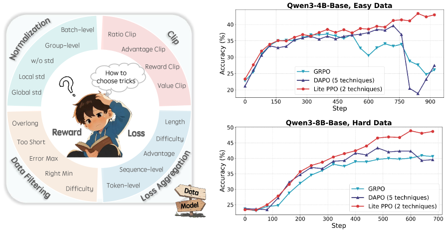
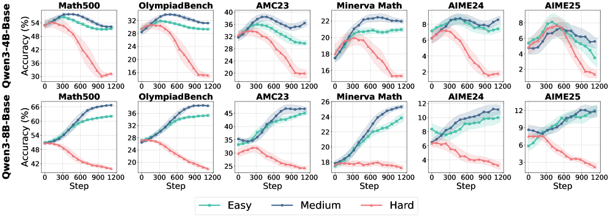
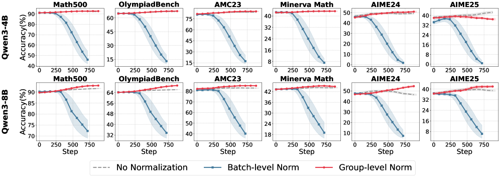
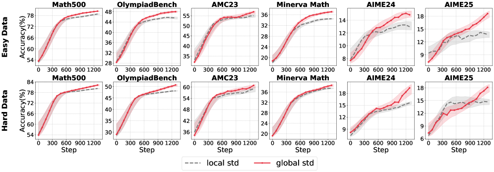
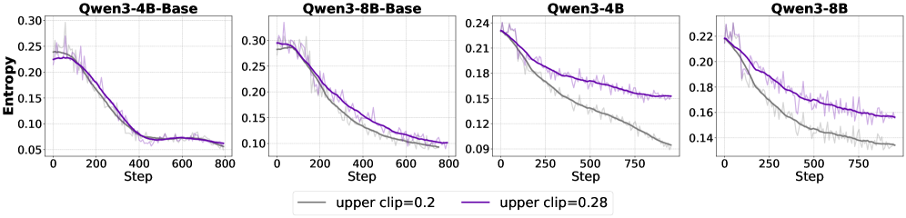
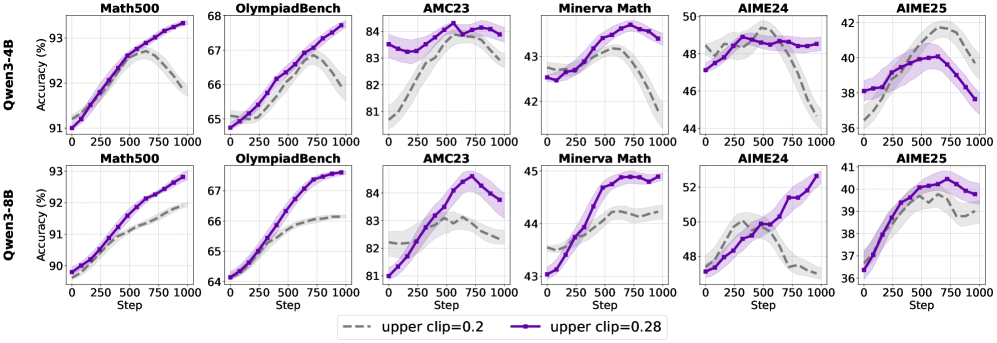

# Part I: Tricks or Traps? A Deep Dive into RL for LLM Reasoning
[ST][RL][Train] | [TP][PPO][GRPO][Reward] | [APP][Reasoning][Math]

## Summary

This paper provides a comprehensive systematic review of reinforcement learning techniques for LLM reasoning, addressing the fragmentation and conflicting conclusions in the RL4LLM community. Through rigorous reproductions and isolated evaluations within a unified open-source framework (ROLL), the authors analyze the internal mechanisms, applicable scenarios, and core principles of widely-adopted RL techniques including normalization, clipping, masking, and loss aggregation strategies. The key finding is that **Lite PPO**—a minimalist combination of just two techniques (advantage normalization with group-level mean and batch-level std, plus token-level loss aggregation)—consistently outperforms complex algorithms like GRPO and DAPO on mathematical reasoning benchmarks.



**Figure 1**: Left: The proliferation of RL optimization techniques has raised barriers to practical adoption. Right: This work establishes detailed application guidelines via dissecting internal mechanisms of widely-used tricks, and introduces Lite PPO, a minimalist two-technique combination that enhances learning capacity in critic-free policies.

---

## Key Technical Innovations

### 1. Advantage Normalization Analysis [RL][Reward][Train]

The paper conducts a systematic analysis of advantage normalization strategies, revealing critical insights about their effectiveness:

**Group-level vs Batch-level Normalization**:
- Group-level: `A_k^group = (r_k - mean({r_j})) / std({r_j})` - computes within prompt group
- Batch-level: `A_i^batch = (r_i - mean({r_j})) / std({r_j})` - computes across entire batch

**Key Finding - Sensitivity to Reward Mechanism**:
- Under sparse binary rewards (R ∈ {0,1}): Group-level normalization shows superior stability and final performance
- Under expanded rewards (R ∈ {-1,1}): Batch-level normalization regains effectiveness
- Batch normalization is highly sensitive to reward distribution skew, often causing collapse when few outlier samples dominate advantage estimates



**Figure 4**: Accuracy over training iterations with different normalization techniques. Group-level normalization consistently achieves more stable training dynamics and higher final performance compared to both batch-level normalization and no normalization under default reward scale (R ∈ {0,1}).

**Standard Deviation Analysis**:
- The standard deviation term is the key mechanism driving normalization effectiveness
- When rewards are highly concentrated (e.g., all responses correct/incorrect), std becomes extremely small, causing excessive gradient amplification
- Removing std (mean-only normalization) prevents gradient explosion in concentrated reward scenarios
- For naturally high-variance rewards, either normalization approach works well

**Robust Normalization Technique**:
- **Optimal combination**: Group-level mean + Batch-level std
- Batch-level std provides stronger normalization by reducing gradient magnitudes
- Prevents excessive policy updates while aligning with sparse reward signals

---

### 2. Clip-Higher Mechanism [RL][Train][Async]

**Problem with Traditional Clipping**:
The standard PPO clip mechanism (ε = 0.2) disproportionately suppresses low-probability tokens, leading to entropy collapse—a harmful positive feedback loop where reduced exploration reinforces high-probability patterns, further decreasing entropy.

**Clip-Higher Solution**:
DAPO introduces decoupled clip bounds: `clip(ratio, 1-ε_low, 1+ε_high)` where ε_high > ε_low

**Model-Dependent Effectiveness**:



**Figure 8**: Entropy comparison across different models with Clip-Higher. Higher clip upper bound mitigates entropy drop in aligned models but shows minimal effect on base models.

| Model Type | Clip-Higher Effect | Reason |
|------------|-------------------|--------|
| **Base Models** | Minimal/Negative impact | Low policy clipping rate (~0.003), naive policy expressiveness limits exploration |
| **Aligned Models** | Significant improvement | Superior reasoning capabilities, higher clip bound expands permissible update range for diverse action sampling |

**Linguistic Analysis**:
- At ε_high = 0.20: Clipping predominantly affects connective tokens ("therefore", "if", "but") that introduce new reasoning directions
- At ε_high = 0.28: Clip frequency decreases, focus shifts to high-frequency function words ("is", "the", ","), allowing broader discourse reasoning structure exploration

**Upper Bound Guidelines**:
- 4B models: ε_high = 0.32 performs best
- 8B models: ε_high = 0.28 is optimal
- Different model scales have different parameter preferences

---

### 3. Token-Level vs Sequence-Level Loss Aggregation [RL][Train]

**Sequence-Level (GRPO approach)**:
```
J = (1/G) Σ (1/|o_i|) Σ min(ratio · A, clip(ratio, ...) · A)
```
- Averages loss across tokens within each sample, then averages across batch
- Assigns equal weight to each response regardless of length
- **Problem**: Longer responses have diminished per-token influence

**Token-Level (DAPO approach)**:
```
J = (1/Σ|o_i|) Σ Σ min(ratio · A, clip(ratio, ...) · A)
```
- Sums losses across all tokens, normalizes by total token count
- Guarantees equal contribution from each token

**Model-Dependent Effectiveness**:



**Figure 13**: Top: Token-level loss consistently improves convergence, peak accuracy, and robustness for base models. Bottom: Sequence-level aggregation outperforms token-level loss for aligned models across most datasets.

| Model Type | Preferred Aggregation | Rationale |
|------------|----------------------|-----------|
| **Base Models** | Token-level | Each token contributes equally; especially effective on challenging datasets |
| **Aligned Models** | Sequence-level | Already possess strong/stable reasoning; better preserves structure of aligned outputs |

---

### 4. Overlong Filtering Strategy [RL][Rollout][Train]

**Problem**: Fixed maximum generation length truncates multi-step reasoning, causing coherent reasoning to be falsely labeled as negative samples, contaminating training signals.

**Overlong Filtering**: Masks reward signals of excessively long responses to preserve training robustness.

**Sensitivity to Maximum Length**:



**Figure 14**: Test accuracy of Qwen3-8B models under different maximum generation lengths with overlong filtering. Benefits are substantial at 8k threshold but diminish significantly at 20k threshold.

| Filter Threshold | Effect | Response Length Behavior |
|------------------|--------|--------------------------|
| **8k tokens** | Substantial benefits | Model generates shorter responses |
| **20k tokens** | Minimal benefits | Model generates longer responses |

**Key Insight - Degenerate Generation Analysis**:
- At 20k threshold: Overlong filtering primarily removes "negative" samples (repetitive/non-terminating outputs)
- The technique filters out unproductive samples that contribute little to learning
- Proportion of "repetitive but unable to terminate" samples decreases with overlong filtering
- Helps model distinguish between "completed generation" vs "truncated generation"

---

### 5. Lite PPO: Minimalist Two-Technique Combination [RL][Train]

Based on comprehensive mechanism analysis, the authors propose **Lite PPO** for non-aligned (base) models:

**Two Core Techniques**:
1. **Advantage Normalization**: Group-level mean + Batch-level std
2. **Token-Level Loss Aggregation**

**Rationale**:
- Normalization shapes sparse rewards into robust guiding signals
- Token-level aggregation eliminates length bias, particularly effective for base models
- Removes overlong filtering (which restricts small models' ability to generate complex outputs)



**Figure 16**: Test accuracy of non-aligned models trained via three RL methods. Lite PPO (ours) demonstrates superior performance compared to technique-heavy DAPO (6+ techniques) and widely-used GRPO, particularly on smaller base models where other policies collapse rapidly.

---

## DAG-Specific Considerations [DAG][RL][Train]

While this paper focuses on RL technique analysis rather than explicit DAG construction, the findings have direct implications for DAG-based RL training systems:

1. **Normalization in RL DAG**: Group-level mean with batch-level std normalization provides stable advantage computation across variable-length trajectory DAG branches
2. **Loss aggregation granularity**: Token-level vs sequence-level loss determines how gradients flow through token-level DAG nodes in training branches
3. **Filtering in rollout DAG**: Overlong filtering prevents truncated samples from contaminating the replay buffer in the rollout → training DAG pipeline
4. **Model-dependent DAG design**: Base models vs aligned models require different DAG node configurations (normalization strategy, loss aggregation, clip bounds)

---

## Performance Results

### Dataset Coverage
- **Training**: SimpleRL-Zoo-Data (Easy/Medium/Hard), DeepMath-103k
- **Evaluation**: MATH-500, OlympiadBench, MinervaMath, AIME24-25, AMC23

### Lite PPO Performance
| Model | Dataset | Lite PPO | GRPO | DAPO |
|-------|---------|----------|------|------|
| Qwen3-4B-Base | Easy | ~43% | ~39% | ~35% |
| Qwen3-4B-Base | Medium | ~38% | ~34% | ~32% |
| Qwen3-8B-Base | Hard | ~32% | ~28% | ~27% |

### Key Improvements
- **Stability**: Lite PPO shows stable upward trend on small models; other policies collapse after peak
- **Simplicity**: Outperforms complex algorithms with 2 techniques vs 6+ in DAPO
- **Generalization**: Consistent improvements across 6 mathematical benchmarks

---

## External Resources

- **Framework**: [ROLL - Efficient RL Library for LLMs](https://github.com/alibaba/ROLL)
- **Paper**: [arXiv:2508.08221](https://arxiv.org/abs/2508.08221)
- **HTML**: [Full Paper with Figures](https://arxiv.org/html/2508.08221v1)
- **Related Work**:
  - GRPO: DeepSeekMath (arXiv:2402.03300)
  - DAPO: arXiv:2503.14476
  - REINFORCE++: arXiv:2501.03262

---

## Key Insights

1. **Technique sensitivity matters**: Most RL techniques exhibit obvious preferences and sensitivities to experimental setup (model type, data distribution, reward mechanism, hyperparameters)

2. **Simplicity outperforms complexity**: A minimalist two-technique combination (Lite PPO) surpasses algorithms with redundant components

3. **Reward mechanism dictates normalization**: Group-level normalization superior for binary rewards; batch-level becomes competitive with expanded reward ranges

4. **Model alignment changes optimal strategies**: Base models prefer token-level loss and traditional clipping; aligned models benefit from sequence-level loss and clip-higher

5. **Standard deviation is the key**: The std term in advantage normalization is the primary mechanism driving effectiveness or causing instability
