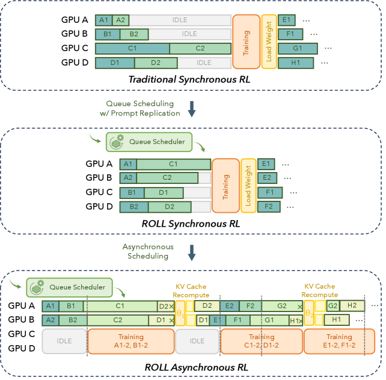
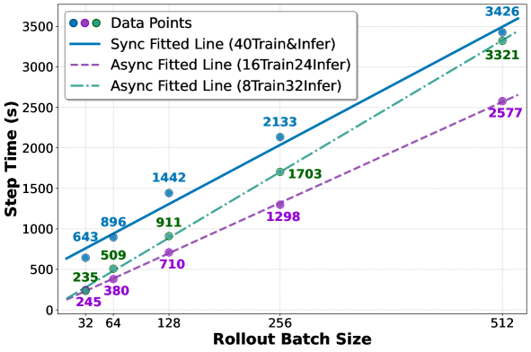
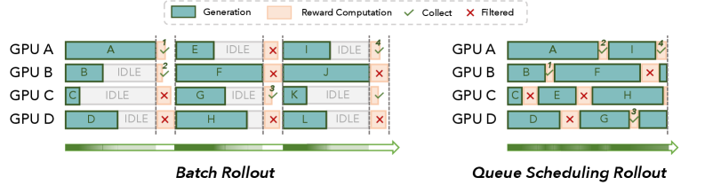

# Part II: ROLL Flash – Accelerating RLVR and Agentic Training with Asynchrony
[ST][DAG][Async] | [TP][RL][Rollout] | [APP][Reasoning][Agent]

## Summary

ROLL Flash strengthens the ROLL framework with asynchronous execution, significantly improving resource utilization and scalability for RL post-training. The system addresses two critical bottlenecks in existing RL post-training: (1) **long-tail rollouts** causing severe resource idleness (rollout accounts for >70% of training time), and (2) **poor resource scalability** where adding GPUs doesn't substantially reduce decoding time. ROLL Flash introduces two key design principles: **fine-grained parallelism** (sample-level lifecycle control) and **rollout-train decoupling** (parallel execution on separate resources). The framework achieves up to **2.24× throughput improvement** over synchronous training and demonstrates strong advantages in both scalability and utilization.



**Figure 1**: (a) Overview of vanilla synchronous training alongside ROLL Flash optimizations: queue scheduling, prompt replication, and asynchronous architecture. (b) Throughput scaling with GPUs: Async achieves 2.12× higher throughput than synchronous on 128 GPUs for Qwen3-8B-Think model, and 2.24× for Base model.

---

## Key Technical Innovations

### 1. Rollout-Train Decoupling Architecture [DAG][Async][Runtime]

**Problem**: Synchronous RL training requires strict synchronization barriers between rollout and training stages, causing substantial resource bubbles (>70% idle time) and underutilization.

**Solution**: ROLL Flash decouples rollout and training, executing them in parallel on separate resources:

```
┌─────────────────────────────────────────────────────────────────┐
│                    ROLL Flash Async Architecture                 │
├─────────────────────────────────────────────────────────────────┤
│  Rollout Stage          │           Training Stage                │
│  (Inference GPUs)       │           (Training GPUs)               │
│  ┌──────────────────┐   │   ┌──────────────────────────────────┐ │
│  │  LLMProxy        │   │   │  AsyncController                 │ │
│  │  ├─ Worker 1     │   │   │  ├─ get_batch (from SampleBuffer)│ │
│  │  ├─ Worker 2     │   │   │  ├─ train_step                   │ │
│  │  └─ Worker N     │   │   │  └─ model_update (broadcast)     │ │
│  └────────┬─────────┘   │   └──────────────────────────────────┘ │
│           │             │                    ↑                    │
│           ▼             │                    │                    │
│  ┌──────────────────┐   │            ┌──────┴───────┐            │
│  │  EnvManager 1-N  │   │            │  SampleBuffer │            │
│  │  └─ BaseEnv      │───┼────────────│  (Trajectories)│          │
│  │  └─ Event Loop   │   │            └──────────────┘            │
│  └──────────────────┘   │                                        │
└─────────────────────────────────────────────────────────────────┘
```

**Key Components**:
- **LLMProxy**: Orchestrates fleet of inference workers with non-blocking event loop
- **EnvManager**: Independent event-driven rollout workers enabling sample-level execution
- **SampleBuffer**: Shared buffer for trajectory collection with freshness constraints
- **AsyncController**: Manages weight synchronization and training pipeline

**Throughput Scaling Results**:

| GPUs | Sync-Naive | Sync-ROLL | Async (ROLL Flash) | Speedup |
|------|------------|-----------|--------------------|---------|
| 16   | 1.0×       | 1.15×     | 1.28×              | 1.28×   |
| 32   | 1.0×       | 1.18×     | 1.52×              | 1.52×   |
| 64   | 1.0×       | 1.22×     | 1.89×              | 1.89×   |
| 128  | 1.0×       | 1.28×     | 2.24×              | 2.24×   |

---

### 2. Fine-Grained Parallelism: Queue Scheduling [DAG][Async][Rollout]

**Problem**: Conventional batched rollouts process prompts as a single batch, where the longest sequence gates the entire batch, causing significant GPU underutilization.

**Solution**: Queue scheduling treats each prompt as an independent task, enabling immediate dispatch to reward workers upon completion:



**Figure 6**: Comparison of Batch Rollout vs Queue Scheduling. Batch Rollout introduces substantial GPU idle time due to straggler effects. Queue Scheduling maintains high GPU utilization by computing rewards promptly and overlapping with ongoing generation.

**Key Benefits**:
1. **Continuous GPU engagement**: Rewards computed immediately upon response completion
2. **Dynamic filtering support**: Early termination when sufficient qualifying samples collected
3. **Reduced pipeline bubbles**: Generation overlaps with reward computation

**Performance Results** (8×8 configuration, 16 redundant prompts):
| Configuration | Generation Time | Speedup |
|---------------|-----------------|---------|
| Sync Batch    | 125 seconds     | 1.0×    |
| Queue (0 add) | 58 seconds      | 2.16×   |
| Queue (16 add)| 37 seconds      | 3.38×   |

---

### 3. Prompt Replication for Intra-Rollout Parallelism [DAG][Async][Rollout]

**Problem**: Multi-candidate decoding (num_return_sequences >> 1) forces a single worker to synchronously decode all responses, creating synchronization bottlenecks.

**Solution**: Expand each prompt into **n independent rollout tasks**, each producing a single response, allowing candidates to run on separate GPUs:

```
Traditional Batch Rollout:
Prompt A → Worker 1 → [Response A1, A2, A3, ..., A16] (bottleneck!)

Prompt Replication (ROLL Flash):
Prompt A1 → Worker 1 → Response A1
Prompt A2 → Worker 2 → Response A2
Prompt A3 → Worker 3 → Response A3
...
Prompt A16 → Worker 16 → Response A16
```

**Performance Results**:

| Config | Batch×Return | Traditional | Prompt Rep | Speedup |
|--------|--------------|-------------|------------|---------|
| Small  | 32×16        | 116s        | 89s        | 1.30×   |
| Large  | 64×16        | 149s        | 81s        | 1.84×   |
| Wide   | 16×64        | 162s        | 83s        | 1.95×   |

---

### 4. Asynchronous Ratio α [DAG][Async][Train]

**Concept**: Bounds the policy version gap between current policy and the policy that initiated sample generation.

**Definition**: If current policy is version n, any sample in SampleBuffer must have been initiated by policy version ≥ (n-α).

**Purpose**: Controls trade-off between throughput and sample freshness:
- **Low α**: Samples stay fresh, but generation may lag behind training (bottleneck)
- **High α**: Maximum throughput, but samples become stale (potential degradation)

**Optimal Values**:

| Variable | Condition | Optimal α |
|----------|-----------|-----------|
| Model Size | 0.6B - 8B | 2 (insensitive) |
| Sequence Length | 4K | 1 |
| Sequence Length | 32K | 2 |
| Rollout Size | 32 | 4 |
| Rollout Size | 256 | 2 |

**Key Finding**: A small async ratio (α=2) suffices for most scenarios, achieving substantial speedups without significant off-policy penalties.

---

### 5. Environment-Level Asynchronous Rollout (Agentic RL) [DAG][Async][Agent]

**Problem**: In agentic pipelines, trajectory completion varies widely—some finish in seconds, others extend to minutes due to environment initialization and network latency.

**Solution**: Decompose trajectories into fine-grained interaction units, immediately dispatch pending trajectories to available LLM workers once environment interaction begins.



**Figure 9**: Speedup increases with higher variance in environment latency. At (10,10) distribution, step time drops from 892s to 362s (2.46× improvement).

**Real Environment Results**:

| Environment | Sync Time | Async Time | Speedup |
|-------------|-----------|------------|---------|
| SWE         | 10.22h    | 8.32h      | 1.23×   |
| ALFWorld    | 13.37h    | 8.44h      | 1.58×   |

---

### 6. Redundant Environment Rollout [DAG][Async][Agent]

**Problem**: Environment instability (fail-slow, fail-stop) creates bottlenecks in agentic RL training.

**Solution**: Two tunable controls for resilience:
1. **num_env_groups**: More concurrent environment groups
2. **group_size**: More candidate trajectories per group

**Key Finding**: Increasing num_env_groups delivers stronger resilience than increasing group_size.

**Performance Results** (μ=10, σ=5 latency, batch=256):

| Configuration | num_groups × group_size | Step Time | Speedup |
|---------------|------------------------|-----------|---------|
| Baseline      | 32 × 8                 | 243s      | 1.0×    |
| Config 1      | 36 × 9                 | 45s       | 5.40×   |
| Config 2      | 36 × 12                | 46s       | 5.28×   |

**Combined with Environment-Level Async**:
| Environment | Base Speedup | +Redundant Env | Total |
|-------------|--------------|----------------|-------|
| SWE (Sync)   | 1.23×        | 1.08×          | 1.33× |
| SWE (Async)  | 1.68×        | 1.08×          | 1.81× |
| ALFWorld (Async) | 2.27×   | 1.20×          | 2.72× |

---

## DAG-Specific Considerations [DAG][Async][Runtime]

ROLL Flash implements RL training as an asynchronous DAG with the following characteristics:

1. **Rollout-Train Decoupling DAG**: Parallel execution pipelines for rollout (LLMProxy → EnvManager → SampleBuffer) and training (AsyncController → train_step), with producer-consumer flow eliminating synchronization barriers

2. **Sample-level scheduling granularity**: Each prompt/response treated as independent DAG node, enabling fine-grained load balancing and reducing straggler bottlenecks from long-tail responses

3. **Multi-level asynchrony**: Within rollout (LLM generation overlaps with environment interaction), between rollout and training (continuous production-consumer model), and across environment groups (redundant execution)

4. **Freshness-constrained DAG edges**: Asynchronous ratio α bounds staleness along DAG edges, preventing samples from exceeding policy version gap of (n-α) from current policy version n

5. **Agentic DAG decomposition**: Multi-turn trajectories decomposed into fine-grained interaction units, enabling immediate dispatch of pending trajectories once environment feedback received

**Future DAG integration opportunities**:
- Hierarchical DAG composition for multi-stage verification (e.g., code execution → test result → reward)
- Dynamic DAG topology adaptation based on task difficulty and environment latency
- Multi-agent DAG coordination where specialized agents handle different reasoning modalities

---

## Performance Results

### Resource Scalability (Qwen3-8B-Think, 32K seq length):

| GPUs | Sync-Naive | Sync-ROLL | Async | Speedup |
|------|------------|-----------|-------|---------|
| 16   | 100%       | 115%      | 128%  | 1.28×   |
| 32   | 100%       | 118%      | 152%  | 1.52×   |
| 64   | 100%       | 122%      | 189%  | 1.89×   |
| 128  | 100%       | 128%      | 224%  | **2.24×** |

### Training Stability (Async Ratio 2-8, Off-Policy Algorithms):

All methods achieve comparable Pass@1 accuracy across benchmarks:
- **MATH500**: Async slightly outperforms Sync
- **OlympiadBench**: Async shows marginal improvement
- **Minerva Math**: Minimal difference

### Agentic Training Speedup:

| Environment | Technique | Speedup |
|-------------|-----------|---------|
| ALFWorld    | Env-level async | 1.58× |
| ALFWorld    | + Redundant env | **2.72×** |
| SWE         | Env-level async | 1.23× |
| SWE         | + Redundant env | **1.81×** |

---

## External Resources

- **Framework**: [ROLL - RL Library for LLMs](https://github.com/alibaba/ROLL)
- **Paper**: [arXiv:2510.11345](https://arxiv.org/abs/2510.11345)
- **HTML**: [Full Paper with Figures](https://arxiv.org/html/2510.11345v1)
- **Related Work**:
  - AReaL: arXiv:2505.24298 (Async RL system)
  - AsyncFlow: arXiv:2507.01663
  - DAPO: arXiv:2503.14476

---

## Key Insights

1. **Asynchronous training is inherently more efficient**: Producer-consumer model keeps rollout saturated, eliminates resource waste from long-tail responses

2. **Small async ratio suffices**: α=2 achieves near-maximal acceleration in most practical scenarios while preserving sample freshness

3. **Queue scheduling + Prompt replication**: Fine-grained parallelism within rollout stage reduces straggler effects by 1.3-1.95×

4. **Environment variance drives async benefits**: Higher variance in environment latency yields greater speedup (up to 2.46× in simulations)

5. **Redundant environment groups > larger groups**: Increasing num_env_groups more effective than group_size for handling fail-slow/fail-stop environments

6. **Off-policy algorithms preserve accuracy**: Existing methods (GRPO, Decoupled PPO, TOPR) effectively compensate for staleness, matching synchronous training performance
