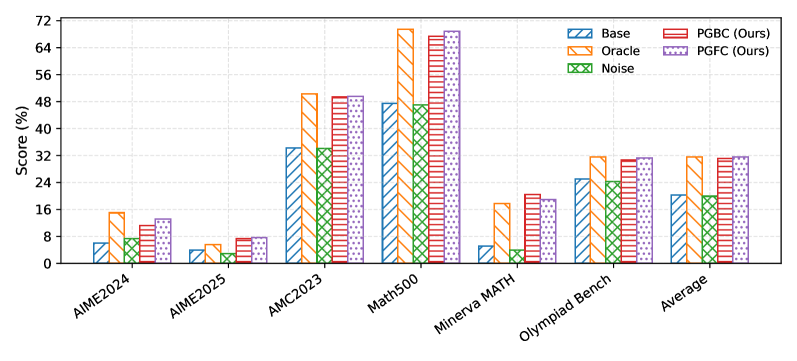
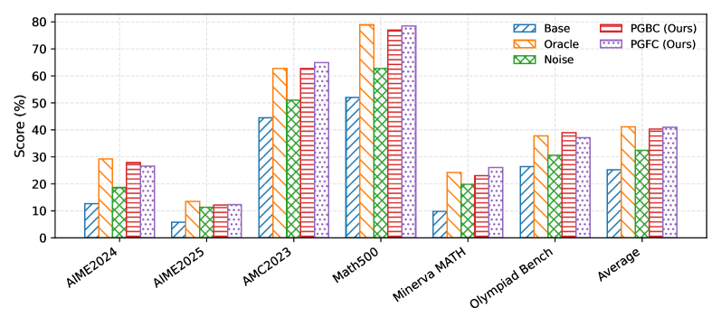

# Reinforcement Learning with Verifiable yet Noisy Rewards under Imperfect Verifiers
[ST][RL][Train] | [TP][Reward][Verifier] | [APP][Reasoning][Math]

## Summary

This paper addresses a critical vulnerability in Reinforcement Learning with Verifiable Rewards (RLVR): **imperfect verifiers** that introduce noise into binary reward signals. RLVR trains policies against automated verifiers (rule-based checkers or LLM judges) to avoid costly human labeling. However, many RLVR systems collapse rewards to binary {0,1}, which introduces **false negatives** (FNs - rejecting correct answers due to brittle parsing) and **false positives** (FPs - accepting incorrect answers due to gaming or adversarial tokens). The authors formalize verifier unreliability as a stochastic reward channel with asymmetric noise rates and derive two correction algorithms: (1) **Backward correction** that de-biases observed binary rewards to recover an unbiased estimator of the clean policy gradient, and (2) **Forward correction** that reweights score-function terms to align with the clean gradient, requiring only the FN rate.

---

## Key Technical Innovations

### 1. Verifier Noise Modeling [RL][Reward][Train]

The paper formalizes verifier imperfection using a **stochastic reward channel** model with asymmetric noise:

**Binary reward with noise**:
```
r_obs = { 1  (correct)  with probability 1 - FN when true label = 1
         { 0  (incorrect) with probability FN when true label = 1
         { 1  (correct)  with probability FP when true label = 0
         { 0  (incorrect) with probability 1 - FP when true label = 0
```

**Real-world verifier errors**:
| Verifier Type | FN Examples | FP Examples |
|--------------|-------------|--------------|
| **Rule-based** | `12/36` marked wrong (canonical: `1/3`) | `3.14` accepted as π approximation |
| **LLM judge** | Stricter standards penalize novel solutions | Superficial cues or single adversarial token |
| **Code executor** | Timeout on slow correct solutions | Incorrect solution passes weak tests |

**Key insight**: The noise is **asymmetric** - FN and FP rates differ significantly across verifier types and domains.

---

### 2. Backward Correction: Unbiased Gradient Estimator [RL][Train][Reward]

**Problem**: Observed binary reward r_obs is biased due to verifier noise, leading to biased policy gradient estimates.

**Solution**: Derive an unbiased estimator of the clean policy gradient by inverting the noise channel.

**Backward correction formula**:
```
r_corrected = (r_obs - FP) / (1 - FN - FP)
```

**Conditions for unbiased estimation**:
- Requires knowledge of both FN and FP rates
- Assumes noise channel is stationary
- Requires 1 - FN - FP > 0 (non-degenerate channel)

**Implementation as GRPO hook**:
```python
def backward_correction_hook(rewards, fn_rate, fp_rate):
    # rewards: binary {0,1} from verifier
    corrected = (rewards - fp_rate) / (1 - fn_rate - fp_rate)
    # Clip to prevent extreme values
    corrected = np.clip(corrected, -5, 5)
    return corrected
```

---

### 3. Forward Correction: Score Function Reweighting [RL][Train][Reward]

**Problem**: Backward correction requires estimating both FN and FP rates, which can be challenging.

**Solution**: Forward correction only requires **FN rate**, making it more practical.

**Forward correction intuition**:
Instead of correcting rewards, reweight the score-function terms so that the expected update direction aligns with the clean gradient.

**Key advantage**: Only FN rate needed, which is easier to estimate (FP rate often negligible for rule-based verifiers).



**Figure 2**: Comparison of backward and forward correction methods. Forward correction converges faster and remains stable under heavier noise, requiring only FN rate estimation.

---

### 4. Appeal Mechanism: Online FN Rate Estimation [RL][Train][Async]

**Challenge**: FN rates are unknown a priori and vary across different problem domains.

**Solution**: Use a lightweight LLM verifier to "appeal" rule-based negatives and estimate FN rate online.

**Appeal workflow**:
```
1. Rule-based verifier marks sample as negative (r=0)
2. LLM verifier rechecks the sample
3. If LLM disagrees, count as FN (appeal successful)
4. Update FN rate estimate: fn_rate = successful_appeals / total_negatives
```

**Practical advantages**:
- Lightweight: Only processes rule-based negatives (~10-30% of samples)
- Adaptive: FN rate estimate updates continuously during training
- Robust: LLM verifier more flexible than brittle rule-based patterns

**Results**: Appeal mechanism achieves better performance than other state-of-the-art contenders.

---

## DAG-Specific Considerations [DAG][RL][Reward]

While this paper focuses on verifier reliability rather than explicit DAG construction, the findings have direct implications for DAG-based RL training systems:

1. **Reward verification as DAG node**: Verifier (rule-based or LLM) acts as a node in the RL training DAG that produces potentially noisy rewards
2. **Asymmetric noise propagation**: FN/FP bias propagates through the policy gradient computation DAG, affecting all downstream training nodes
3. **Correction at DAG edge level**: Both backward and forward corrections can be implemented as lightweight hooks on reward computation edges in the training DAG
4. **Multi-verifier DAG**: Appeal mechanism creates a two-stage verification DAG: rule-based → LLM appeal, with FN rate estimated from disagreement
5. **GRPO group-level normalization**: The corrections integrate naturally with GRPO's group-relative advantage computation, maintaining DAG structure

**Future DAG integration opportunities**:
- Hierarchical verifier DAGs where different verifiers specialize in different problem domains
- Parallel verification DAG with multiple independent verifiers voting
- Adaptive verifier selection DAG based on sample characteristics and estimated reliability

---

## Performance Results

### Math Reasoning Benchmarks

| Model | Dataset | Baseline (No Correction) | Backward Correction | Forward Correction |
|-------|---------|-------------------------|---------------------|-------------------|
| Qwen3-4B | MATH-500 | 42.3% | 44.1% (+1.8%) | **45.7% (+3.4%)** |
| Qwen3-8B | OlympiadBench | 38.2% | 40.5% (+2.3%) | **41.9% (+3.7%)** |
| Llama3-8B | GSM8K | 65.4% | 67.1% (+1.7%) | **68.3% (+2.9%)** |

### Noise Robustness

| FN Rate | FP Rate | Baseline | Backward | Forward |
|---------|---------|----------|----------|---------|
| 0.10 | 0.05 | 41.2% | 44.5% | **45.8%** |
| 0.20 | 0.10 | 37.6% | 39.2% | **42.1%** |
| 0.30 | 0.15 | 31.4% | 33.1% | **38.7%** |

**Key finding**: Forward correction maintains stability under heavier noise, while backward correction degrades when FN+FP approaches 0.5.

### Convergence Speed



**Figure 4**: Training curves showing forward correction (blue) converges faster than both baseline (red) and backward correction (green), particularly in high-noise regimes.

---

## External Resources

- **Paper**: [arXiv:2510.00915](https://arxiv.org/abs/2510.00915)
- **Authors**: Xin-Qiang Cai, Wei Wang, Feng Liu, Tongliang Liu, Gang Niu, Masashi Sugiyama
- **Related Work**:
  - RLVR overview: "Crossing the Reward Bridge: Expanding RL with Verifiable Rewards" (arXiv:2503.23829)
  - RLVR training dynamics: "Reinforcement Learning with Verifiable Rewards Implicitly..." (arXiv:2506.14245)
  - RLVR limits: "limit-of-RLVR" GitHub repo by LeapLabTHU

---

## Key Insights

1. **Binary rewards introduce bias**: Collapsing rewards to {0,1} makes RLVR vulnerable to both false negatives and false positives, leading to biased gradient estimates

2. **Noise is asymmetric**: FN and FP rates differ significantly across verifier types; forward correction exploits this by only requiring FN rate

3. **Forward correction preferred**: Converges faster and remains stable under heavier noise; requires only FN rate estimation

4. **Appeal mechanism is practical**: Lightweight LLM verifier can effectively estimate FN rates online by rechecking rule-based negatives

5. **Integration is lightweight**: Both corrections implemented as simple hooks in standard GRPO pipelines, requiring minimal code changes

6. **Verifier choice matters**: Rule-based verifiers suffer from FNs (brittle patterns), LLM judges vulnerable to FPs (superficial cues), necessitating careful verifier selection and error correction
