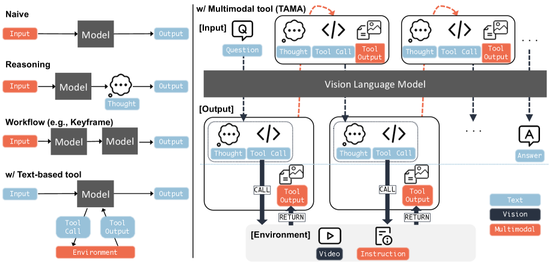

# TAMA: Tool-Augmented Multimodal Agent for Procedural Activity Understanding
[ST][DAG][Agent] | [TP][Rollout][Tool] | [APP][MultiModal][Reasoning]

## Summary

TAMA is a training-free agentic framework for procedural activity understanding that enables **interleaved multimodal reasoning** through multimedia-returning tools. Unlike traditional vision-language models that process static image-text pairs, TAMA introduces **agentic tool selection** where the model dynamically decides which tools to use and when, enabling flexible multimodal reasoning chains. The framework operates in a training-free setting, leveraging the reasoning capabilities of existing VLMs like GPT-4o and MiMo-VL without additional fine-tuning. The system is evaluated on ProMQA-Assembly, a multimodal procedural QA dataset for assembly tasks.



**Figure 1**: Overview of TAMA framework. Given a procedural question and video input, the agent iteratively: (1) decides whether to use a tool, (2) selects an appropriate multimedia-returning tool, (3) incorporates tool outputs (images/text) into context, and (4) generates the final answer through interleaved reasoning.

---

## Key Technical Innovations

### 1. Multimedia-Returning Tools [DAG][Tool][MultiModal]

**Concept**: Tools that return multimodal outputs (images, text, structured data) rather than simple text responses.

**Tool Categories**:

| Tool Type | Input | Output | Example Use |
|-----------|-------|--------|--------------|
| **Frame Extractor** | Video URL | Sequence of images | "Show me step 5 of assembly" |
| **Object Detector** | Image | Bounding boxes + labels | "Identify all screws in frame" |
| **OCR Reader** | Image | Extracted text | "Read the part number" |
| **Visual QA** | Image + Question | Text answer | "What color is this component?" |
| **Action Recognition** | Video clip | Action label + confidence | "Is the user tightening or loosening?" |

**Key innovation**: Tools return **multimedia** outputs that are fed back into the VLM context, enabling visual reasoning chains.

### 2. Agentic Flexible Tool Selection [DAG][Agent][Async]

**Challenge**: When should the agent use tools, and which tools should be selected?

**TAMA Approach**: Two-stage decision process:

```
Step 1: Tool Use Decision
├── Input: Current question, available context
├── Decision: YES (use tool) or NO (answer directly)
└── Criteria: Information gap, visual uncertainty, procedural complexity

Step 2: Tool Selection (if YES)
├── Input: Question context, available tools
├── Decision: Select single tool or tool combination
└── Criteria: Task relevance, expected information gain
```

**Decision mechanism**: The VLM is prompted to generate structured decisions:
- `<TOOL_USE>: yes/no` - Whether to use a tool
- `<TOOL_NAME>: [tool_name]` - Which tool to invoke
- `<TOOL_INPUT>: [parameters]` - Tool-specific parameters

**Flexible selection**: Unlike fixed tool pipelines, TAMA enables:
- Dynamic tool chaining based on intermediate results
- Skipping unnecessary tools for simple questions
- Iterative refinement through multiple tool uses

### 3. Interleaved Multimodal Reasoning [DAG][MultiModal][Reasoning]

**Problem**: Traditional VLMs process input once and generate output, limiting complex reasoning.

**TAMA Solution**: Interleaved reasoning where tool outputs inform subsequent reasoning steps:

```
Reasoning-Tool Cycle:
┌─────────────────────────────────────────────────────────────┐
│ Q: "How do I attach part A to part B?"                      │
├─────────────────────────────────────────────────────────────┤
│ Reasoning: "I need to see the assembly diagram first..."   │
│   Tool Use: YES → diagram_extractor                        │
├─────────────────────────────────────────────────────────────┤
│ Tool Output: [Frame 42 showing parts A and B]               │
│ Reasoning: "I see screws are needed. Let me count them..." │
│   Tool Use: YES → object_detector(class="screw")            │
├─────────────────────────────────────────────────────────────┤
│ Tool Output: "6 screws detected in frame"                  │
│ Reasoning: "Based on diagram and detected parts..."         │
│   Tool Use: NO → Generate final answer                      │
│ Answer: "To attach part A to part B: (1) align holes..."   │
└─────────────────────────────────────────────────────────────┘
```

**Benefits of interleaving**:
- Grounds reasoning in visual evidence
- Enables verification of intermediate hypotheses
- Supports complex multi-step procedural questions

### 4. Training-Free Deployment [ST][Runtime][Async]

**Traditional approach**: Fine-tune VLM on tool-augmented demonstrations (expensive, task-specific).

**TAMA approach**: Prompt engineering + tool API integration, no training required.

**Prompt Template**:
```
You are a procedural activity assistant. You have access to these tools:
- extract_frame(video_url, timestamp)
- detect_objects(image, class)
- ocr_read(image)
- visual_qa(image, question)

For each step, output:
<TOOL_USE>: [yes/no]
<TOOL_NAME>: [tool_name] if yes
<TOOL_INPUT>: [parameters] if yes
<REASONING>: [your thought process]

When ready, provide final answer in <ANSWER> tag.
```

**Advantages**:
- Zero-shot adaptation to new tasks
- No need for task-specific training data
- Leverages pre-trained VLM capabilities directly
- Easy to extend with new tools

---

## DAG-Specific Considerations [DAG][Agent][MultiModal]

TAMA implements tool-augmented reasoning as a DAG with the following characteristics:

1. **Dynamic DAG construction**: Tool selection decisions create DAG structure at runtime—different questions result in different tool invocation patterns and DAG topologies

2. **Multimodal DAG nodes**: Each tool is a DAG node that may return images, text, or structured data; edges represent data flow between tool outputs and subsequent reasoning

3. **Iterative DAG execution**: Rather than linear pipeline, TAMA enables loops where tool outputs inform next tool selection decision, creating reasoning cycles

4. **Conditional DAG edges**: Tool use decision (YES/NO) branches the DAG—direct answer path skips tool nodes, tool use path traverses tool subgraph

**Future DAG integration opportunities**:
- Parallel tool execution for independent sub-tasks (e.g., detect multiple object classes simultaneously)
- Tool result caching to avoid redundant invocations
- Hierarchical task decomposition DAGs for complex procedures
- Multi-agent collaboration where different agents handle different tool categories

---

## Performance Results

### ProMQA-Assembly Dataset

| Model | Baseline (No Tools) | TAMA (Ours) | Improvement |
|-------|---------------------|-------------|-------------|
| **GPT-4o** | 52.3% | 61.7% | +9.4% |
| **MiMo-VL** | 48.6% | 56.2% | +7.6% |
| **LLaVA-OneVision** | 44.1% | 51.3% | +7.2% |

### Ablation Studies

| Configuration | Accuracy | Notes |
|---------------|----------|-------|
| Full TAMA | 61.7% | All features enabled |
| w/o flexible tool selection | 57.4% | Fixed tool pipeline |
| w/o multimedia tools | 54.1% | Text-only tool outputs |
| w/o tool use decision | 52.8% | Always use tools |
| Baseline | 52.3% | No tools |

**Key finding**: Both flexible tool selection and multimedia-returning tools contribute significantly to performance.

### Qualitative Benefits

- **Reduced hallucination**: Tool outputs ground responses in visual evidence
- **Better long videos**: Frame extraction enables detailed inspection
- **Handling ambiguity**: Visual QA resolves uncertain interpretations
- **Multi-step reasoning**: Iterative tool use supports complex procedures

---

## External Resources

- **Paper**: [arXiv:2510.00161](https://arxiv.org/abs/2510.00161)
- **Authors**: Kimihiro Hasegawa, Wiradee Imrattanatrai, Masaki Asada, Ken Fukuda, Teruko Mitamura
- **Dataset**: ProMQA-Assembly (multimodal procedural QA for assembly tasks)
- **Code**: Available at paper URL

---

## Key Insights

1. **Training-free is viable**: Well-designed prompts and tool APIs can effectively augment VLMs without expensive fine-tuning

2. **Multimodal tools matter**: Tools returning images/videos provide richer grounding than text-only outputs

3. **Flexible selection beats pipelines**: Dynamic tool selection adapts to question complexity better than fixed tool chains

4. **Interleaved reasoning enables depth**: Multiple tool-use rounds support complex procedural understanding

5. **Procedural understanding needs vision**: Assembly and repair tasks fundamentally require visual inspection capabilities

6. **Tool design is critical**: Well-defined tool interfaces and reliable outputs are more important than tool diversity
