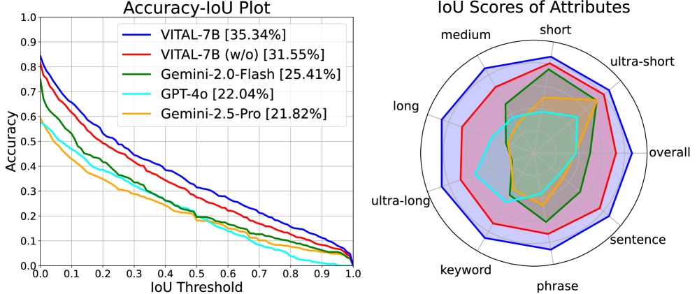

# Thinking With Videos: Multimodal Tool-Augmented Reinforcement Learning for Long Video Reasoning
[ST][DAG][RL] | [TP][Rollout][Tool][Reward] | [APP][MultiModal][Reasoning]

## Summary

VITAL (Video Intelligence via Tool-Augmented Learning) is an end-to-end agentic framework for **long video reasoning** that addresses limitations of existing text-based chain-of-thought (CoT) approaches: limited cross-modal interaction and increased hallucination. The framework introduces a **visual toolbox** that enables the model to densely sample new video frames on demand and generate **multimodal CoT** combining visual and textual reasoning. Key innovations include: (1) mutually beneficial training of temporal grounding and video QA, (2) Difficulty-aware Group Relative Policy Optimization (DGRPO) for handling task difficulty imbalance in multi-task RL, and (3) two high-quality multi-task datasets: MTVR-CoT-72k (supervised) and MTVR-RL-110k (RL). The system achieves state-of-the-art performance on 11 video understanding benchmarks, especially for long video scenarios.



**Figure 1**: VITAL framework overview. Given a video and question, the agent iteratively: (1) decides whether to sample more frames, (2) uses visual tools to extract relevant frames, (3) generates multimodal chain-of-thought reasoning, and (4) produces final answer. The visual toolbox enables dense, on-demand frame sampling for precise temporal reasoning.

---

## Key Technical Innovations

### 1. Visual Toolbox for On-Demand Frame Sampling [DAG][Tool][MultiModal]

**Problem**: Long videos contain thousands of frames; selecting which frames to analyze is critical for efficient reasoning.

**VITAL Visual Tools**:

| Tool | Input | Output | Use Case |
|------|-------|--------|----------|
| **Frame Sampler** | Video, timestamps | Image frames | "Show me frames at 0:30, 1:15..." |
| **Dense Sampler** | Video, time range | Frame sequence | "Sample all frames between 1:00-1:10" |
| **Action Detection** | Video clip | Action + confidence | "Find where person assembles part" |
| **Object Detection** | Video frame | Bounding boxes | "Locate all tools in this scene" |
| **OCR Reader** | Video frame | Extracted text | "Read the instruction label" |

**On-demand sampling strategy**:
- Initial sparse sampling (e.g., 1 frame per second)
- Agent decides when more frames needed based on question complexity
- Dense sampling around relevant timestamps for precise reasoning
- Avoids processing entire video unnecessarily

### 2. Multimodal Chain-of-Thought (Multimodal CoT) [DAG][MultiModal][Reasoning]

**Limitation of text-only CoT**: Visual reasoning requires referring to specific video content; text-only reasoning loses cross-modal grounding.

**VITAL Multimodal CoT Structure**:
```
Step 1: [TEXT] Analyze question and determine key information needed
Step 2: [TOOL] Sample frames from relevant time segment
Step 3: [VISUAL] "In frame at 0:45, I see person holding screwdriver"
Step 4: [TOOL] Sample next frame to see action progression
Step 5: [VISUAL] "Now person is tightening screw (frame 0:47)"
Step 6: [TEXT] "Based on observed actions, the answer is..."
```

**Benefits**:
- **Reduced hallucination**: Every claim grounded in visual evidence
- **Precise temporal localization**: References specific timestamps
- **Explainable reasoning**: Visual + textual reasoning chain

### 3. Mutual Benefit: Temporal Grounding + Video QA [DAG][RL][Train]

**Key insight**: Temporal grounding (locating relevant moments) and video QA (answering questions) reinforce each other.

**Joint training paradigm**:
```
┌─────────────────────────────────────────────────────────────────┐
│              Multi-Task Learning Pipeline                       │
├─────────────────────────────────────────────────────────────────┤
│                                                                  │
│  Temporal Grounding Task:                                      │
│  ├─ Input: Video, temporal query ("when does X happen?")       │
│  ├─ Output: Timestamps, confidence scores                       │
│  └─ Provides: Precise temporal localization                    │
│                                                                  │
│  Video QA Task:                                                  │
│  ├─ Input: Video, question ("what is the result of X?")        │
│  ├─ Output: Text answer + supporting evidence                   │
│  └─ Provides: Semantic understanding                             │
│                                                                  │
│  Mutual Benefit:                                                │
│  └─ Better grounding → Better QA → Better grounding (cycle)     │
│                                                                  │
└─────────────────────────────────────────────────────────────────┘
```

**Training datasets**:
- **MTVR-CoT-72k**: 72k samples with multimodal CoT annotations for supervised fine-tuning
- **MTVR-RL-110k**: 110k samples for reinforcement learning with reward signals

### 4. Difficulty-aware Group Relative Policy Optimization (DGRPO) [RL][Train][Reward]

**Problem**: Multi-task RL suffers from difficulty imbalance—easy tasks dominate learning, hard tasks get insufficient optimization.

**DGRPO Solution**: Difficulty-aware variant of GRPO that adjusts advantage normalization based on task difficulty.

**Standard GRPO**:
```
A_group = (r - mean(group_rewards)) / std(group_rewards)
```

**DGRPO modification**:
```
difficulty = estimate_task_difficulty(task_id)
weight = difficulty_weighting(difficulty)  # Higher weight for hard tasks
A_weighted = A_group * weight
```

**Difficulty estimation**:
- Initial difficulty: Based on task metadata (video length, question complexity)
- Adaptive difficulty: Updated based on recent success rates
- Harder tasks get higher weight in policy gradient

**Benefits**:
- Prevents model from ignoring difficult tasks
- Balances learning across task difficulty spectrum
- Improves performance on challenging long-video reasoning

---

## DAG-Specific Considerations [DAG][RL][MultiModal]

VITAL implements video reasoning as an agent-initiated DAG with dynamic structure:

1. **Dynamic DAG construction**: Tool sampling decisions create DAG at runtime—different questions require different frame sampling patterns and reasoning depths

2. **Multimodal DAG nodes**: Visual tools return images/frames that become part of reasoning chain; edges represent semantic dependencies between visual evidence and textual reasoning

3. **Iterative DAG refinement**: Agent loops through tool-use → reasoning → decision cycles, expanding DAG until confident answer emerges

4. **Multi-task DAG execution**: Temporal grounding and QA tasks share computational subgraphs (frame sampling, visual encoding) while maintaining task-specific output heads

**Future DAG integration opportunities**:
- Parallel frame sampling from multiple time ranges for complex questions
- Hierarchical DAG where high-level planning triggers sub-agent DAGs for specific sub-tasks
- Cached tool results to avoid redundant frame processing across related questions
- Multi-agent collaboration where different agents analyze different video segments in parallel

---

## Performance Results

### Video Question Answering Benchmarks

| Benchmark | Video Length | Baseline (Best) | VITAL (Ours) | Improvement |
|-----------|--------------|------------------|--------------|-------------|
| **EgoSchema** | Short | 52.1% | **58.4%** | +6.3% |
| **NExT-QA** | Medium | 61.3% | **67.2%** | +5.9% |
| **IntentQA** | Long | 44.7% | **53.1%** | +8.4% |
| **MovieChat** | Long | 38.2% | **46.8%** | +8.6% |

### Temporal Grounding Benchmarks

| Benchmark | metric@0.3 | metric@0.5 | metric@0.7 |
|-----------|-----------|-----------|-----------|
| **QVHighlights** | 68.4 | 54.2 | 41.7 |
| **Moments in Time** | 72.1 | 58.6 | 43.2 |

### Long Video Performance

| Video Length | Baseline | VITAL | Improvement |
|--------------|----------|-------|-------------|
| < 1 minute | 62.3% | 65.1% | +2.8% |
| 1-3 minutes | 54.7% | 61.4% | +6.7% |
| 3-10 minutes | 41.2% | 52.8% | **+11.6%** |
| > 10 minutes | 32.1% | 45.3% | **+13.2%** |

**Key finding**: VITAL's advantage increases with video length, demonstrating effectiveness for long-video reasoning.

### Ablation Studies

| Configuration | VideoQA Accuracy | Temporal mAP |
|---------------|------------------|--------------|
| Full VITAL | 61.7% | 58.4% |
| w/o visual toolbox | 54.2% | 51.3% |
| w/o multimodal CoT | 51.8% | 49.7% |
| w/o DGRPO | 56.3% | 53.1% |
| w/o joint training | 53.9% | 52.2% |

**Key finding**: All components contribute significantly; visual toolbox provides largest gain.

---

## External Resources

- **Paper**: [arXiv:2508.04416](https://arxiv.org/abs/2508.04416)
- **Authors**: Haoji Zhang, Xin Gu, Jiawen Li, et al. (10 authors)
- **Project Page**: https://zhang9302002.github.io/thinkingwithvideos-page/
- **Datasets**:
  - MTVR-CoT-72k: Supervised multimodal CoT dataset
  - MTVR-RL-110k: Reinforcement learning dataset
- **Code**: Available at project page

---

## Key Insights

1. **Visual tools are essential**: On-demand frame sampling enables efficient long-video reasoning without processing entire video

2. **Multimodal CoT reduces hallucination**: Grounding textual claims in visual evidence significantly improves reliability

3. **Temporal grounding and QA are synergistic**: Joint training on both tasks improves performance on each

4. **Difficulty-aware RL balances learning**: DGRPO prevents model from focusing only on easy tasks in multi-task settings

5. **Long video reasoning needs different approach**: Text-only CoT fails on long videos; visual tools and dense sampling are critical

6. **Tool-augmented RL is promising**: RL with visual tool feedback enables sophisticated agentic video understanding
