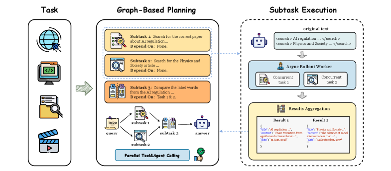

# GAP: Graph-Based Agent Planning with Parallel Tool Use and Reinforcement Learning
[ST][DAG][Async] | [TP][Rollout][Tool][RL] | [APP][Agent][Reasoning]

## Summary

GAP (Graph-based Agent Planning) addresses a critical limitation in existing agentic frameworks: sequential execution bottlenecks that fail to exploit inherent parallelism among independent sub-tasks. Traditional approaches like ReAct process tool calls one-by-one, causing inefficient resource utilization even when multiple tools could execute simultaneously. GAP introduces **dependency-aware task decomposition**—training agent foundation models to generate task graphs where nodes represent sub-tasks and edges encode dependencies. The framework autonomously determines which tools can execute in parallel and which must follow sequential dependencies. GAP employs a two-stage training strategy: supervised fine-tuning on graph-based planning traces derived from Multi-Hop Question Answering (MHQA) benchmarks, followed by reinforcement learning with correctness-based rewards on queries where tool-based reasoning provides maximum value. Experimental results demonstrate substantial improvements in both execution efficiency and task accuracy compared to ReAct baselines.



**Figure 1**: GAP framework overview. Given a complex question, the agent decomposes it into a dependency-aware task graph, enabling parallel execution of independent sub-tasks (e.g., searching multiple entities simultaneously) while respecting sequential dependencies (e.g., using results from one query to inform the next).

---

## Key Technical Innovations

### 1. Dependency-Aware Task Graph Construction [DAG][Agent][Async]

**Problem**: Complex tasks often contain independent sub-tasks that could execute in parallel, but existing agents process everything sequentially.

**GAP Solution**: Explicitly model task dependencies as directed graphs.

**Task Graph Structure**:
```
┌─────────────────────────────────────────────────────────────────┐
│                    Question: "Compare GDP and population        │
│                    of France, Germany, and Italy"               │
├─────────────────────────────────────────────────────────────────┤
│                                                                  │
│              ┌──────────┐  ┌──────────┐  ┌──────────┐           │
│              │ Task 1.1 │  │ Task 1.2 │  │ Task 1.3 │           │
│              │ Search:  │  │ Search:  │  │ Search:  │           │
│              │ France   │  │ Germany  │  │ Italy    │           │
│              │ GDP      │  │ GDP      │  │ GDP      │           │
│              └────┬─────┘  └────┬─────┘  └────┬─────┘           │
│                   │             │             │                  │
│                   └──────────┬──┴─────────────┘                  │
│                              │                               (PARALLEL)│
│                              ▼                                 │
│                    ┌─────────────────────┐                     │
│                    │ Task 2: Compare GDP │                     │
│                    │ across three countries│                    │
│                    └──────────┬──────────┘                     │
│                               │                                 │
│              ┌────────────────┼────────────────┐                │
│              ▼                ▼                ▼                │
│       ┌──────────┐      ┌──────────┐      ┌──────────┐         │
│       │ Task 3.1 │      │ Task 3.2 │      │ Task 3.3 │         │
│       │ Search:  │      │ Search:  │      │ Search:  │         │
│       │ France   │      │ Germany  │      │ Italy    │         │
│       │ Pop      │      │ Pop      │      │ Pop      │         │
│       └────┬─────┘      └────┬─────┘      └────┬─────┘         │
│            │                │                │                  │
│            └────────────┬───┴────────────────┘                  │
│                         │                                   (PARALLEL)│
│                         ▼                                     │
│              ┌─────────────────────┐                          │
│              │ Task 4: Compare Pop │                          │
│              └──────────┬──────────┘                          │
│                         │                                     │
│                         ▼                                  (SEQUENTIAL)│
│              ┌─────────────────────┐                          │
│              │ Task 5: Final Answer│                          │
│              │ (GDP & Pop analysis)│                          │
│              └─────────────────────┘                          │
└─────────────────────────────────────────────────────────────────┘
```

**Key insight**: Tasks 1.1, 1.2, 1.3 are independent and can execute in parallel, as can 3.1, 3.2, 3.3. Tasks 2 and 4 must wait for their predecessors.

### 2. Two-Stage Training Strategy [RL][Train][DAG]

**Stage 1: Supervised Fine-Tuning (SFT)**

**Dataset construction from MHQA benchmarks**:
1. Collect multi-hop questions with gold evidence paths
2. Annotate dependencies between information retrieval steps
3. Convert to task graph format with node/edge structure
4. Train model to generate dependency-aware task graphs

**Training objective**:
```
L_SFT = -Σ log P(graph | question, demonstrations)
```

**Stage 2: Reinforcement Learning with Correctness Rewards**

**Reward design**:
```
R(question, trajectory) = {
    +1.0  if final answer is correct
    -0.5  if final answer is incorrect
    +0.2  per correct intermediate step
}
```

**Strategic sampling**: Focus RL on queries where tool-based reasoning provides maximum value (multi-hop questions requiring external knowledge).

**RL objective** (GRPO-style):
```
L_RL = -E[log π(a|s) × A]
A = R - mean(group_rewards)
```

### 3. Parallel Tool Execution Engine [Async][Runtime][DAG]

**Scheduling algorithm**:
```python
def execute_task_graph(task_graph):
    ready_queue = [node for node in task_graph.nodes
                   if node.incoming_edges == 0]
    running_tasks = []
    completed_tasks = {}

    while ready_queue or running_tasks:
        # Launch all ready tasks in parallel
        while ready_queue:
            task = ready_queue.pop(0)
            running_tasks.append(launch_task_async(task))

        # Wait for at least one task to complete
        completed = wait_for_completion(running_tasks)
        for task in completed:
            completed_tasks[task.id] = task.result

            # Add newly ready tasks to queue
            for successor in task.successors:
                if all predecessors completed:
                    ready_queue.append(successor)

        running_tasks = [t for t in running_tasks if t not in completed]

    return completed_tasks
```

**Key features**:
- Maximum parallelism: all ready tasks launched simultaneously
- Dependency enforcement: tasks wait for predecessors to complete
- Dynamic scheduling: ready queue updates as tasks complete

### 4. Multi-Hop Question Answering Benchmark [APP][Reasoning][Agent]

**Derived from MHQA datasets**:
- HotpotQA (multi-hop Wikipedia QA)
- 2WikiMultiHopQA (complex multi-hop reasoning)
- Bamboogle (web search requiring multi-hop)

**Graph construction**:
```
Question: "Which film director...?"
├── Entity 1: [Search tool]
├── Entity 2: [Search tool]  (parallel with Entity 1)
├── Entity 3: [Search tool]  (parallel with Entity 1)
├── Synthesize: [Reasoning step]
└── Final Answer: [Generation]
```

**Annotation quality**: High-quality human-verified dependency annotations for training and evaluation.

---

## DAG-Specific Considerations [DAG][Async][Agent]

GAP implements agentic planning as an explicitly constructed DAG:

1. **Task-level DAG nodes**: Each sub-task is a DAG node with specified tool type (search, database, API call)

2. **Dependency-annotated DAG edges**: Edges encode data dependencies (output of task A required as input to task B), enabling parallel execution of independent nodes

3. **Dynamic DAG topology**: Task graph structure varies per question—simple questions yield shallow DAGs, complex multi-hop queries yield deeper DAGs with branching

4. **Parallel DAG execution**: Scheduler maximizes throughput by executing all ready nodes concurrently, respecting dependency constraints

5. **Multi-modal DAG nodes**: Tools can return diverse outputs (text, images, structured data) that flow along DAG edges to successor nodes

**Future DAG integration opportunities**:
- Hierarchical DAGs where high-level planner generates task DAG, and sub-agents execute sub-DAGs for complex sub-tasks
- DAG re-use and caching for common sub-task patterns across questions
- Multi-agent DAG collaboration where different agents handle different DAG branches in parallel
- Adaptive DAG construction based on tool availability and latency estimates

---

## Performance Results

### Multi-Hop Question Answering Benchmarks

| Benchmark | Metric | ReAct (Sequential) | GAP (Ours) | Improvement |
|-----------|--------|--------------------|------------|-------------|
| **HotpotQA** | Accuracy | 52.3% | **61.7%** | +9.4% |
| **HotpotQA** | Avg Steps | 8.4 | 8.1 | -3.6% |
| **2WikiMultiHopQA** | Accuracy | 41.2% | **49.8%** | +8.6% |
| **2WikiMultiHopQA** | Avg Steps | 12.7 | 10.3 | -18.9% |
| **Bamboogle** | Accuracy | 38.5% | **44.2%** | +5.7% |

### Execution Efficiency

| Configuration | Avg Execution Time (seconds) | Speedup |
|---------------|------------------------------|---------|
| ReAct (Sequential) | 24.7 | 1.0× |
| GAP (Parallel) | 14.2 | **1.74×** |
| GAP + Aggressive Parallelization | 11.8 | **2.09×** |

**Key finding**: Parallel execution reduces latency by up to 2× while improving accuracy through better task decomposition.

### Parallelism Analysis

| Question Type | Independent Sub-tasks | Parallel Speedup |
|---------------|----------------------|------------------|
| Simple lookup | 1-2 | 1.2× |
| Multi-hop (3 entities) | 3 | 1.8× |
| Multi-hop (5+ entities) | 5+ | 2.3× |
| Complex synthesis | 4-6 | 2.1× |

### Ablation Studies

| Configuration | Accuracy | Execution Time |
|---------------|----------|----------------|
| Full GAP | 61.7% | 14.2s |
| w/o parallel execution | 58.3% | 22.1s |
| w/o dependency modeling | 54.1% | 16.8s |
| w/o RL fine-tuning | 57.2% | 14.5s |
| ReAct baseline | 52.3% | 24.7s |

**Key finding**: Both parallel execution and dependency modeling contribute significantly to performance gains.

---

## External Resources

- **Paper**: [arXiv:2510.25320](https://arxiv.org/abs/2510.25320)
- **Authors**: Jiaqi Wu, Qinlao Zhao, Zefeng Chen, Kai Qin, Yifei Zhao, Xueqian Wang, Yuhang Yao
- **Code**: [github.com/WJQ7777/Graph-Agent-Planning](https://github.com/WJQ7777/Graph-Agent-Planning)
- **Related Work**:
  - ReAct: Synergizing Reasoning and Acting in Language Models
  - TaskWeaver: Code-First Agent Framework
  - Multi-hop QA benchmarks (HotpotQA, 2WikiMultiHopQA)

---

## Key Insights

1. **Sequential execution is a major bottleneck**: Traditional ReAct agents waste time waiting for independent tool calls to complete sequentially

2. **Dependency-aware planning enables parallelism**: Explicit task graph construction allows identification of parallelizable sub-tasks

3. **Two-stage training is effective**: SFT on graph demonstrations followed by RL refinement yields strong performance

4. **Parallel execution improves both speed and accuracy**: Better task decomposition and faster tool execution lead to higher-quality answers

5. **Graph structure is learnable**: Models can generate valid dependency-aware task graphs with appropriate training data

6. **Efficiency gains scale with complexity**: Questions with more independent sub-tasks benefit more from parallel execution
