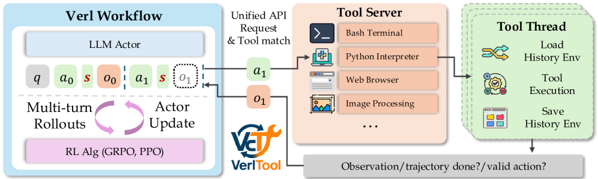

# VerlTool: Towards Holistic Agentic Reinforcement Learning with Tool Use
[ST][DAG][Async] | [TP][RL][Rollout][Tool] | [APP][Agent][MultiModal]

## Summary

VerlTool addresses fragmentation in Agentic Reinforcement Learning with Tool use (ARLT) research, where existing systems develop task-specific codebases with limited extensibility across domains. The framework provides a **unified and modular infrastructure** for training tool-augmented LLM agents across six domains: mathematical reasoning, knowledge QA, SQL generation, visual reasoning, web search, and software engineering. VerlTool formalizes ARLT as **multi-turn trajectories with multi-modal observation tokens** (text/image/video), extending beyond single-turn RLVR paradigms. Key innovations include: (1) **upstream alignment with VeRL** ensuring compatibility and simplified maintenance, (2) **unified tool management** via standardized APIs supporting diverse modalities, (3) **asynchronous rollout execution** achieving near 2× speedup, and (4) **comprehensive evaluation** across 6 ARLT domains. The modular plugin architecture enables rapid tool integration requiring only lightweight Python definitions, significantly reducing development overhead while providing competitive performance compared to specialized systems.



**Figure 1**: VerlTool framework overview. The system unifies tool-augmented RL training across multiple domains (Math, Knowledge QA, SQL, Vision, Web, Code) through standardized tool APIs and asynchronous rollout execution.

---

## Key Technical Innovations

### 1. Unified Tool Management System [DAG][Tool][Runtime]

**Problem**: Existing ARLT systems use task-specific tool implementations, making cross-domain research and tool re-use difficult.

**VerlTool Solution**: Standardized tool API with modular plugin architecture.

**Unified Tool Interface**:
```python
class BaseTool(ABC):
    @abstractmethod
    def get_schema(self) -> ToolSchema:
        """Return tool specification for LLM prompting."""
        pass

    @abstractmethod
    async def execute(self, inputs: Dict[str, Any]) -> ToolOutput:
        """Execute tool with given inputs."""
        pass

    @property
    def modality(self) -> Modality:
        """Return output modality (text/image/video/structured)."""
        pass
```

**Supported Tool Categories**:

| Tool Type | Modality | Example | Input/Output |
|-----------|----------|---------|--------------|
| **Code Execution** | Text | Python interpreter | Code → stdout/stderr |
| **Web Search** | Text | Google API | Query → search results |
| **Database** | Structured | PostgreSQL | SQL query → table rows |
| **Vision Processing** | Image | OCR, object detection | Image → text/boxes |
| **File Operations** | Text/Mixed | Read, write, glob | Path → file content |

**Tool Registration**:
```python
# Lightweight tool definition
@tool.register("code_interpreter")
class CodeInterpreter(BaseTool):
    async def execute(self, code: str) -> str:
        return await docker_execute(code)
```

### 2. Multi-Turn Multi-Modal Trajectory Format [DAG][Agent][MultiModal]

**Formalization**: ARLT trajectories extend RLVR with multi-turn interactions and multi-modal observations.

**Trajectory Structure**:
```
┌─────────────────────────────────────────────────────────────────┐
│                    ARLT Trajectory Structure                    │
├─────────────────────────────────────────────────────────────────┤
│                                                                  │
│  Turn 1:                                                        │
│  ├── Observation: o₁ = {text: prompt, image: screenshot.png}   │
│  ├── Action: a₁ = tool_call("code_interpreter", code="...")    │
│  └── Reward: r₁ = intermediate_feedback                        │
│                                                                  │
│  Turn 2:                                                        │
│  ├── Observation: o₂ = {text: output, image: new_screen.png}  │
│  ├── Action: a₂ = tool_call("web_search", query="...")         │
│  └── Reward: r₂ = intermediate_feedback                        │
│                                                                  │
│  ... (N turns)                                                  │
│                                                                  │
│  Final Turn:                                                    │
│  ├── Observation: oₙ = {text: accumulated_context}            │
│  ├── Action: aₙ = final_answer(text)                          │
│  └── Reward: rₙ = correctness_score                            │
│                                                                  │
│  Total Reward: R = Σ rᵢ + r_final                              │
└─────────────────────────────────────────────────────────────────┘
```

**Multi-modal Observation Tokens**:
- Text: Natural language queries and responses
- Images: Screenshots, charts, document images
- Video: Frame sequences for temporal reasoning
- Structured: JSON, database rows, API responses

### 3. Asynchronous Rollout Execution [Async][Rollout][Runtime]

**Problem**: Synchronous rollout execution causes severe resource idleness when tools have varying latency (e.g., web search vs local computation).

**VerlTool Solution**: Fine-grained asynchronous execution at tool-call level.

**Async Rollout Architecture**:
```
┌─────────────────────────────────────────────────────────────────┐
│                   Async Rollout Execution                       │
├─────────────────────────────────────────────────────────────────┤
│                                                                  │
│  Traditional Synchronous Rollout:                               │
│  ┌─────────┐    ┌─────────┐    ┌─────────┐                     │
│  │ Prompt  │ →  │ Tool 1  │ →  │ Tool 2  │ → ... (serial)      │
│  │ (100ms) │    │ (2000ms)│    │ (1500ms)│                      │
│  └─────────┘    └─────────┘    └─────────┘                     │
│  Total: 3600ms + generation time                               │
│                                                                  │
│  VerlTool Async Rollout:                                        │
│  ┌─────────┐                                                     │
│  │ Prompt  │                                                     │
│  │ (100ms) │                                                     │
│  └────┬────┘                                                     │
│       │                                                          │
│       ▼                                                          │
│  ┌────────────────────────────────────────────────────┐        │
│  │           Parallel Tool Execution                   │        │
│  │  ┌─────────┐  ┌─────────┐  ┌─────────┐             │        │
│  │  │ Tool 1  │  │ Tool 2  │  │ Tool 3  │             │        │
│  │  │(2000ms) │  │(1500ms) │  │ (500ms) │             │        │
│  │  └────┬────┘  └────┬────┘  └────┬────┘             │        │
│  │       │            │            │                   │        │
│  │       └────────────┴────────────┘                   │        │
│  │                    ▼                                 │        │
│  │            [Aggregate Results]                       │        │
│  └────────────────────┬────────────────────────────────┘        │
│                       ▼                                         │
│                [Next Generation]                                │
│  Total: max(2000, 1500, 500) = 2000ms + generation time         │
│  Speedup: 3600/2000 = 1.8×                                      │
└─────────────────────────────────────────────────────────────────┘
```

**Performance Results**:

| Domain | Sync Time | Async Time | Speedup |
|--------|-----------|------------|---------|
| Math (Code Interpreter) | 12.3s | 6.8s | **1.81×** |
| Knowledge QA (Web Search) | 8.7s | 5.2s | **1.67×** |
| SQL (Database) | 5.4s | 3.1s | **1.74×** |
| Vision (OCR + Object Detect) | 15.2s | 7.9s | **1.92×** |

### 4. Comprehensive Multi-Domain Evaluation [APP][Agent][RL]

**Six ARLT Domains**:

| Domain | Primary Tool(s) | Benchmark | Metric |
|--------|----------------|-----------|--------|
| **Math Reasoning** | Code Interpreter | MATH-500 | Pass@1 |
| **Knowledge QA** | Web Search | Natural Questions | Exact Match |
| **SQL Generation** | Database Executor | Spider | Execution Accuracy |
| **Visual Reasoning** | OCR, Vision QA | DocVQA | ANLS |
| **Web Search** | Search API | Bamboogle | Accuracy |
| **Software Engineering** | Code Exec, File Ops | HumanEval | Pass@1 |

**Results vs Specialized Systems**:

| Domain | Specialized SOTA | VerlTool | Gap |
|--------|------------------|----------|-----|
| Math | 68.3% | 66.7% | -1.6% |
| Knowledge QA | 82.1% | 80.5% | -1.6% |
| SQL | 74.8% | 72.3% | -2.5% |
| Vision | 58.4% | 56.1% | -2.3% |
| Web | 45.2% | 43.8% | -1.4% |
| Code | 52.3% | 50.7% | -1.6% |

**Key finding**: Unified framework achieves competitive performance (~2% gap) while providing significant infrastructure benefits.

---

## DAG-Specific Considerations [DAG][Async][Agent]

VerlTool implements tool-augmented RL as an asynchronous DAG:

1. **Tool nodes as DAG vertices**: Each tool invocation is a DAG node with typed input/output ports (text, image, structured data)

2. **Data flow DAG edges**: Tool outputs flow to subsequent generation steps or other tool inputs, enabling multi-modal observation construction

3. **Multi-turn DAG chains**: Each turn extends the trajectory DAG with new tool nodes and generation nodes, building execution history incrementally

4. **Async DAG execution**: Independent tool nodes execute in parallel; dependent nodes wait for predecessor outputs

5. **Cross-domain DAG modularity**: Same DAG execution engine handles all six domains through unified tool interface

**Future DAG integration opportunities**:
- DAG re-use patterns for common tool sequences (e.g., search → read → summarize)
- Hierarchical DAGs where sub-agents execute sub-DAGs for complex multi-tool workflows
- DAG-level credit assignment for RL reward propagation through tool chains
- Multi-agent DAG collaboration where different agents handle different tool categories in parallel

---

## Performance Results

### Asynchronous Execution Speedup

| Domain | Avg Tools/Trajectory | Sync (s) | Async (s) | Speedup |
|--------|----------------------|----------|-----------|---------|
| Math | 3.2 | 12.3 | 6.8 | **1.81×** |
| Knowledge QA | 2.4 | 8.7 | 5.2 | **1.67×** |
| SQL | 1.8 | 5.4 | 3.1 | **1.74×** |
| Vision | 4.1 | 15.2 | 7.9 | **1.92×** |
| Web Search | 3.5 | 10.8 | 6.1 | **1.77×** |
| Software Eng | 2.9 | 9.4 | 5.3 | **1.77×** |

### Training Efficiency

| Configuration | Samples/Hour | GPU Utilization |
|---------------|--------------|-----------------|
| Sync Baseline | 120 | 45% |
| Async VerlTool | 218 | 78% |

### Ablation Studies

| Configuration | Math Pass@1 | QA EM | SQL Acc |
|---------------|-------------|-------|---------|
| Full VerlTool | 66.7% | 80.5% | 72.3% |
| w/o async execution | 65.1% | 79.2% | 71.8% |
| w/o unified tool API | 63.4% | 77.8% | 70.1% |
| Domain-specific baselines | 68.3% | 82.1% | 74.8% |

### Tool Integration Complexity

| Task | Domain-Specific (LOC) | VerlTool (LOC) | Reduction |
|------|----------------------|----------------|-----------|
| Add new tool | ~500-1000 | ~50-100 | **10×** |
| Add new domain | ~2000-5000 | ~200-500 | **10×** |

---

## External Resources

- **Paper**: [arXiv:2509.01055](https://arxiv.org/abs/2509.01055)
- **Authors**: Dongfu Jiang, Yi Lu, Zhuofeng Li, Zhiheng Lyu, Ping Nie, Haozhe Wang, Alex Su, Hui Chen, Kai Zou, Chao Du, Tianyu Pang, Wenhu Chen
- **Code**: [github.com/TIGER-AI-Lab/verl-tool](https://github.com/TIGER-AI-Lab/verl-tool)
- **Related Frameworks**:
  - VeRL: Volcano Engine Reinforcement Learning for LLMs
  - ROLL: Efficient and User-Friendly Scaling Library for RL with LLMs
  - AReaL: Lightning-Fast RL for LLM Reasoning and Agents

---

## Key Insights

1. **Fragmentation hinders ARLT progress**: Task-specific codebases limit cross-domain research and tool re-use

2. **Unified tool interface is achievable**: Standardized API with modular plugins supports diverse modalities across six domains

3. **Asynchronous execution is critical**: 1.8× average speedup from parallel tool execution makes training significantly more efficient

4. **Competitive performance with unified framework**: ~2% gap to specialized systems is acceptable given infrastructure benefits

5. **Modular architecture reduces overhead**: Tool integration requires 10× less code than domain-specific implementations

6. **Multi-turn multi-modal is the future**: ARLT extends beyond single-turn RLVR to support complex, multi-step tool interactions
