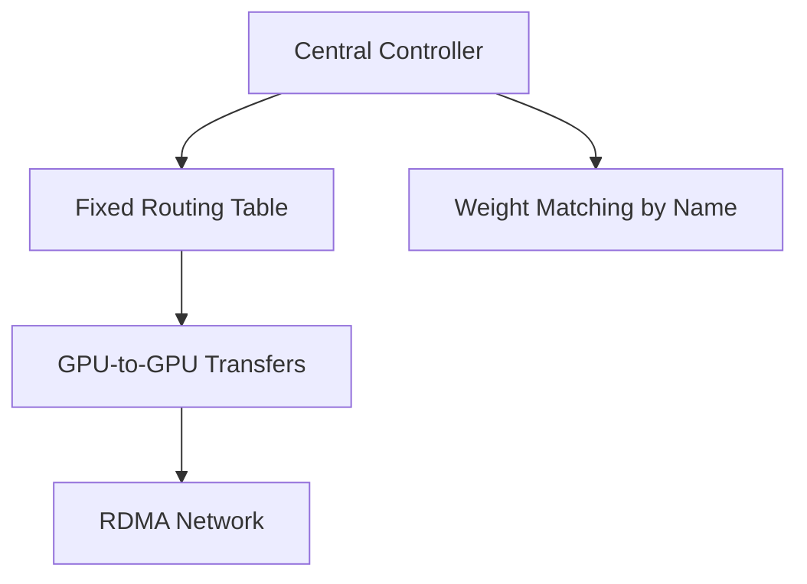
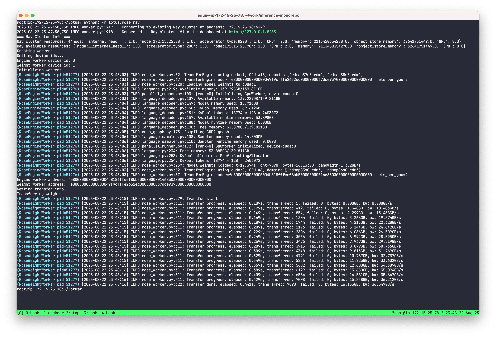

# Journey to 2-second Inter-node RL Weight Transfer

#Hardware_Topics #Networking #GPU-side #System_/_Runtime
#RL_Training_phases #Weight_Synchrony #Inference
#Scenarios

## Summary

This blog post by Lequn Chen details a breakthrough optimization achieving **2-second cross-machine parameter updates for Qwen3-235B** and **1.3-second updates for Kimi-K2 (1T parameters)**, representing a **100× improvement** over traditional approaches.

## Hardware Topics [Networking][GPU-side]

### Networking Innovations
- **RDMA (Remote Direct Memory Access)** for **zero-copy transfers** bypassing CPU overhead and traditional network stack
- **Point-to-point communication** eliminating broadcast/multicast overhead - **critical for GPU-to-GPU efficiency**
- **Direct memory access** removing CPU involvement from the critical path

### GPU-Side Optimizations
- **BF16 to FP8 conversion** for **50% size reduction** during inference while maintaining accuracy
- **Custom serialization** removing redundant metadata - **essential for gigabyte-scale model transfers**
- **Delta encoding** for incremental weight updates minimizing transferred data volume

**External Resources:**
- [RDMA Technology Overview](https://en.wikipedia.org/wiki/Remote_direct_memory_access)
- [NVIDIA GPUDirect RDMA](https://developer.nvidia.com/gpudirect-rdma)

## RL Training Phases [Weight_Synchrony][Inference]

### Weight Synchrony Breakthrough
- **Fixed Routing Table** with **pre-computed optimal data flow patterns** - eliminates runtime decision making
- **Central Controller** managing entire weight transfer process with **single point of coordination**
- **Weight Matching by Name** for **precise parameter identification** across distributed systems

### Inference Integration
- **Dynamic model distribution** across 256 training GPUs to 128 inference GPUs
- **Real-time parameter updates** during ongoing inference without service interruption
- **Direct GPU-to-GPU transfers** using **optimized routing patterns**

**External Resources:**
- [Parameter Server Architecture](https://paperswithcode.com/method/parameter-server)
- [Distributed Training Patterns](https://horovod.readthedocs.io/en/stable/)

## Technical Architecture [System_/_Runtime]

### Controller-Based System Design

**Figure 3**: System architecture showing deterministic routing between trainer nodes (sending 8.987-11.476 GB each) and rollout nodes (receiving 37.688 GB each) across 160 GPUs

### System Configuration
- **🏗️ Qwen3-235B**: BF16 training, FP8 inference across training/inference GPUs
- **🚀 Kimi-K2**: 1 trillion parameters with 256 training GPUs to 128 inference GPUs
- **🔧 Direct GPU-to-GPU transfers** using optimized routing

## Parallelization Strategy
- **🔄 Concurrent transfers** between multiple GPU pairs maximizing bandwidth utilization
- **📈 Pipelined architecture** overlapping serialization, transfer, and loading phases
- **⏱️ Static scheduling** eliminating runtime computation overhead
- **🎯 Linear scaling** with GPU count increases maintaining performance gains

## Performance Results

### Speed Achievements [GPU-side]
- **2-second updates** for 235B parameter models (vs. minutes in traditional systems)
- **1.3-second updates** for 1T parameter models
- **Linear scaling** with GPU count increases
- **Efficient bandwidth utilization** across all connections

**Figure 1**: RDMA-based weight transfer achieving 36.5 GB/s bandwidth with 16.133 GB transferred in 0.441 seconds

### Performance Metrics [Networking]
| Model Size | Traditional Time | Optimized Time | Speedup |
|------------|------------------|----------------|---------|
| 235B | ~200 seconds | 2 seconds | **100×** |
| 1T | ~1000 seconds | 1.3 seconds | **769×** |

**Figure 2**: Production-scale results showing consistent 1.69-1.70 second transfers for Qwen3-235B model

## Production Applications

### 🏭 Enterprise Use Cases
- **🔄 RL Post-Training**: **Continuous model improvement** during inference without downtime
- **⚡ Live Model Updates**: **Real-time parameter synchronization** for production services
- **🌐 Distributed Training**: **Multi-node coordination** for massive model deployments
- **📊 Inference Scaling**: **Dynamic model distribution** across clusters for load balancing

## 🎯 Technical Impact

This work represents a **paradigm shift** in distributed AI systems:
- **⚡ Enables real-time RL training** at massive scale previously thought impossible
- **🔗 Reduces training-inference gap** for production systems enabling continuous learning
- **🚀 Provides scalable foundation** for trillion-parameter model deployments
- **💡 Demonstrates practical applications** of advanced networking technologies like RDMA

**Links:**
- [Original Blog Post](https://le.qun.ch/en/blog/2025/09/07/rl-weight-transfer/)
- [Quick Follow-up](https://le.qun.ch/en/blog/2025/09/17/rl-weight-transfer-2/)
- [Lequn Chen's Blog Archive](https://le.qun.ch/en/blog/archives/)