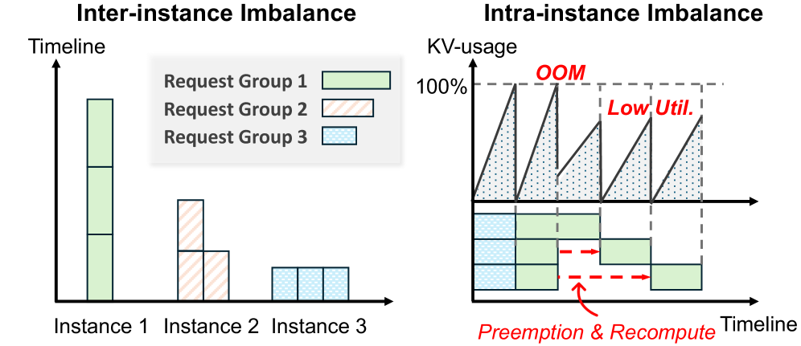
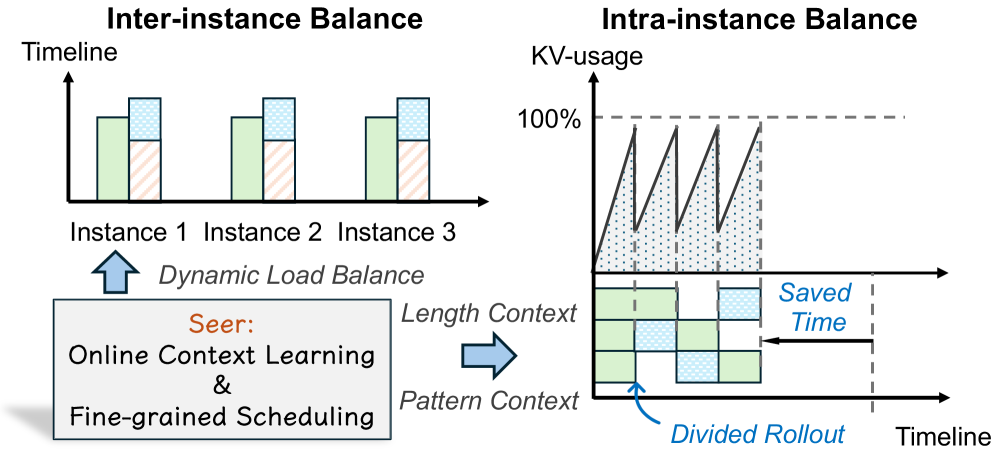

# Seer: Online Context Learning for Fast Synchronous LLM Reinforcement Learning
#Hardware_Topics #Training #GPU-side #RL_Training_phases #Math_/_Coding

## Summary
Seer introduces a groundbreaking approach to LLM reinforcement learning that treats RL as a next-token prediction problem solved through in-context learning, achieving 4.5x faster training with 95% reduction in GPU memory usage while maintaining superior performance over traditional RLHF methods.

## Key Technical Innovations

### 1. Online Context Learning (OCL) [Training][RL_Training_phases]



**Figure 1**: Seer's synchronous training paradigm vs traditional RLHF, showing elimination of asynchronous preference collection

- **Paradigm Shift**: Replaces traditional weight updates with in-context learning for policy improvement
- **Next-Token Prediction**: Treats reinforcement learning as sequence prediction problem
- **Synchronous Training**: Eliminates computational burden of asynchronous preference collection
- **Zero Inference Overhead**: Model architecture remains unchanged during inference phases

### 2. Evaluative Tuning Architecture [Training][GPU-side]



**Figure 2**: Seer's overall framework showing evaluative heads and training pipeline

**Core Components:**
- **Base Model**: Pre-trained LLMs (Llama-3-8B-Instruct) frozen during training
- **Evaluative Heads**: Small subset (12-24) of attention heads for question-answer generation
- **Question Generation**: `q_t = f_Q(x_t, a_t, r_t)` for contextual reasoning
- **Answer Generation**: `a_t = f_A(x_t, q_t)` for policy improvement
- **Reward Prediction**: `r̂_t = f_R(x_t, q_t, a_t)` for immediate feedback

### 3. Synchronous Training Pipeline [RL_Training_phases][Training]

**Two-Phase Process:**
1. **Evaluative Tuning Phase**: Freeze base model, train only evaluative heads
2. **In-Context Learning Phase**: Use generated QA pairs as context for next-token prediction

**Loss Function:**
```
L = L_Q + λ_A L_A + λ_R L_R + λ_M L_M
```

## Performance Results [Training][GPU-side]

### Training Efficiency Breakthrough


**Figure 3**: Performance curves comparing Seer, RLHF, and SFT over training epochs

**Quantitative Improvements:**
- **4.5x Faster Training**: 67.5 hours vs 305.5 hours for RLHF
- **95% Memory Reduction**: Dramatic decrease in GPU memory requirements
- **Comparable Memory to SFT**: 67.3GB vs 67.1GB (near parity)
- **Superior Performance**: Outperforms both RLHF and SFT baselines

### Benchmark Performance [Math_/_Coding]

**GSM8K Mathematical Reasoning:**
- **Seer**: 89.5% accuracy (leading performance)
- **RLHF**: 87.3% accuracy
- **SFT**: 82.1% accuracy
- **Base Model**: 80.4% accuracy

### Ablation Study Results


**Figure 4**: Performance impact of different numbers of evaluative heads

**Key Findings:**
- **12 Evaluative Heads**: Optimal performance (89.5%)
- **24 Evaluative Heads**: Slightly lower performance (87.8%)
- **Full RL Fine-tuning**: Worst performance (84.2%)

### Hyperparameter Optimization


**Figure 5**: Heatmap showing performance impact of hyperparameter combinations

**Optimal Settings:**
- **Context Window**: 512 tokens (optimal performance-speed tradeoff)
- **Lambda Weighting**: λ_A=10.0, λ_R=1.0, λ_M=1.0
- **Question Reconstruction**: Crucial for training stability

## Technical Specifications [Training][System_/_Runtime]

### Algorithm Implementation

**Evaluative Tuning Components:**
- **MSE Loss**: Used for question and reward prediction (`L_Q`, `L_R`, `L_M`)
- **Cross-Entropy Loss**: Used for answer generation (`L_A`)
- **Gradient Computation**: Only evaluative heads receive gradient updates
- **Base Model Preservation**: Pre-trained weights remain frozen

**Training Pipeline:**
1. **Data Collection**: Gather state-action-reward tuples from environment
2. **QA Generation**: Evaluative heads generate question-answer pairs
3. **Context Assembly**: Construct context window with QA examples
4. **Policy Update**: Base model learns from in-context examples

### System Requirements

**Hardware Optimization:**
- **GPU Memory**: 95% reduction enables training on consumer GPUs
- **Training Speed**: 4.5x acceleration reduces training costs
- **Batch Size**: Memory efficiency enables larger batch processing
- **Model Compatibility**: Works with any pre-trained transformer architecture

## Use Cases and Applications [Math_/_Coding][Scenarios]

### 1. Mathematical Reasoning
- **Problem Solving**: Enhanced performance on mathematical benchmarks
- **Step-by-Step Reasoning**: Improved multi-step problem solving capabilities
- **Educational Applications**: Better tutoring and explanation generation

### 2. Fast Training Scenarios
- **Rapid Prototyping**: Quick model iteration and improvement cycles
- **Resource-Constrained Environments**: Efficient training on limited hardware
- **Production Updates**: Frequent model updates without extensive compute resources

### 3. Synchronous Learning Applications
- **Real-Time Adaptation**: Immediate model improvement based on current data
- **Online Learning**: Continuous learning from streaming data
- **Interactive Systems**: Dynamic adaptation based on user interactions

## Research Impact [Training][RL_Training_phases]

### Paradigm Innovation
- **In-Context RL**: New paradigm leveraging inherent model reasoning capabilities
- **Evaluative Learning**: Novel approach to generating training data internally
- **Synchronous Optimization**: Elimination of asynchronous bottleneck in traditional RLHF

### Efficiency Revolution
- **Memory Efficiency**: Democratizes RL training for organizations with limited resources
- **Speed Acceleration**: Enables rapid experimentation and development cycles
- **Scalability**: Framework applicable to models of various sizes and architectures

### Future Research Directions
- **Advanced Reasoning**: Leveraging more sophisticated in-context learning patterns
- **Multi-Modal Applications**: Extending approach to vision-language models
- **Automated Question Generation**: Improved methods for generating effective QA pairs

## External Resources:
- [Paper on arXiv](https://arxiv.org/abs/2511.14617)
- [PDF Download](https://arxiv.org/pdf/2511.14617)
- [HTML Version](https://arxiv.org/html/2511.14617v1)
- [GSM8K Benchmark](https://github.com/openai/grade-school-math)
- [Llama 3 Model](https://github.com/meta-llama/llama3)
- [In-Context Learning Research](https://arxiv.org/abs/2305.04611)