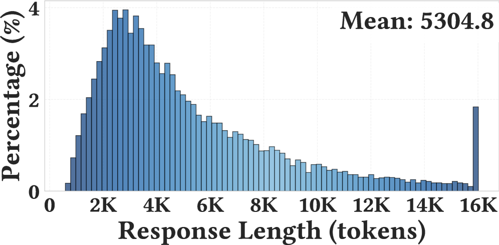
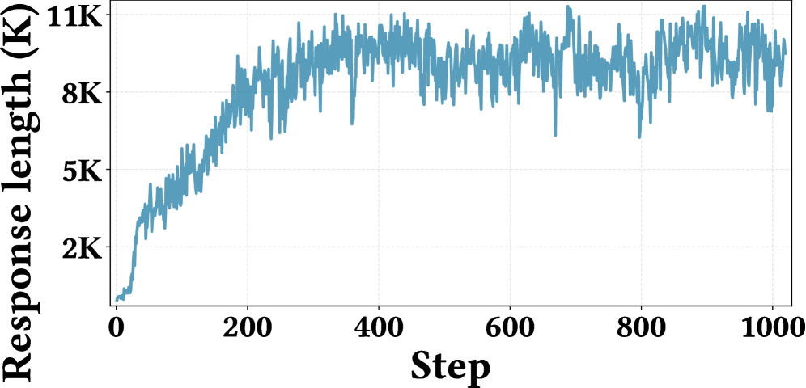

# RhymeRL: History Rhymes - Accelerating LLM Reinforcement Learning with Historical Patterns
#Hardware_Topics #Training #GPU-side #RL_Training_phases #Math_/_Coding

## Summary
RhymeRL introduces a novel framework that identifies and reuses effective historical learning trajectories from past RL training runs to accelerate current LLM reinforcement learning. Based on the principle that "history rhymes but doesn't repeat exactly," it achieves 1.6× training speedup while maintaining or improving final model performance through intelligent pattern matching and historical guidance.

## Key Technical Innovations

### 1. Historical Pattern Recognition [Training][RL_Training_phases]


**Figure 1**: Visualization of trajectory rhyming patterns showing similarities across different training runs

**Core Philosophy:**
- **Historical Rhyming**: Discovery that RL training trajectories share similar effective paths across different models and scales
- **Cross-Scale Transfer**: Small model trajectories rhyme with large model trajectories
- **Pattern Reuse**: Effective leveraging of proven historical learning patterns

### 2. RhymeRL Architecture Framework [System_/_Runtime][Training]


**Figure 2**: Complete RhymeRL framework showing retrospection, similarity, and retrodiction components

**Core Components:**
- **Retrospective Database**: Stores high-performing historical trajectories with associated rewards
- **Similarity Engine**: Computes trajectory similarities using `Cᵣʰʸᴍᴇ(·,·)` metric
- **Retrodiction Module**: Predicts optimal historical samples for current training states
- **Sample Bank**: Creates candidate pools combining historical and current generation data

### 3. Two-Stage Sampling Process [Training][GPU-side]



**Figure 3**: Retrodiction-guided sampling mechanism with trajectory selection and fine-grained scoring

**Stage 1 - Trajectory Selection:**
- **Similarity Computation**: Filter trajectories by similarity scores (top 20% by default)
- **Pattern Matching**: Identify rhyming patterns from historical successful trajectories
- **Cross-Scale Analysis**: Match current training stage with analogous historical stages

**Stage 2 - Retrodiction-Guided Sampling:**
- **PPO Policy Scoring**: Apply policy to score and select optimal responses from candidate pools
- **Fine-Grained Selection**: Optimal sample selection from historical candidates
- **Adaptive Integration**: Combine historical wisdom with current exploration

### 4. Execution Matching System [RL_Training_phases][Training]



**Figure 4**: Performance curves showing 1.6× speedup compared to standard PPO training

**Matching Mechanism:**
- **Analogous Point Identification**: Maps current training progress to historical stages
- **Threshold-Based Filtering**: Select most relevant historical trajectories
- **Optimal Intervention**: Applies historical guidance at key decision points

## Performance Results [Training][GPU-side]

### Training Acceleration Metrics

**Speed Achievements:**
- **1.6× Overall Speedup**: Consistent acceleration across different model families and tasks
- **Oracle Performance**: 4× potential acceleration with perfect historical knowledge
- **Minimal Overhead**: Only 10-20% additional cost for similarity computation and retrodiction

**Quality Preservation:**
- **No Performance Degradation**: Maintains or improves final model performance
- **Reward Progression**: Matches or exceeds standard PPO training curves
- **Consistent Benefits**: Effective across model sizes (1B, 3B, 8B parameters)

### Benchmark Performance [Math_/_Coding]

**Evaluation Results:**
- **GSM8K (Mathematical Reasoning)**: Competitive performance with accelerated training
- **AlpacaEval 2.0**: Maintains instruction following quality and safety
- **Arena Hard**: Preserves model competitiveness and performance ranking

### Ablation Study Results


**Figure 5**: Ablation studies showing impact of similarity thresholds and selection ratios

**Key Findings:**
- **Optimal Threshold**: Top 20% most similar trajectories provide best performance
- **Selection Ratio**: Balanced historical-to-current ratio maximizes benefits
- **Robustness**: Performance stable across different hyperparameter settings

## Technical Specifications [System_/_Runtime][Training]

### Similarity Computation Algorithm

**Trajectory Similarity Metric:**
```python
C_rhyme(τ_i, τ_j) = similarity(reward_sequences, state_distributions)
```

**Key Features:**
- **Normalized Reward Sequences**: Compares reward progression patterns
- **State Distribution Analysis**: Evaluates similarity in state visitation patterns
- **Temporal Alignment**: Accounts for timing differences between trajectories

### Historical Pattern Analysis


**Figure 6**: Heatmap showing trajectory rhyming patterns across different models and scales

**Pattern Discovery:**
- **Cross-Family Similarities**: Different model architectures exhibit similar learning patterns
- **Scale Transfer**: Early small-model training rhymes with later large-model stages
- **Task Independence**: Patterns transfer across different downstream tasks

### Implementation Architecture

**System Components:**
1. **Historical Database**: Efficient storage and retrieval of training trajectories
2. **Similarity Engine**: Real-time computation of trajectory similarity scores
3. **Retrodiction Module**: Neural network for predicting optimal historical samples
4. **Integration Layer**: Seamless incorporation with existing PPO training pipelines

## Use Cases and Applications [Scenarios][Training]

### 1. Multi-Model Training Organizations
- **Research Labs**: Accelerate training across multiple model families using shared history
- **AI Companies**: Leverage accumulated training experience for faster development cycles
- **Academic Institutions**: Cost-effective training with limited computational resources

### 2. Large-Scale Model Development
- **Foundation Models**: Accelerate training of billion-parameter models
- **Domain Adaptation**: Faster fine-tuning for specific applications
- **Model Families**: Efficient training of related model architectures

### 3. Resource-Constrained Environments
- **Budget-Limited Training**: Achieve faster results with reduced compute costs
- **Time-Critical Applications**: Rapid model deployment for urgent needs
- **Carbon-Conscious Training**: Reduce environmental impact through efficiency

## Research Impact [Training][RL_Training_phases]

### Paradigm Innovation
- **Historical Learning**: Systematic approach to leveraging training experience
- **Pattern Recognition**: Mathematical framework for identifying trajectory similarities
- **Cross-Scale Transfer**: Discovery of rhyming patterns across model scales

### Efficiency Revolution
- **Training Acceleration**: Fundamental improvement in RL training efficiency
- **Resource Optimization**: Better utilization of computational resources
- **Knowledge Accumulation**: Framework for building institutional training knowledge

### Future Research Directions
- **Advanced Similarity Metrics**: More sophisticated trajectory comparison methods
- **Multi-Modal Rhyming**: Extension to vision-language and other modalities
- **Automated Discovery**: AI-driven identification of rhyming patterns

## External Resources:
- [Paper on arXiv](https://arxiv.org/abs/2508.18588)
- [PDF Download](https://arxiv.org/pdf/2508.18588)
- [HTML Version](https://arxiv.org/html/2508.18588v1)
- [PPO Algorithm](https://arxiv.org/abs/1707.06347)
- [GSM8K Benchmark](https://github.com/openai/grade-school-math)
- [AlpacaEval](https://tatsu-lab.github.io/alpaca_eval/)
- [Arena Hard](https://github.com/lmarena/arena-hard)