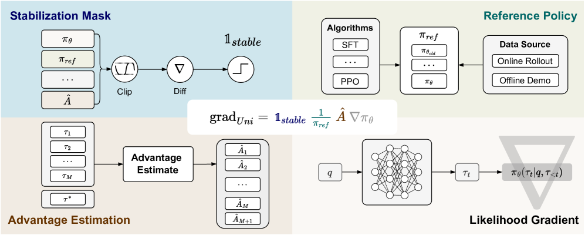

# Towards a Unified View of Large Language Model Post-Training
#Post-Training [Reinforcement_Learning] [SFT] [Theoretical_Framework] [Algorithm_Unification] [Hybrid_Training]

## Summary

This paper presents a unified theoretical framework that demonstrates how diverse LLM post-training approaches—Supervised Fine-Tuning (SFT) and Reinforcement Learning (RL)—are instances of a single optimization process. The authors derive a Unified Policy Gradient Estimator (UPGE) and propose Hybrid Post-Training (HPT), an algorithm that dynamically selects training signals to achieve effective exploitation of demonstrations while maintaining stable exploration.

## Key Technical Innovations [Theoretical_Foundation][Algorithm_Design]

### Unified Policy Gradient Estimator (UPGE) [Mathematical_Framework][Policy_Gradient]



**Figure 1**: The Unified Policy Gradient Estimator framework showing four interchangeable components that unify diverse post-training approaches

**Core Mathematical Framework:**
```
grad_Uni = 1_stable × (1/π_ref) × Â × ∇π_θ
```

**Four Interchangeable Components:**
1. **Stabilization Mask (1_stable)**: Safety mechanism for training stability (PPO clipping, CIPS mask, etc.)
2. **Reference Policy Denominator (π_ref)**: Token-level reweighting coefficient
3. **Advantage Estimate (Â)**: Sequence-level quality assessment
4. **Likelihood Gradient (∇π_θ)**: Standard policy gradient computation

### Algorithm Unification [Algorithm_Analysis][Comparative_Study]

**Unified Perspective on Post-Training Methods:**

| Method | Reference Policy | Advantage | Application |
|--------|------------------|-----------|-------------|
| **SFT** | π_θ (current) | Â_SFT = 1 | Offline demonstration |
| **PPO** | π_θ_old (rollout) | GAE | Online RL |
| **GRPO** | π_θ_old (rollout) | Group-relative reward | Online RL |
| **SRFT** | 1 (offline) | Normalized reward | Offline/Online hybrid |

### Theoretical Insights [Bias_Variance_Tradeoff][Optimization_Theory]

**Key Findings:**
- **Not Contradictory**: SFT and RL are complementary learning signals, not conflicting objectives
- **Unified Objective**: All methods derive from a common optimization goal with different data distribution assumptions
- **Bias-Variance Tradeoff**: Different gradient components offer varying bias-variance characteristics
- **Component Interchangeability**: Four framework parts can be mixed and matched

## Hybrid Post-Training (HPT) [Dynamic_Selection][Adaptive_Algorithms]

### Dynamic Signal Selection [Training_Dynamics][Exploration_Exploitation]

**Core Innovation**: Adaptive mixing between SFT and RL based on performance feedback
- **Rollout Accuracy Gate**: Switch between SFT and RL based on current performance
- **Dynamic Adaptation**: Different mixing ratios for models of varying capabilities
- **Stable Exploration**: Maintains learned reasoning patterns while exploring new solutions

**Algorithm Characteristics:**
- **Effective Exploitation**: Leverages high-quality demonstrations when available
- **Stable Exploration**: Prevents degradation of learned capabilities during RL
- **Intrinsic Adaptability**: Automatically adjusts to model scale and task complexity

## Experimental Results [Performance_Evaluation][Benchmarking]

### Comprehensive Evaluation [Mathematical_Reasoning][Out_of_Distribution]

**Testing Framework:**
- **Six Mathematical Reasoning Benchmarks**: Comprehensive mathematical problem solving
- **Two Out-of-Distribution Suites**: Generalization capability assessment
- **Multiple Model Scales**: Qwen2.5-Math (1.5B, 7B), Llama3.1-8B

**Key Achievements:**
- **7-point gain** over strongest baseline on AIME 2024 with Qwen2.5-Math-7B
- **Consistent superiority** across models of varying scales and families
- **Enhanced exploration**: Highest Pass@1024 for improved generalization

### Training Dynamics Analysis [Empirical_Analysis][Training_Visualization]

**Performance Mechanisms:**
- **Exploration vs Exploitation Balance**: Dynamic integration achieves optimal tradeoff
- **Training Stability**: Maintains reasoning patterns during RL exploration
- **Model Capability Adaptation**: Effective on both large and small models

## Theoretical Contributions [Research_Impact][Algorithm_Theory]

### Foundational Unification [Paradigm_Shift][Theoretical_Advance]

**Major Theoretical Contributions:**
1. **Single Optimization Process**: Proves SFT and RL are instances of unified optimization
2. **Component Analysis**: Breaks down diverse methods into four interchangeable parts
3. **Bias-Variance Characterization**: Theoretical understanding of gradient component tradeoffs
4. **Dynamic Optimization Framework**: Principled approach to adaptive training signal selection

### Practical Implications [System_Design][Training_Efficiency]

**Benefits for LLM Development:**
- **Resource Efficiency**: Eliminates multi-stage SFT→RL pipeline complexity
- **Performance Optimization**: Achieves superior results with principled approach
- **Scalability**: Effective across different model architectures and scales
- **Implementation Simplicity**: Clear algorithmic framework for practical deployment

## External Resources [Implementation][Code_Repository]

**Official Resources:**
- [arXiv Paper](https://arxiv.org/abs/2509.04419)
- [GitHub Repository](https://github.com/TsinghuaC3I/Unify-Post-Training)
- [HTML Version](https://arxiv.org/html/2509.04419v1)

**Research Team:**
- **Primary Affiliation**: Tsinghua University, Shanghai AI Laboratory, WeChat AI
- **Contact**: lvxt24@mails.tsinghua.edu.cn
- **Code Availability**: Full implementation released as open source

**Key Citation:**
```bibtex
@misc{lv2025unified,
  title={Towards a Unified View of Large Language Model Post-Training},
  author={Lv, Xingtai and Zuo, Yuxin and Sun, Youbang and others},
  year={2025},
  eprint={2509.04419},
  archivePrefix={arXiv},
  primaryClass={cs.CL}
}
```