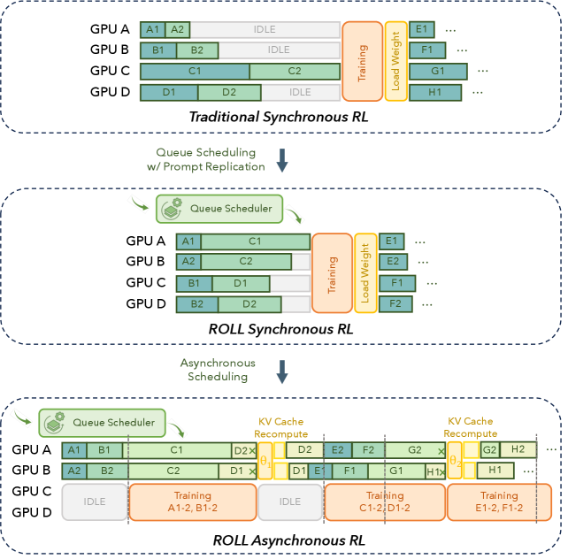

# Part II: ROLL Flash - Accelerating RLVR and Agentic Training with Asynchrony

#Hardware_Topics #GPU-side #System_/_Runtime
#RL_Training_phases #Inference #Training #Experience_Buffer_/_Replay
#Scenarios #Math_/_Coding #Multi-agents

## Summary

ROLL Flash extends the ROLL framework with **native asynchronous execution** for RL post-training, achieving **up to 2.24x speedup on RLVR tasks** and **2.72x on agentic tasks**. Built on two core principles—**fine-grained parallelism** and **rollout-train decoupling**—the system introduces queue scheduling, prompt replication, and environment-level asynchronous execution to dramatically improve resource utilization and scalability.

## Key Technical Innovations

### 1. Core Design Principles [System_/_Runtime][Inference]

**Figure 1**: ROLL Flash asynchronous execution framework showing fine-grained parallelism and rollout-train decoupling architecture

#### Fine-Grained Parallelism [GPU-side][Training]
- **Sample-level lifecycle control** during rollout stage with immediate scheduling
- **Overlap optimization** among LLM generation, environment interaction, and reward computation
- **Queue scheduling** treating each prompt as independent task for dynamic dispatch
- **Prompt replication** expanding single prompts into multiple independent rollout tasks

#### Rollout-Train Decoupling [Experience_Buffer_/_Replay][System_/_Runtime]
- **Separate resource allocation** for rollout and training stages
- **Parallel execution** eliminating strict synchronization barriers
- **Stale policy tolerance** enabling training on samples generated from previous model versions
- **Asynchronous ratio control** bounding policy version gaps for training stability

### 2. Advanced System Components [Inference][Training]

#### LLMProxy [GPU-side][System_/_Runtime]
- **Fine-grained task management** for individual prompt scheduling
- **Dynamic load balancing** across available GPU workers
- **Immediate reward computation** overlapping with ongoing generation
- **Optimized resource utilization** eliminating pipeline bubbles

#### EnvManager [Multi-agents][Experience_Buffer_/_Replay]
- **Environment-level asynchronous rollout** decomposing trajectories into interaction units
- **Redundant environment rollout** handling latency variations and failures
- **Fine-grained scheduling** for continuous agent-environment interaction
- **Failure tolerance** with redundant execution paths

#### SampleBuffer and AsyncController [Training][System_/_Runtime]
- **Freshness constraint enforcement** through asynchronous ratio bounds
- **Dynamic data pool management** balancing sample staleness and throughput
- **Quality-aware sampling** prioritizing fresher samples when needed
- **Stability preservation** preventing performance degradation from stale rollouts

### 3. RLVR Pipeline Optimizations [Math_/_Coding][GPU-side]

**Figure 2**: ROLL Flash performance on RLVR tasks showing up to 2.24x speedup with asynchronous execution

#### Queue Scheduling Performance [Inference][Training]
- **3.4x speedup** with 16 redundant prompts and 8×8 configuration
- **125s to 37s reduction** in average per-step generation time
- **Immediate reward dispatch** eliminating batch synchronization barriers
- **Dynamic filtering acceleration** for high-quality sample collection

#### Prompt Replication Benefits [GPU-side][System_/_Runtime]
- **1.84x speedup** at 64×16 configuration (batch size × responses)
- **1.95x speedup** at 16×32 configuration
- **Straggler effect mitigation** through fine-grained intra-rollout parallelism
- **GPU utilization improvement** with reduced mean step time

### 4. Agentic Pipeline Accelerations [Multi-agents][Experience_Buffer_/_Replay]

#### Environment-Level Asynchronous Rollout [Inference][Training]
- **2.46x speedup** under high variance environment latency (μ=10s, σ=10s)
- **Real-world gains**: 1.23x on SWE, 1.58x on ALFWorld in sync training
- **Latency variance exploitation** where benefits grow with environment unpredictability
- **Continuous agent interaction** without GPU idle time during environment responses

#### Redundant Environment Rollout [Multi-agents][System_/_Runtime]
- **Multiple parallel execution paths** for critical trajectory segments
- **Failure recovery** through alternate environment instances
- **Latency masking** balancing workload across heterogeneous environments
- **Throughput optimization** maintaining high resource utilization

## Performance Results [GPU-side][Training]

### Theoretical Analysis [System_/_Runtime]
- **Generation time bounds** proving queue scheduling superior to batch processing
- **Producer-consumer efficiency** with continuous rollout saturation
- **Resource allocation optimization** through fine-grained control
- **Scalability guarantees** for increasing GPU resources

### Empirical Validation [Math_/_Coding][Inference]
- **Strong scalability** across Qwen3-Base and Think models
- **Consistent speedup growth** as GPU resources scale to hundreds of GPUs
- **Small asynchronous ratio sufficiency** for near-maximal acceleration
- **Off-policy algorithm compatibility** maintaining training stability

### Training Stability [Experience_Buffer_/_Replay]
- **Asynchronous ratio optimization** balancing freshness and throughput
- **Sample freshness constraints** preventing staleness-induced degradation
- **Off-policy algorithm integration** (PPO, GRPO) compensating for staleness effects
- **Performance parity** with synchronous training while delivering significant speedups

## System Architecture Benefits [System_/_Runtime][GPU-side]

### Resource Utilization [Inference][Training]
- **Elimination of resource bubbles** through continuous generation
- **Memory-bandwidth optimization** for decoding-intensive workloads
- **GPU saturation maintenance** avoiding idle time during long-tail responses
- **Dynamic load balancing** across heterogeneous workloads

### Scalability Improvements [Multi-agents][Experience_Buffer_/_Replay]
- **Linear scaling potential** through decoupled rollout and training resources
- **Parallel generation expansion** supporting thousands of concurrent prompts
- **Environment interaction optimization** for complex agentic tasks
- **Flexible resource allocation** adapting to workload characteristics

### Algorithm Compatibility [Training][System_/_Runtime]
- **Off-policy algorithm support** enabling asynchronous training stability
- **PPO and GRPO implementation** with proven performance preservation
- **Freshness-aware training** maintaining sample quality in async settings
- **Configurable staleness bounds** for different application requirements

## Impact and Applications [Math_/_Coding][Multi-agents]

### RL Reasoning Tasks [Experience_Buffer_/_Replay]
- **Mathematical reasoning acceleration** with complex chain-of-thought generation
- **Code generation optimization** for long-sequence problem solving
- **Multi-turn interaction handling** with efficient environment management
- **Dynamic filtering scenarios** maximizing high-quality sample collection

### Agentic Applications [Multi-agents][Inference]
- **ALFWorld acceleration**: 2.72x speedup for embodied reasoning tasks
- **SWE optimization**: 1.81x improvement for software engineering workflows
- **Complex environment handling** with unpredictable latency patterns
- **Multi-agent coordination** with asynchronous interaction patterns

### Production Deployment [System_/_Runtime][GPU-side]
- **Resource efficiency** reducing training costs while maintaining quality
- **Scalable infrastructure** supporting hundreds of GPUs effectively
- **Fault tolerance** through redundant execution paths
- **Operational flexibility** with configurable synchronization constraints

## Technical Integration [Training][Inference]

### Framework Compatibility [System_/_Runtime]
- **ROLL extension** maintaining existing interface compatibility
- **Off-the-shelf algorithm support** for common RL methods
- **Easy deployment** with minimal configuration requirements
- **Monitoring and management** tools for production environments

### Future Extensibility [Multi-agents][Training]
- **Modular design** enabling additional optimization components
- **Algorithm-agnostic architecture** supporting emerging RL methods
- **Environment abstraction** for diverse agentic applications
- **Scalable implementation** ready for next-generation hardware

## Broader Significance [Math_/_Coding][System_/_Runtime]

ROLL Flash represents a **paradigm shift** from synchronous batch processing to **asynchronous fine-grained execution** in RL post-training. By combining **system-level innovations** with **algorithmic compatibility**, it delivers substantial performance improvements while maintaining training stability, making it particularly valuable for **large-scale production deployments** and **complex agentic applications**.

**External Resources:**
- [Agentic]: [Agentic RL](https://arxiv.org/abs/2310.01797)
- [Scaling]: [Large-Scale RL](https://arxiv.org/abs/2310.12940)
- [Async]: [Async Training](https://arxiv.org/abs/2505.24298)
- [Framework]: [ROLL GitHub](https://github.com/alibaba/ROLL)

**Links:**
- [arXiv Paper](https://arxiv.org/abs/2510.11345)
- [PDF](./raw_docs/2510.11345.pdf)
- [ROLL Framework](https://github.com/alibaba/ROLL)