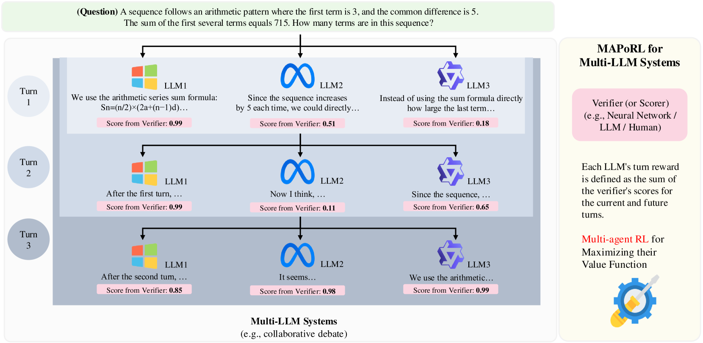
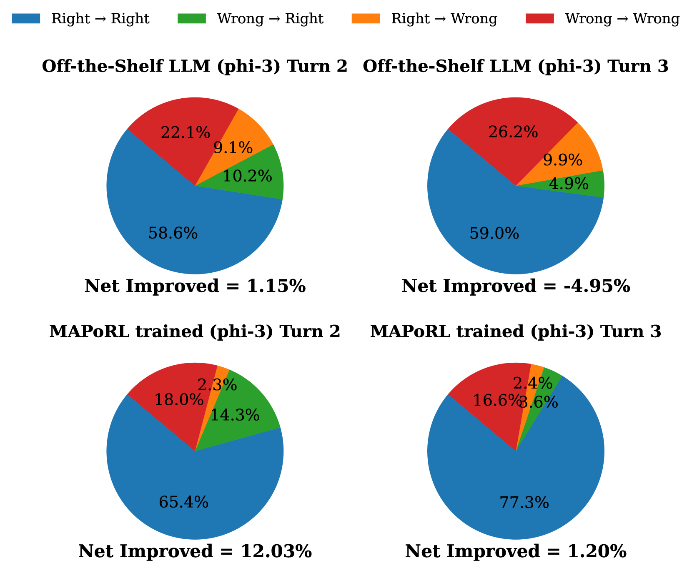
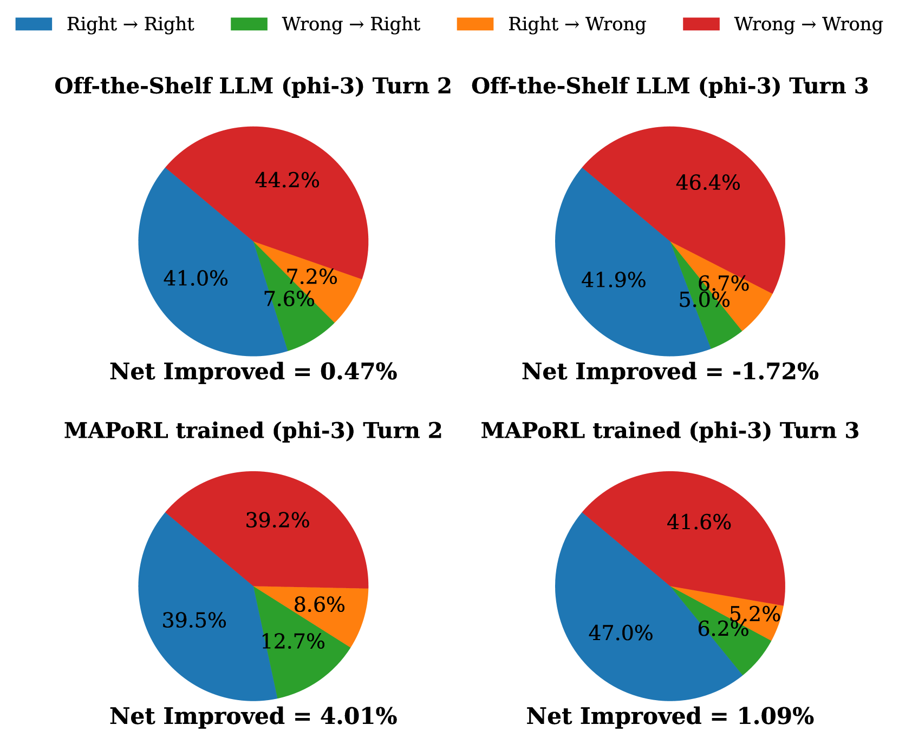

# MAPoRL: Multi-Agent Post-Co-Training for Collaborative Large Language Models with Reinforcement Learning
#Multi-agents #RL_Training_Phases #Training #Inference #Math_/_Coding #Alignment

## Summary [Multi-agents][Training][RL_Training_Phases]

MAPoRL introduces a novel post-training paradigm that uses multi-agent reinforcement learning (MARL) to train multiple LLMs for collaborative problem-solving, demonstrating that co-training is essential for effective multi-agent collaboration.

## Key Technical Innovations [Multi-agents][Training][Inference]

### 1. Multi-Agent Post-Co-Training Framework [Multi-agents][Training][RL_Training_Phases]

**Figure 1**: MAPoRL integrates with any multi-LLM system featuring a scorer/verifier. In this collaborative debate system for mathematical problem-solving, LLMs generate responses based on multi-agent system pipeline, and a verifier evaluates outputs. Multi-Agent RL maximizes each agent's value function based on these scores.

- **Core breakthrough**: Shifts from single-agent training to multi-agent co-training for collaboration
- **Technical detail**: Multiple LLMs generate responses independently, engage in multi-turn discussions, and improve final answers through structured interaction
- **Performance impact**: Enables agents to develop genuine cooperative behaviors rather than just simulating collaboration

### 2. Influence-Aware Verification Rewards [Training][RL_Training_Phases]

The reward function considers both current turn performance and future collaborative impact:

$$R_{\theta}(q,s_{ta}) = E[\frac{1}{\sum_{t'\in[t,T]}\gamma^{t'-t}}(\text{Verifier}(q,s_{ta}) + \sum_{t'\in[t+1,T]}\sum_{j\in[A]}\frac{1}{A}\gamma^{t'-t}\text{Verifier}(q,s_{t'j}))]$$

- **Innovation**: Rewards not only current answer quality but also influence on future agent responses
- **Mechanism**: Uses Generalized Advantage Estimation (GAE) for value function optimization
- **Effect**: Encourages agents to consider long-term collaborative benefits over short-term gains

### 3. Collaborative Game-Theoretic Framework [Multi-agents][Math_/_Coding]

**Figure 2**: Performance comparison showing vanilla collaboration by off-the-shelf LLMs cannot improve performance, while MAPoRL-trained LLMs show consistent improvement across turns.

- **Theoretical insight**: Single-agent training is insufficient for genuine cooperation
- **Game model**: Agents choose between "Collaborate" (a₀) and "Act Independently" (a₁) actions
- **Key finding**: Multi-agent co-training reaches equilibrium with cooperative behavior

## Performance Results [Multi-agents][Math_/_Coding][Alignment]

### Collaborative Improvement Across Turns

**Figure 3**: MAPoRL-trained models show improved performance as collaboration turns increase, unlike off-the-shelf LLMs which show no improvement.

- **Mathematical reasoning**: GSM8K performance improves significantly across collaboration turns
- **Logical inference**: ANLI dataset shows consistent performance gains
- **Key result**: Off-the-shelf LLMs with longer reasoning (600 tokens) showed no improvement, while MAPoRL-trained models improved

### Answer Transition Analysis [Multi-agents][Alignment]

**Figure 4-5**: Changes in response correctness transitions across multiple MAPoRL turns, showing decreased Incorrect→Incorrect and Correct→Incorrect transitions.

- **Improved collaboration**: Reduced incorrect answer persistence
- **Enhanced self-correction**: Better Wrong→Right transitions
- **Stability**: Fewer Correct→Incorrect degradations

### Incentive Mechanism Design [Multi-agents][Training]

The framework introduces sophisticated incentive parameters (α, β) to encourage specific collaborative behaviors:

| Parameter | Purpose | Effect |
|-----------|---------|--------|
| α₀ | Critical reasoning from incorrect answers | Extract useful information |
| α₁ | Persuadability to correct information | Follow correct majority |
| β₀ | Provide incorrect but useful responses | Helpful wrong answers |
| β₁ | Persuade others with correct answers | Effective teaching |

**Performance Impact**: α₁ increase (0→2) yielded 9.5% improvement in following correct majority opinions, demonstrating effective incentive design.

## External Resources [Multi-agents][Training][RL_Training_Phases]

- **GitHub Repository**: [https://github.com/chanwoo-park-official/MAPoRL](https://github.com/chanwoo-park-official/MAPoRL)
- **Multi-Agent PPO**: Foundation for decentralized policy training with centralized critics
- **GSM8K Dataset**: Mathematical reasoning benchmark for evaluation
- **ANLI Dataset**: Adversarial Natural Language Inference for logical reasoning testing