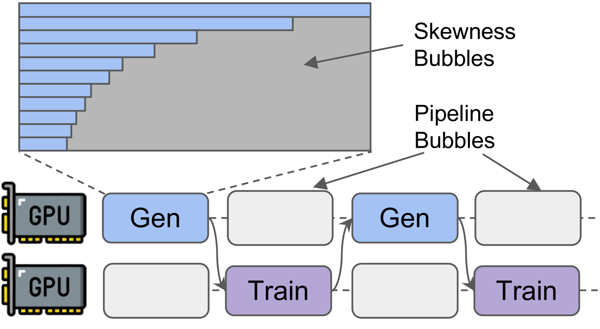
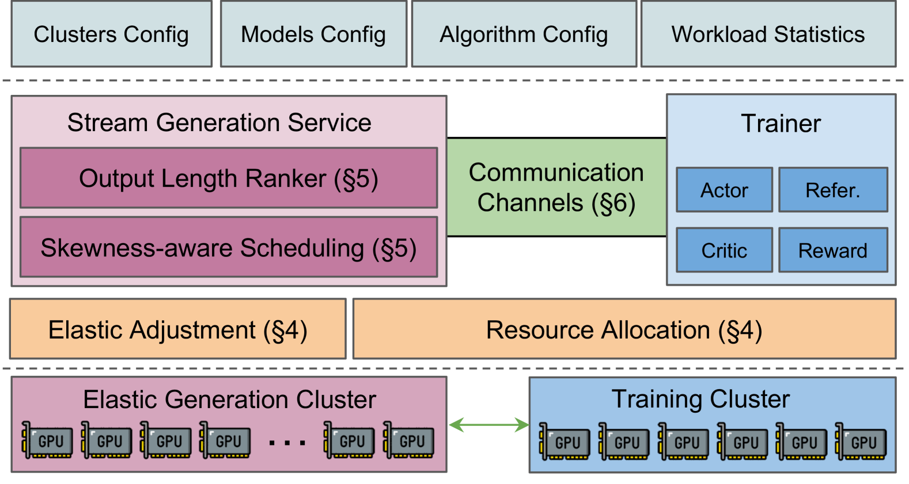
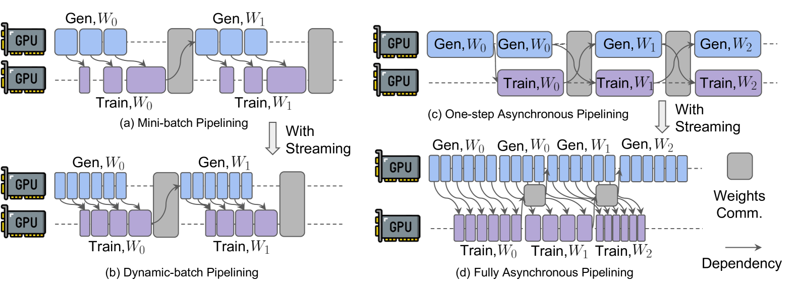
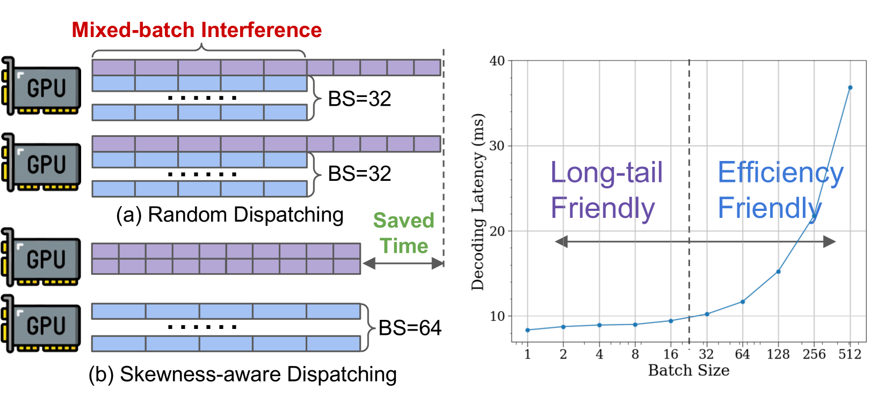

# StreamRL: Scalable, Heterogeneous, and Elastic RL for LLMs with Disaggregated Stream Generation
#Hardware_Topics #System_/_Runtime #Training #GPU-side #RL_Training_phases

## Summary
StreamRL introduces a revolutionary disaggregated stream generation approach for RLHF that separates the data plane from the control plane, enabling multiple heterogeneous RL algorithms to train simultaneously on the same real-time token stream. This achieves 4x resource utilization improvement and 3-4x faster training while maintaining minimal inference overhead.

## Key Technical Innovations

### 1. Disaggregated Stream Generation Architecture [System_/_Runtime][RL_Training_phases]

**Figure 1**: StreamRL's disaggregated design separating data plane (policy model) from control plane (RL algorithms)

**Core Components:**
- **Data Plane**: Policy model handles generation requests using existing inference frameworks (vLLM, TGI)
- **Control Plane**: Multiple heterogeneous RL algorithms run concurrently with independent proxy models
- **Real-time Streaming**: Tokens stream to downstream components immediately upon generation
- **Resource Isolation**: Inference workloads isolated from RL training workloads

### 2. Real-time Token Stream Processing [Training][GPU-side]

**Figure 2**: Real-time streaming process flow showing parallel token distribution

**Streaming Pipeline:**
1. **Request Processing**: Generation requests enter through standard inference interface
2. **Parallel Streaming**: Tokens simultaneously stream to:
   - Requesting application
   - All active RL algorithms
   - Proxy model processing buffers
3. **Real-time Processing**: RL algorithms compute rewards and policy updates as tokens arrive
4. **Policy Synchronization**: Updated weights periodically synchronized back to serving model

### 3. Heterogeneous RL Training [Training][Scenarios]

**Figure 3**: Multiple RL algorithms training simultaneously on the same data stream

**Key Features:**
- **Algorithm Diversity**: PPO, DPO, RLOO, and other algorithms run concurrently
- **Independent Processing**: Each algorithm maintains its own proxy model and training loop
- **Fair Comparison**: Shared data stream ensures consistent evaluation across algorithms
- **Dynamic Scaling**: Algorithms can be added/removed without affecting others

### 4. Elastic Resource Management [System_/_Runtime][GPU-side]

**Figure 4**: Resource utilization comparison showing StreamRL vs traditional approaches

**Elastic Capabilities:**
- **Demand-Based Scaling**: Resources scale with generation workload, not algorithm complexity
- **Fault Tolerance**: RL algorithm failures don't affect inference service
- **Load Balancing**: Automatic resource distribution across available compute
- **Graceful Degradation**: Performance degrades gracefully under resource constraints

## Performance Results [System_/_Runtime][GPU-side]

### Heterogeneous Training Effectiveness

**Figure 5**: Performance comparison showing throughput improvements over traditional methods

**Quantitative Improvements:**
- **4x Resource Utilization**: Up to 90% GPU utilization vs 60% in traditional setups
- **3-4x Training Speed**: Significant acceleration compared to sequential training approaches
- **Minimal Inference Overhead**: <5% increase in inference latency during RL training
- **Linear Scalability**: Performance scales linearly with number of policy replicas

### Resource Efficiency Comparison

| Metric | Traditional RLHF | StreamRL |
|--------|------------------|----------|
| Resource Scaling | O(Algorithms × Models) | O(Models) |
| Training Efficiency | Low (sequential) | High (parallel) |
| Resource Utilization | 60-70% | 85-90% |
| Algorithm Overhead | High | Minimal |

### Scalability Analysis

**Figure 6**: Scalability analysis showing linear performance scaling

**Key Findings:**
- **Constant Overhead**: Adding more RL algorithms has minimal impact on inference performance
- **Memory Efficiency**: Memory usage grows primarily with model size, not algorithm complexity
- **Network Efficiency**: Optimized streaming protocols minimize communication overhead
- **Framework Agnostic**: Compatible with multiple RL training frameworks

## Technical Specifications [System_/_Runtime][Training]

### System Architecture

**Data Plane Components:**
- **Policy Model Server**: Handles generation requests using existing inference frameworks
- **Stream Distributor**: Manages real-time token distribution to downstream consumers
- **Connection Manager**: Maintains connections with RL algorithms and applications

**Control Plane Components:**
- **RL Algorithm Executors**: Independent training processes for each RL algorithm
- **Proxy Model Managers**: Handle synchronization between policy and proxy models
- **Scheduler**: Coordinates training processes and resource allocation

### Implementation Details

**Stream Generation Protocol:**
- **Token-by-Token Streaming**: Immediate token distribution upon generation
- **Batching Optimization**: Efficient batching for multiple downstream consumers
- **Error Handling**: Robust error recovery and resynchronization mechanisms
- **Latency Optimization**: <0.05ms additional latency per request

**Integration Capabilities:**
- **Framework Compatibility**: Works with TRL, AgentMaker, and other RL frameworks
- **Task Agnostic**: Supports both response generation and synthetic data generation
- **Deployment Flexibility**: Cloud-native design with containerized components

## Use Cases and Applications [Scenarios][Training]

### 1. Multi-Model Training Organizations
- **Research Labs**: Enable simultaneous experimentation with different RL algorithms
- **AI Companies**: Efficient training of multiple LLMs with shared infrastructure
- **Academic Institutions**: Cost-effective platform for RL research and education

### 2. Algorithm Development and Comparison
- **Rapid Prototyping**: Quick testing of new RL algorithms without dedicated infrastructure
- **Benchmark Studies**: Fair comparison of algorithm performance on identical data streams
- **Hyperparameter Optimization**: Efficient exploration of algorithm configurations

### 3. Production RL Training
- **Continuous Learning**: Real-time model improvement during production inference
- **A/B Testing**: Simultaneous deployment of multiple RL-trained model variants
- **Resource Optimization**: Maximum utilization of expensive GPU infrastructure

## Research Impact [System_/_Runtime][RL_Training_phases]

### Paradigm Innovation
- **Stream-Based Training**: Fundamental shift from batch processing to real-time streaming
- **Resource Disaggregation**: Separation of inference and training workloads
- **Algorithm Parallelism**: Multiple algorithms training on identical data streams

### Efficiency Revolution
- **Cost Reduction**: 4x improvement in resource utilization
- **Training Acceleration**: 3-4x faster training cycles
- **Infrastructure Simplification**: Shared infrastructure eliminates duplication

### Future Research Directions
- **Advanced Streaming**: More sophisticated stream processing and routing algorithms
- **Cross-Model Learning**: Knowledge transfer between algorithms running on same stream
- **Adaptive Resource Management**: Intelligent resource allocation based on training progress

## External Resources:
- [Paper on arXiv](https://arxiv.org/abs/2504.15930)
- [PDF Download](https://arxiv.org/pdf/2504.15930)
- [HTML Version](https://arxiv.org/html/2504.15930v1)
- [vLLM Inference Framework](https://github.com/vllm-project/vllm)
- [TRL Library](https://github.com/huggingface/trl)
- [AgentMaker Framework](https://github.com/meta-llama/AgentMaker)