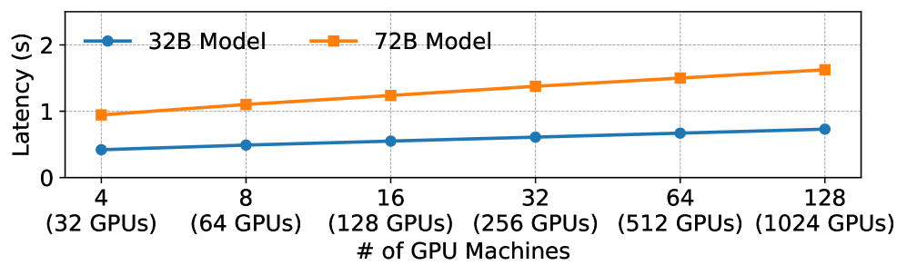
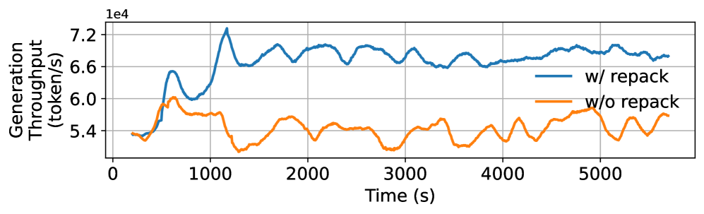
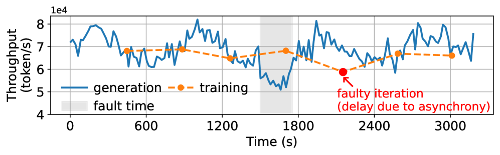

# Laminar: A Scalable Asynchronous RL Post-Training Framework

#Hardware_Topics #GPU-side #CPU-side #Networking #System_/_Runtime
#RL_Training_phases #Inference #Training #Weight_Synchrony #Experience_Buffer_/_Replay
#Scenarios #Math_/_Coding(with_verifier) #Multi-agents

## Summary

Laminar introduces a **fully decoupled architecture** that eliminates the long-tail trajectory generation bottleneck in RL post-training at production scale. The key innovation is **trajectory-level asynchrony**, enabling each trajectory to be generated and consumed independently at its own optimal pace, removing rigid global synchronization points.

## Key Technical Contributions

### 1. Relay Workers Architecture [Weight_Synchrony][System_/_Runtime]

**Figure 1**: Complete Laminar system architecture showing trajectory-level asynchrony with relay workers managing parameter distribution

- **Hierarchical parameter service** with master relay broadcasting to worker relays
- **CPU-based intermediaries** eliminate GPU memory overhead for weight synchronization

**Figure 2**: Relay broadcast latency measurements showing sub-1.6 second weight distribution for 72B models

- **On-demand weight pulls** allow rollouts to fetch latest parameters anytime without stalling training

### 2. Dynamic Repack Mechanism [Inference][Experience_Buffer_/_Replay]

**Figure 3**: Dynamic trajectory repack mechanism eliminating GPU bubbles during long-tail generation

- **KVCache-based monitoring** identifies underutilized rollouts with small decode batches

**Figure 4**: KVCache utilization patterns enabling intelligent trajectory consolidation

- **Trajectory consolidation** merges incomplete trajectories from multiple rollouts onto fewer dedicated replicas

**Figure 5**: Quantitative repack mechanism efficiency showing 14.8% KVCache utilization increase with 26% generation throughput improvement

- **Minimal overhead** (0.69s repacking time) without increasing trajectory latency

### 3. Fault-Tolerant Design [System_/_Runtime]

**Figure 6**: System behavior during machine failures showing robust fault tolerance mechanisms

- **Isolated component failures** prevent single point failures from halting entire training jobs
- **Heartbeat-based failover** with constant-time O(1) broadcast chain reconstruction
- **Partial response pool** stores in-progress trajectories for fault tolerance
- **Swift recovery** within seconds without disrupting ongoing training

## Performance Results [Training][System_/_Runtime]

### Throughput Improvements

**Figure 7**: Performance comparison showing 5.48x speedup over state-of-the-art RL systems on 1024-GPU clusters

- **5.48x speedup** over state-of-the-art RL systems on 1024-GPU clusters
- **53.7% scaling efficiency** on math tasks (up to 68.2% on 32B models)
- **46.5% scaling efficiency** on tool-calling tasks
- **Maximum staleness of 4** compared to higher bounds in other systems

### Training Convergence
- **Stable model convergence** with minimal staleness across trajectories
- **Faster convergence time** compared to baseline synchronous and asynchronous systems
- **Consistent policy versions** for individual trajectories avoiding mixed-policy generation issues

## System Architecture Components

### Rollout Module
- **Rollout manager** coordinates workload monitoring and trajectory repacking
- **Independent rollouts** generate trajectories without global synchronization dependencies
- **External environment integration** for multi-turn agentic tasks

### Data Module
- **Prompt pool** supplies initial generation states
- **Partial response pool** provides fault tolerance for in-progress trajectories
- **Experience buffer** stores completed trajectories with flexible sampling APIs

### Trainer Module
- **Multi-model execution** (actor, critic, reference) in time-sharing manner
- **Immediate training resumption** after weight publication to master relay
- **Flexible sampling strategies** for different RL algorithms

## Impact and Applications

Laminar's architecture enables **efficient scaling of RL post-training** to thousands of GPUs for extended durations while maintaining training stability. The system is particularly effective for:

- **Math and coding tasks** with highly variable trajectory lengths
- **Multi-turn agentic applications** with unpredictable environment interaction latency
- **Production-scale RL training** requiring fault tolerance and robustness
- **Large language model post-training** with complex reasoning capabilities

**Links:**
- [arXiv Paper](https://arxiv.org/abs/2510.12633)
- [PDF](./raw_docs/2510.12633.pdf)