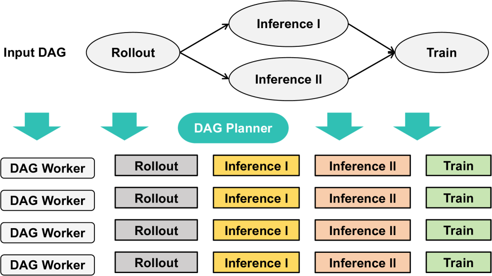
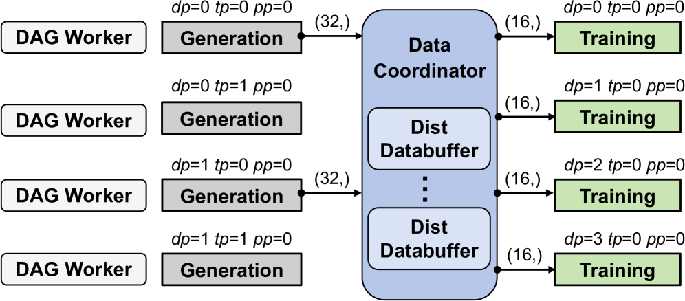
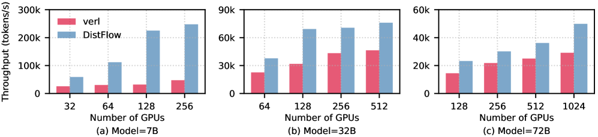

# DIsTFLow: A Fully Distributed RL Framework for Scalable and Efficient LLM Post-Training

#Hardware_Topics #GPU-side #Networking #System_/_Runtime
#RL_Training_phases #Inference #Training #Experience_Buffer_/_Replay
#Scenarios #Math_/_Coding(with_verifier)

## Summary

DIsTFLow introduces a **multi-controller paradigm** that eliminates centralized bottlenecks in RL frameworks by dispatching data transfer and execution tasks across all workers. This fully distributed architecture achieves **near-linear scalability up to 1024 GPUs** and **up to 7x end-to-end throughput improvement** over state-of-the-art frameworks.

## Key Technical Innovations

### 1. Multi-Controller Architecture [System_/_Runtime][Networking]

**Figure 1**: Multi-controller architecture eliminating centralized bottlenecks through distributed control across all GPUs

**Figure 2**: Visualization of bottleneck problem in single-controller architectures that DistFlow solves

- **Eliminates centralized node** that creates bottlenecks in traditional hybrid-controller systems
- **Uniform dispatch** of computational and data flow across each GPU
- **Independent worker operation** enabling linear scalability
- **Decoupled resource configuration** from execution logic allowing unique execution flows per worker

### 2. DAG-Defined Execution Model [Training][Inference]

**Figure 3**: How PPO and GRPO algorithms can be modeled as DAGs, demonstrating DistFlow's fundamental design insight

**Figure 4**: DAG Planner decomposing workflows into sequential pipelines for flexible execution automation

- **User-input DAG** specifies complete RL workflow through configuration file
- **Node abstraction** with four key attributes: Node ID, Role (ACTOR/CRITIC/REWARD/REFERENCE), Type (MODEL_INFERENCE/MODEL_TRAIN/COMPUTE), and Dependencies
- **DAG Planner** translates logical graph into concrete, linearized execution pipeline
- **Sequential execution** avoids resource contention and OOM errors by analyzing logical depth

### 3. Component Architecture [System_/_Runtime]

- **DAG Planner**: Translates high-level DAG into executable tasks and serializes workflow
- **DAG Workers**: Primary computational units bound to individual GPUs using 3DParallelWorker base class
- **Data Coordinator**: Manages entire data lifecycle and orchestrates complex data redistribution between parallelism stages

### 4. Advanced Data Management [Experience_Buffer_/_Replay][GPU-side]

**Figure 5**: Distributed data loading mechanism where each worker handles its own data portion

**Figure 6**: Distributed databuffer workflow with intelligent data redistribution between training stages

- **Distributed Dataloader** with two operational paths based on DP size changes
- **Fast-path operation** using shared memory when DP size remains unchanged
- **All-to-all communication** for data re-partitioning when parallelism strategies change
- **Distributed Databuffer** automatically handles data redistribution between stages with different DP sizes

## Performance Results [Training][GPU-side]

### End-to-End Throughput

**Figure 7**: **Key performance figure showing up to 7x speedup** over state-of-the-art frameworks across different configurations

- **PPO Algorithm**: 1.09x-1.64x speedup over verl baseline
- **GRPO Algorithm**: Up to 2.62x speedup (data-intensive scenarios)
- **7B Model**: 2.26x speedup on 128 GPUs for communication-to-compute intensive workloads
- **72B Model**: Successfully handles tasks where baseline encounters OOM errors

### Scalability Performance [System_/_Runtime]

**Figure 8**: Performance advantage increases with context length, validating effectiveness for modern LLM training

**Figure 9**: Training convergence comparison proving DistFlow maintains quality while achieving speedup

- **Linear scalability** demonstrated across 7B, 32B, and 72B models
- **93.9% scaling efficiency** for 32B model across varying GPU counts
- **Near-linear performance** closely tracking ideal scalability curve
- **Proportional global batch size** scaling with node count

### Multi-Modal Capabilities [Math_/_Coding]
- **VLM Support**: Successful scaling to 1024 GPUs with Vision-Language Models
- **Long-Context Handling**: Efficient processing of 8K to 64K token context lengths
- **MM-Eureka-Dataset**: Optimized for multi-modal RL training scenarios

## Technical Implementation

### Engine Integration
- **Training**: PyTorch FSDP and Megatron as training engines
- **Inference**: vLLM and SGLang for efficient auto-regressive generation
- **Resource Management**: Ray framework for GPU and CPU resource management
- **Base Architecture**: 3DParallelWorker class inspired by verl's hierarchical API design

### System Configuration
- **Hardware**: 128 nodes with 8 NVIDIA Hopper GPUs each, NVLink interconnects
- **Networking**: RDMA over RoCE v2 for high-speed communication
- **Software Stack**: PyTorch 2.6.0, CUDA 12.6, vLLM 0.8.5, NCCL 2.21.5

## Impact and Applications

DIsTFLow's architecture provides **significant flexibility for rapid algorithmic experimentation** by completely decoupling algorithm logic from physical resource management. This enables researchers to:

- **Define entire RL workflows** through DAG configuration without engaging with source code
- **Validate novel algorithms** efficiently and cost-effectively
- **Scale to thousand-GPU clusters** while maintaining linear performance
- **Handle diverse workloads** from language models to vision-language models

The framework's ability to maintain **high throughput and linear scalability** while providing **modular flexibility** makes it particularly suitable for large-scale AI research institutions and production environments requiring efficient RL post-training capabilities.

**Links:**
- [arXiv Paper](https://arxiv.org/abs/2507.13833)
- [PDF](./raw_docs/2507.13833.pdf)