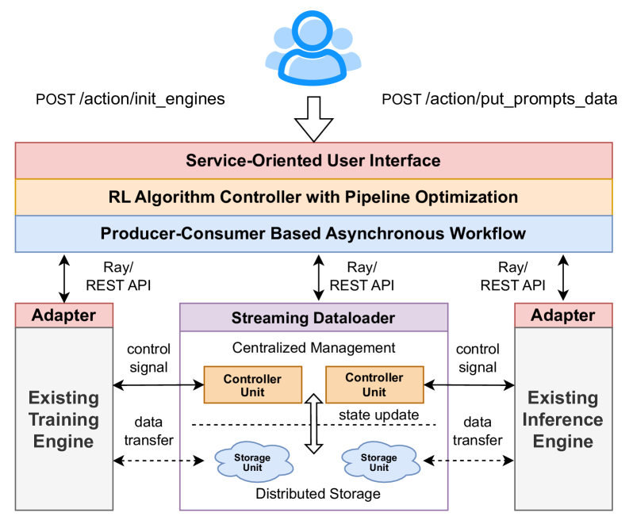

# AsyncFlow: An Asynchronous Streaming RL Framework for Efficient LLM Post-Training

#Hardware_Topics #GPU-side #CPU-side #Networking #System_/_Runtime
#RL_Training_phases #Inference #Training #Weight_Synchrony #Experience_Buffer_/_Replay
#Scenarios #Math_/_Coding(with_verifier)

## Summary

AsyncFlow introduces a **task-separated architecture** with **distributed streaming data management** that achieves significant performance improvements over traditional RL frameworks. The system features a **producer-consumer-based asynchronous workflow** and achieves an **average 1.59x throughput improvement** with a **maximum 2.03x speedup** in large-scale clusters.

## Key Technical Innovations

### 1. TransferQueue: Distributed Streaming Dataloader [Experience_Buffer_/_Replay][System_/_Runtime]

**Figure 1**: Core TransferQueue component with control plane/data plane separation for distributed streaming data management

- **Control plane and data plane separation** inspired by Software-Defined Networking (SDN)
- **Centralized data management** with distributed storage capability across RL tasks
- **Dynamic batch assembly** from currently available data without waiting for complete datasets
- **PyTorch DataLoader integration** for seamless compatibility with training/inference engines
- **Fine-grained load balancing** through metadata tracking of storage locations and consumption status

### 2. Producer-Consumer Asynchronous Workflow [Inference][Training]

**Figure 2**: Complete 4-layer AsyncFlow framework showing producer-consumer asynchronous workflow optimization

- **Delayed parameter update mechanism** defers actor rollout weight updates by one step
- **Continuous generation** during parameter transitions using old weights while asynchronously loading new ones
- **Sub-step asynchrony** enables sequential parameter updates across abundant rollout instances
- **Pipeline overlapping** eliminates warm-up and cool-down phases for nearly infinite stable phase extension
- **Controllable staleness** balances training efficiency with algorithmic stability

### 3. Service-Oriented Architecture [System_/_Runtime]

**Figure 3**: Practical execution timeline demonstrating AsyncFlow workflow with 32B model on 512 NPUs showing substantial parallelism

- **Hierarchical service interface** with user-level and backend-level abstractions
- **Engine-agnostic design** supporting various training/inference backends
- **Modular backend adapters** decouple algorithm logic from execution engines
- **Unified algorithm controller** through Trainer class for academic research
- **Industrial-scale APIs** for workflow automation with minimal configuration

### 4. Advanced Resource Management [GPU-side][CPU-side]

**Figure 4**: Concurrent read/write operations across distributed storage units demonstrating fine-grained parallelism

- **Graph-based resource planning** using hybrid cost model (analytical + profiling)
- **Hardware-specific optimization** for Ascend NPU clusters with HCCL links
- **Task resource allocation** optimized through execution time simulation
- **Ray-based resource management** for distributed computing coordination

## Performance Results [Training][GPU-side]

### Overall Throughput Improvement

- **Average 1.59x throughput gain** across all configurations compared to verl baseline
- **Maximum 2.03x speedup** for 7B model on 256 NPUs
- **1.76x and 1.82x throughput** on 512 NPUs for different model configurations
- **33.4% improvement** even at resource-constrained 32 NPU scale

### Scalability Performance
- **High scaling efficiency** maintaining linearity of 0.65 and 0.88 when cluster expands 16x
- **Robust large-scale performance** with significant improvements in industrial settings
- **Linear scalability** demonstrated across 32 to 1024 NPU configurations
- **Task-separated superiority** especially evident at large-scale deployments

### Ablation Study Results
- **TransferQueue alone**: 2.01x throughput improvement over baseline
- **Full AsyncFlow optimization**: 2.74x total improvement (36.3% additional gain over TransferQueue)
- **Minimal pipeline bubbles** through optimized dataflow scheduling
- **Stable convergence** with negligible reward score differences in asynchronous mode

## System Architecture Components

### Hierarchical Layer Design
- **Resource Layer**: Ray-based computing resource management with execution time simulation
- **Backend Layer**: Modular adapters for heterogeneous training/inference engines
- **Optimization Layer**: TransferQueue dataflow management and asynchronous workflow optimization
- **Interface Layer**: Unified algorithm entry point and service-oriented APIs

### Technical Implementation
- **Hardware**: Ascend NPU clusters with 16 NPUs per node, 2880GB system memory
- **Software**: Ascend Extension for PyTorch 7.0.0, CANN 8.1.RC1
- **Algorithms**: GRPO (Group Relative Policy Optimization) implementation
- **Models**: Qwen2.5 series (7B to 32B parameters)
- **Integration**: Built on MindSpeed-RL framework with public availability

## Impact and Applications

AsyncFlow successfully bridges the gap between **academic research requirements** and **industrial deployment scalability** by:

- **Enabling rapid algorithm iteration** through high-level abstraction layer
- **Supporting heterogeneous backend engines** for existing training/inference clusters
- **Providing automated pipeline overlapping** without manual dataflow definition
- **Maintaining algorithmic stability** while achieving significant performance gains
- **Facilitating industrial-scale RL post-training** with robust resource management

The framework's ability to achieve **substantial performance improvements** while maintaining **flexibility and stability** makes it particularly suitable for large-scale LLM post-training deployments requiring efficient resource utilization and rapid algorithm development cycles.

**Links:**
- [arXiv Paper](https://arxiv.org/abs/2507.01663)
- [PDF](./raw_docs/2507.01663.pdf)
- [MindSpeed-RL Framework](https://gitee.com/ascend/MindSpeed-RL)