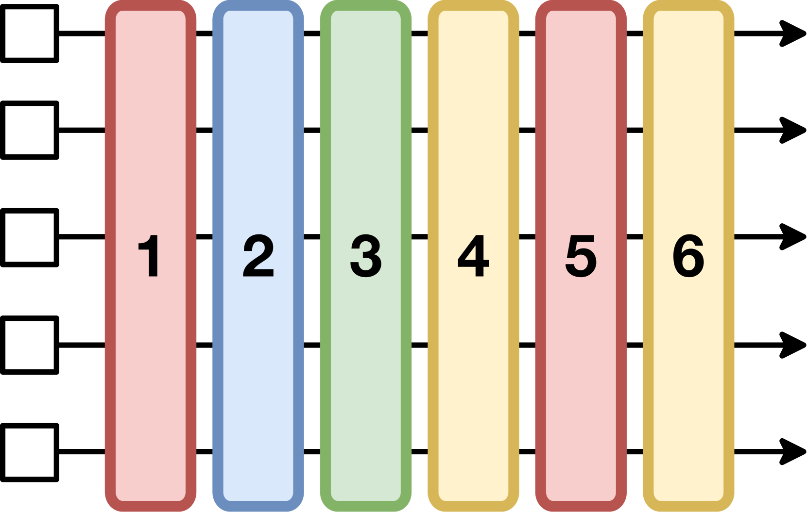

# HybridFlow: A Flexible and Efficient RLHF Framework

#Hardware_Topics #GPU-side #Networking #System_/_Runtime
#RL_Training_phases #Inference #Training #Weight_Synchrony #Experience_Buffer_/_Replay
#Scenarios #Alignment

## Summary

HybridFlow introduces a **hierarchical hybrid programming model** that combines single-controller and multi-controller paradigms to achieve **1.53x~20.57x throughput improvement** over state-of-the-art RLHF systems. The framework features a revolutionary **3D-HybridEngine** with **zero memory redundancy** and significantly reduced communication overhead during model parameter resharding.

## Key Technical Innovations

### 1. Hierarchical Hybrid Programming Model [System_/_Runtime][Networking]

**Figure 1**: Hierarchical hybrid programming model combining single-controller and multi-controller paradigms

- **Single-controller paradigm** for inter-node coordination enabling flexible data dependencies
- **Multi-controller paradigm** for intra-node computation enhancing efficiency
- **Hierarchical APIs** that decouple and encapsulate computation and data dependencies
- **Transfer protocols** hiding complexity of data resharding between distributed models
- **Model classes** encapsulating distributed LLM computation (training, inference, generation) into primitive APIs

### 2. 3D-HybridEngine for Actor Model Optimization [GPU-side][Weight_Synchrony]

**Figure 2**: 3D-HybridEngine achieving zero memory redundancy during model resharding between training and generation phases

- **Zero redundancy model resharding** between training and generation phases
- **Parallel groups** with different strategies for training (p-t-d) and generation (pg-tg-dg)
- **Strategic parallel grouping** enabling overlap between training and generation model weights
- **Concurrent all-gather operations** within micro DP groups reducing communication overhead
- **Sequential execution** on same GPU set eliminating redundant actor model copies

### 3. Advanced Memory and Communication Optimization [System_/_Runtime][GPU-side]
- **Peak memory usage** precisely matching model partition size (eliminating redundancy)
- **Communication volume reduction** from $(t p d-1)/t p d \cdot M$ to $(t p-t_g p_g)/t_g p_g t p \cdot M$
- **Micro DP groups** employed exclusively in generation stage for larger DP size
- **Concurrent data transfer** with computation through strategic grouping methods

### 4. Auto Device Mapping Algorithm [Training][System_/_Runtime]
- **Automated GPU allocation** and placement optimization for RLHF dataflow
- **15 possible placement plans** explored for four-model PPO algorithm
- **Memory-aware allocation** ensuring no OOM errors through $A_{min}$ calculation
- **Latency simulator** estimating performance of different parallelism strategies
- **End-to-end optimization** minimizing RLHF iteration latency

## Performance Results [Training][GPU-side]

### Overall Throughput Improvements

**Figure 3**: Throughput improvements across different model scales showing 1.53x~20.57x speedup over state-of-the-art RLHF systems

- **PPO Algorithm**: 3.67x over DeepSpeed-Chat, 3.25x over OpenRLHF, 12.52x over NeMo-Aligner
- **ReMax Algorithm**: Consistent improvements across all model scales
- **Safe-RLHF Algorithm**: Superior performance with additional cost model
- **Peak performance**: Up to 20.57x speedup compared to baselines
- **70B models**: Highest average speedup of 9.64x due to transition overhead reduction

### Transition Optimization
- **71.2% and 89.1% reduction** in transition overhead compared to DeepSpeed-Chat and OpenRLHF
- **Zero memory redundancy** versus 1/(tpd) and 1/(tp) in baseline systems
- **Significantly reduced communication volume** through micro DP group operations

### Scalability Performance
- **66.8% strong scaling efficiency** across various model scales
- **2.09x minimum speedup** even on 8 GPUs
- **Effective resource utilization** maintaining 1.53x-1.71x improvements on 128 GPUs
- **Adaptive placement strategies** for different cluster sizes and model configurations

## System Architecture

### RLHF Dataflow Support
- **Flexible representation** of PPO, ReMax, and Safe-RLHF algorithms
- **Four model support**: Actor, Critic, Reference Policy, Reward Model
- **Three-stage workflow**: Generation, Preparation, Training
- **Complex data dependencies** with many-to-many multicast patterns

### Device Placement Strategies
- **Colocate**: All models on same device set (DeepSpeed-Chat style)
- **Standalone**: Models on separate devices (OpenRLHF style)
- **Split**: Actor/Reference and Critic/Reward on different device sets
- **HybridFlow**: Algorithmically optimized placement based on workload and cluster size

### Implementation Details
- **12k lines of Python code** for core framework implementation
- **Multi-framework support**: PyTorch 2.1.2, Megatron-core 0.6.0, vLLM 0.3.1
- **Hardware**: 128 A100-80GB GPUs with NVLink and 200Gbps interconnect
- **Advanced parallelism**: Support for 3D parallelism, ZeRO, and PyTorch FSDP

## Impact and Applications

HybridFlow's architecture provides **unprecedented flexibility** for RLHF research and production:

- **Algorithm flexibility**: Easy implementation of various RLHF algorithms through high-level APIs
- **Hardware efficiency**: Optimal resource utilization across different cluster configurations
- **Research productivity**: Fewer lines of code required for complex RLHF workflows
- **Production scalability**: Linear performance scaling to large GPU clusters
- **Memory optimization**: Zero redundancy enabling larger model training on limited resources

The framework's ability to **dramatically reduce both communication overhead and memory requirements** while maintaining **algorithmic flexibility** makes it particularly valuable for both academic research and industrial RLHF deployments requiring efficient resource utilization.

**External Resources:**
- [Hardware Technologies]: [PyTorch FSDP](https://pytorch.org/tutorials/beginner/dist_overview.html)
- [Training Systems]: [3D-Parallelism](https://pytorch.org/tutorials/intermediate/model_parallel_tutorial.html)
- [Algorithm]: [PPO Algorithm](https://arxiv.org/abs/1707.06347)
- [Framework]: [verl GitHub](https://github.com/volcengine/verl)

**Links:**
- [arXiv Paper](https://arxiv.org/abs/2409.19256)
- [PDF](./raw_docs/2409.19256.pdf)
- [GitHub Repository](https://github.com/volcengine/verl)