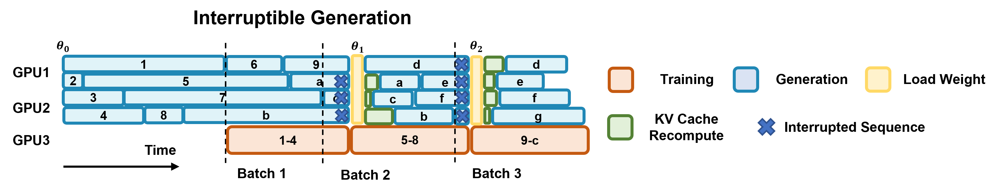
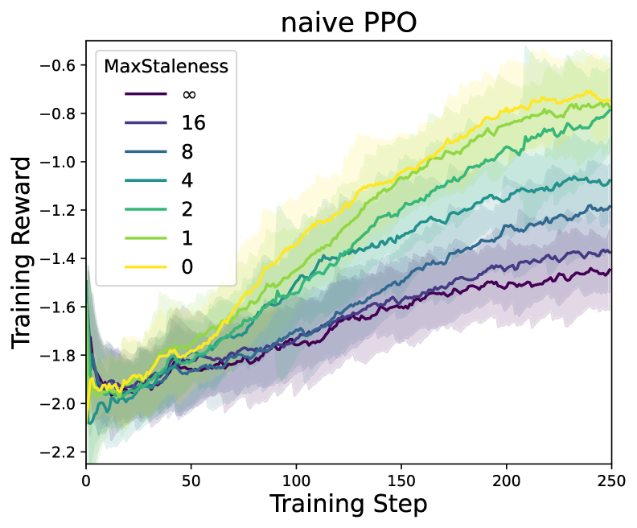
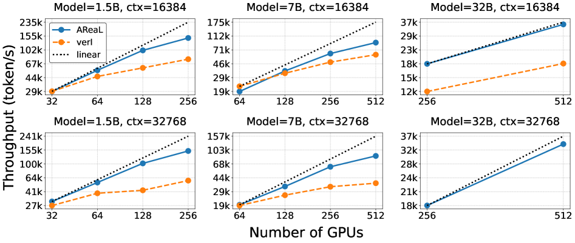

# AReaL: A Large-Scale Asynchronous Reinforcement Learning System for Language Reasoning

#Hardware_Topics #GPU-side #CPU-side #Networking #System_/_Runtime
#RL_Training_phases #Inference #Training #Weight_Synchrony
#Scenarios #Math_/_Coding(with_verifier) #Multi-agents

## Summary

AReaL is a **fully asynchronous RL training system** that completely decouples generation from training, achieving **up to 2.77x training speedup** while maintaining or improving final model performance. The system introduces **interruptible rollout workers**, **staleness-enhanced PPO**, and **system-level optimizations** that enable linear scaling up to 512 GPUs.

## Key Technical Innovations

### 1. Fully Asynchronous Architecture [System_/_Runtime]

**Figure 1**: Complete AReaL architecture showing asynchronous design with interruptible rollout workers and parallel trainer workers

- **Complete decoupling** of generation and training phases eliminating GPU underutilization
- **Streaming generation** where each rollout worker continuously generates outputs without waiting
- **Parallel model updates** whenever training batches are obtained from rollout workers
- **Dynamic weight synchronization** updating rollout workers without stopping ongoing generations

### 2. Interruptible Rollout Workers [Inference]

**Figure 2**: Timeline showing interruptible generation mechanism with KV cache recomputation for consistency

- **On-the-fly parameter updates** interrupting ongoing generations to load new model weights
- **KV cache management** discarding old caches and recomputing with new weights after interruption
- **Consistent batch sizes** maintained through buffering despite interruptions
- **Trajectory composition** from segments generated by different model versions

### 3. Staleness-Enhanced PPO
- **Modified PPO objective** handling samples from much older model versions without performance drop
- **Data filtering process** controlling staleness of each training sample
- **Staleness thresholds** configurable per task (η=4 for coding, η=8 for math)
- **Importance ratio adaptation** for varying model versions in training batches

### 4. Advanced System Optimizations
- **CPU-GPU computation decoupling** pipelining reward computation and data transfer
- **Asyncio coroutines** for concurrent request handling avoiding mutual blocking
- **Padding-free sequence packing** with dynamic allocation for variable-length sequences
- **Parallel reward service** evaluating responses through unit tests or rule-based verification

## Performance Results [Training][Inference]

### End-to-End Performance

**Figure 3**: Training steps vs reward showing 2.77x speedup with MaxStaleness=0 compared to synchronous baseline

- **2.77x training time reduction** compared to synchronous systems
- **Matched or improved performance** on AIME24 math and LiveCodeBench coding benchmarks
- **1.5B model training**: 14.8 hours vs 33.6 hours (VeRL) with comparable AIME24 accuracy (42.2 vs 43.1)
- **7B model training**: 25.4 hours vs 52.1 hours (VeRL) with superior performance (63.1 vs baseline 54.3)
- **14B coding model**: 21.9 hours vs 44.4 hours (VeRL) with improved accuracy (58.1 vs 57.9)

### Scalability Performance [GPU-side]

**Figure 4**: Strong scaling trends showing near-linear scaling up to 512 GPUs and 40-60% higher throughput than verl baseline

- **Linear scaling efficiency** up to 512 GPUs across different model sizes
- **2.5x maximum speedup** over synchronous systems in various configurations
- **40-60% higher throughput** compared to verl baseline at high GPU counts

### Scalability Performance
- **Linear scaling efficiency** up to 512 GPUs across different model sizes
- **2.5x maximum speedup** over synchronous systems in various configurations
- **Robust long-context handling** maintaining efficiency with 32K token context lengths
- **Strong scaling trend** nearly matching ideal linear scaling across all settings

### Hardware Utilization
- **75-25 inference-training partition** optimal for training throughput
- **H800 GPU cluster** with 64 nodes, 8 GPUs each, NVLink intra-node, 3.2Tbps RoCE inter-node
- **Memory-optimized training** with padding-free sequence packing maximizing GPU utilization
- **Efficient resource management** using SLURM for scheduling

## System Architecture Components

### Core Components
- **Interruptible Rollout Workers**: Handle generation requests and weight updates with interruption capability
- **Reward Service**: Evaluates response accuracy through unit tests or rule-based verification
- **Training Workers**: Perform parallel PPO updates whenever training batches are available
- **Data Management**: Coordinating variable-length sequences and staleness control

### Algorithm-System Co-Design
- **Staleness-aware training** balancing workload between rollout and training workers
- **Dynamic batching** for variable-length outputs maximizing throughput
- **Concurrent execution** overlapping CPU operations with GPU computation
- **Flexible RL workflow** supporting customization for different tasks

## Technical Implementation

### Framework Integration
- **Built upon ReaLHF framework** using Python and PyTorch
- **SGLang v0.4.6** for generation serving and efficient inference
- **Megatron-Core v0.11.0** as training backend for distributed training
- **SLURM resource scheduling** for cluster management

### Memory and Performance Optimizations
- **Dynamic allocation algorithm** balancing token distribution across micro-batches
- **Sequence packing strategy** minimizing forward-backward passes
- **KV cache optimization** efficient management during interruptions
- **Reward computation pipelining** overlapping with subsequent generation requests

## Impact and Applications

### Large-Scale Language Reasoning
- **Mathematical reasoning** with complex chain-of-thought generation up to 32K tokens
- **Code generation** with unit test verification and execution
- **Multi-step reasoning** requiring extended thinking trajectories
- **Long-context training** supporting memory-bound sequence generation

### Production-Ready RL Training
- **Industrial-scale deployment** with proven results on models up to 32B parameters
- **Enterprise efficiency** significantly reducing training time while maintaining quality
- **Flexible task adaptation** with configurable staleness thresholds per application
- **Scalable infrastructure** supporting massive parallelization across hundreds of GPUs

### Research Advancement
- **Algorithm innovation** extending PPO to handle staleness in asynchronous settings
- **System design breakthrough** eliminating fundamental bottlenecks in synchronous RL
- **Performance benchmarking** establishing new standards for large-scale RL efficiency
- **Open-source contribution** enabling community adoption and further development

## Use Cases and Deployment Scenarios

### Mathematical Reasoning
- **AIME24 competition problems** with complex multi-step solutions
- **DeepSeek-R1 distilled models** achieving superior reasoning performance
- **Long chain-of-thought generation** with extended thinking tokens
- **Rule-based reward evaluation** using answer verification

### Code Generation
- **LiveCodeBench evaluation** with real-world coding challenges
- **Unit test execution** for automated correctness verification
- **Complex algorithm implementation** requiring multi-step reasoning
- **Production deployment** with efficient inference serving

**Links:**
- [arXiv Paper](https://arxiv.org/abs/2505.24298)
- [PDF](./raw_docs/2505.24298.pdf)
- [GitHub Repository](https://github.com/inclusionAI/AReaL/)