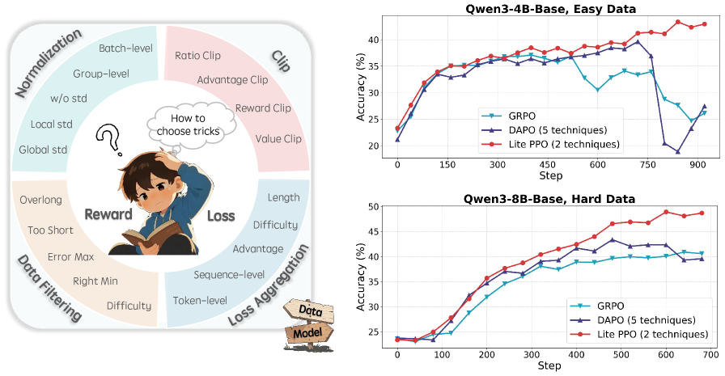
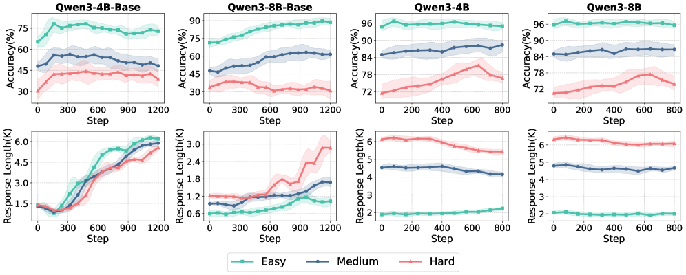

# Part I: Tricks or Traps? A Deep Dive into RL for LLM Reasoning

#Hardware_Topics #System_/_Runtime
#RL_Training_phases #Training #Experience_Buffer_/_Replay
#Scenarios #Math_/_Coding

## Summary

This comprehensive systematic review addresses the **confusing and fragmented landscape** of RL techniques for LLM reasoning through rigorous reproductions and isolated evaluations. The study reveals that a **minimalist combination of just two techniques** (Lite PPO) can outperform complex algorithms like GRPO and DAPO, providing clear **guidelines for technique selection** based on model type, data distribution, and reward mechanisms.

## Key Technical Findings

### 1. Comprehensive Technique Analysis [System_/_Runtime][Training]

**Figure 1**: Comprehensive systematic evaluation framework analyzing RL techniques through isolated experiments and fine-grained ablations

The paper systematically evaluates major RL techniques through fine-grained experiments:
- **Normalization strategies** (group-level vs batch-level, with/without variance)
- **Clipping mechanisms** (symmetric vs asymmetric, higher vs lower bounds)
- **Loss aggregation methods** (sequence-level vs token-level)
- **Overlong response filtering** for different reasoning task lengths
- **Dynamic sampling policies** for reward distribution optimization

### 2. Seven Critical Takeaways [Math_/_Coding][Training]

#### Normalization Insights [Experience_Buffer_/_Replay]
- **Group-level normalization** shows **robust efficiency** across all reward settings
- **Batch-level normalization** provides **stable improvement** under large-scale reward settings
- **Group-level mean with batch-level standard deviation** enables **further robust normalization**
- **Conflicting recommendations** in literature stem from **different experimental setups**

#### Clipping Strategy [Training]
- **Clip Higher** promotes high-quality exploration for aligned models
- **Scaling law observed** between performance and clipping upper bound on small models
- Asymmetric clipping ranges (ε_low, ε_high) better support exploration

#### Loss Aggregation [System_/_Runtime]
- **Token-level aggregation** is effective on base models but shows limited improvement on aligned models
- **Sequence-level loss** calculation preferred for aligned models
- Model architecture significantly impacts optimal aggregation strategy

#### Response Filtering [Math_/_Coding]
- **Overlong filtering** enhances accuracy and clarity for short-to-medium reasoning tasks
- **Limited benefits** for long-tail reasoning tasks
- Trade-offs between response quality and generation diversity

### 3. Lite PPO: Minimalist Superior Solution [Training][Experience_Buffer_/_Replay]

**Figure 2**: Lite PPO performance comparison showing that a minimalist two-technique combination outperforms complex algorithms like GRPO and DAPO across different model sizes

#### Core Components [System_/_Runtime]
**Lite PPO combines just two techniques:**
1. **Advantage normalization**: Group-level mean + batch-level standard deviation
2. **Token-level loss aggregation**: Fine-grained optimization for base models

#### Performance Results [Math_/_Coding]
- **Outperforms DAPO** despite DAPO using six complex techniques
- **Surpasses GRPO** and other mainstream RL4LLM algorithms
- **Stable upward trend** on small models lacking basic reasoning ability
- **Superior performance** on larger base models with long-tail generation capabilities
- **Consistent improvement** across six mathematical benchmarks

## Technical Contributions [System_/_Runtime][Training]

### Systematic Methodology [Math_/_Coding]
- **Unified open-source framework** for reproducible evaluation
- **Fine-grained experiments** across datasets of varying difficulty, model sizes, and architectures
- **Isolated technique evaluation** removing confounding factors
- **Theoretical foundation analysis** connecting implementation details to performance

### Algorithm Analysis [Experience_Buffer_/_Replay]
- **PPO foundation**: Standard clipped surrogate objective with importance ratios
- **GRPO comparison**: Group-relative policy optimization without value function
- **DAPO analysis**: Decoupled clip and dynamic sampling with multiple techniques

### Experimental Rigor [System_/_Runtime]
- **Consistent Qwen3 series models** for policy initialization
- **Comprehensive benchmarking** across mathematical reasoning tasks
- **Multiple difficulty levels** (Easy, Medium, Hard) with detailed training dynamics
- **Extensive ablation studies** validating each technique's contribution

## Practical Guidelines [Training][Math_/_Coding]

### For Non-Aligned Models (Base Models) [Experience_Buffer_/_Replay]
- **Small-to-medium models (4B-8B)**: Use advantage normalization + token-level loss
- **Advantage normalization**: Essential for sparse reward shaping
- **Token-level aggregation**: More efficient than sequence-level for base architectures
- **Avoid overlong filtering**: Preserves long-tail generation capabilities

### For Aligned Models [System_/_Runtime]
- **Clip Higher**: Better exploration for already-aligned models
- **Sequence-level aggregation**: Preferred over token-level
- **Overlong filtering**: Beneficial for short-to-medium tasks
- **Batch-level normalization**: More stable under large-scale rewards

### Model Size Considerations [Training]
- **Small models**: Benefit from clipping scaling laws and robust normalization
- **Large models**: Less sensitive to technique variations but still benefit from core principles
- **Base vs Aligned**: Dramatically different optimal technique combinations

## Impact and Implications [Math_/_Coding][System_/_Runtime]

### Challenges Prevailing Trends [Experience_Buffer_/_Replay]
- **Simplicity over complexity**: Two techniques outperform six-technique algorithms
- **Context over dogma**: Technique effectiveness depends on specific scenarios
- **Evidence over advocacy**: Resolves conflicting recommendations in literature

### Standardization Efforts [Training]
- **Clear guidelines** for technique selection based on model characteristics
- **Reproducible methodology** enabling consistent evaluation across studies
- **Framework consolidation** reducing fragmentation in RL4LLM research

### Industry-Academic Bridge [System_/_Runtime]
- **Implementation transparency** crucial for cross-institution progress
- **Open evaluation frameworks** needed for community advancement
- **Model family analysis** impeded by closed-source commercial models

## Future Vision [Math_/_Coding][Training]

### ROLL Framework Integration [Experience_Buffer_/_Replay]
- **Unified modular suite** consolidating diverse RL algorithms
- **Flexible composition** of optimization strategies
- **Consistent training infrastructure** for benchmarking

### Continued Monitoring [System_/_Runtime]
- **Critical evaluation** of emerging RL4LLM developments
- **Evidence-based guidelines** for practitioners
- **Streamlined algorithms** with minimal engineering overhead

## Broader Significance [Math_/_Coding][Training]

This work represents a **paradigm shift** from complexity-driven over-engineering to **principled minimalism** in RL for LLM reasoning. By demonstrating that **simplicity can outperform complexity**, it challenges prevailing trends and provides a foundation for more **standardized, efficient, and accessible** RL research and implementation.

**External Resources:**
- [Training]: [PPO Optimization](https://arxiv.org/abs/2005.12729)
- [Algorithm]: [GRPO Paper](https://arxiv.org/abs/2402.03300)
- [Comparison]: [RLHF Survey](https://arxiv.org/abs/2203.02155)

**Links:**
- [arXiv Paper](https://arxiv.org/abs/2508.08221)
- [PDF](./raw_docs/2508.08221.pdf)